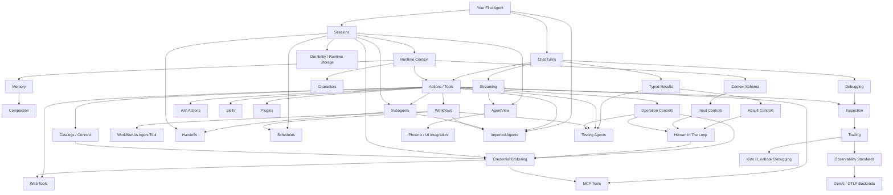

# Jidoka Feature Map

This is a planning document for ordering Jidoka's README, guides, Livebooks,
and examples during the DSL V2 refactor.

## Feature Inventory

After "Your First Agent," Jidoka's feature surface breaks down into these
groups:

- **Core turn model:** chat turns, sessions, streaming.
- **Agent contract:** model, instructions, context, result.
- **Runtime inputs:** context maps, context schemas, characters.
- **Operation surface:** actions/tools, Ash actions, web tools, MCP tools,
  skills, plugins, catalogs.
- **Runtime controls:** input controls, operation controls, result controls,
  interrupts, approvals.
- **Human-in-the-loop:** approval and interruption flows expressed through
  controls rather than a separate policy system.
- **Credential brokering:** planned authenticated tool calls where a broker,
  proxy, or sidecar injects the real credential after the LLM/tool-planning
  boundary, so raw secrets stay out of prompts, transcripts, tool arguments,
  and model logs.
- **State helpers:** memory, compaction, and a clear durability graduation path.
- **Orchestration:** workflows, subagents, handoffs.
- **Runtime integration:** shared runtime, app-owned runtime,
  AgentView/Phoenix integration.
- **Operations:** structured errors, first-class debugging, local inspection,
  tracing, observability standards, and Kino/Livebook views.
- **Portability:** imported JSON/YAML agents.
- **Automation:** schedules.
- **Testing:** provider-free tests, tool tests, result tests, workflow tests,
  live evals.

## Vocabulary

Jidoka should keep state-like words narrow:

- **Context** is caller-provided runtime data for a turn. It may be a naked map
  or a Zoi-validated contract. It is how the host app supplies actor, tenant,
  account, ticket, credential references, and other request-scoped facts.
- **Agent state** is internal process state owned by the running runtime agent.
  It tracks requests, strategy state, latest compaction snapshots, and other
  implementation details. Users should not reach for agent state just to pass
  app data into a turn.
- **Memory** recalls facts across turns or from an external store. It is not a
  replacement for required context; if a tool needs `account_id`, the caller
  should pass it explicitly.
- **Compaction** reduces the provider-facing transcript window by summarizing
  older conversation context. It does not delete the original thread and should
  not be taught as memory.
- **Result** is the app-facing final value from a turn. Typed results validate
  that value before callers receive it.
- Public DSL/docs should say **result**. Internal modules may retain `Output`
  where they bridge raw model/provider output into that app-facing result.

## Topic DAG

## Teaching Order

1. **Your First Agent:** define an agent and run `Jidoka.chat/2`.
2. **Sessions:** identity, multi-turn context, pipe syntax.
3. **Context:** pass runtime facts safely.
4. **Typed Results:** make replies useful to application code.
5. **Actions / Tools:** let the agent do deterministic work.
6. **Controls:** input, operation, result boundaries.
7. **Human-in-the-Loop:** pause risky inputs, operations, or results for review.
8. **Credential Brokering:** planned support for authenticated tools to use
   credentials without exposing raw secrets to the model.
9. **Debugging:** inspect prompts, requests, runtime state, and traces locally.
10. **Observability Standards:** connect structured telemetry to OpenTelemetry
    GenAI-compatible backends.
11. **Memory:** recall useful prior facts.
12. **Compaction:** keep long sessions usable.
13. **Streaming + AgentView:** build UI-facing agents.
14. **Schedules:** run agents without a user prompt.
15. **Workflows:** deterministic multi-step processes.
16. **Subagents + Handoffs:** delegation and ownership transfer.
17. **Tool Integrations:** Ash, web, MCP, skills, plugins, catalogs.
18. **Imported Agents:** portable specs and registries.
19. **Durability + Graduation:** move from Jidoka session addressing to durable
    runtime storage, hibernate/thaw, checkpoints, and thread journals.
20. **Testing:** contract, tool, result, workflow, and live checks.

## Canonical Table Of Contents

Use this sequence for the README feature map, guides, Livebooks, and example
sets:

1. Agents
2. Chat turns
3. Sessions
4. Context
5. Typed results
6. Actions / tools
7. Controls
8. Human-in-the-loop
9. Credential brokering
10. Debugging
11. Observability standards
12. Memory and compaction
13. Streaming and AgentView
14. Schedules
15. Workflows
16. Subagents and handoffs
17. Tool integrations
18. Imported agents
19. Durability and graduation
20. Testing

## README Shape

The README should cover:

1. What Jidoka is.
2. Your first agent.
3. Session-aware chat.
4. One medium example that combines context, one action, and one control.
5. A concise feature list.
6. Runtime model and install notes.
7. Debugging and observability as a development-to-production bridge.
8. Durability and graduation into the full runtime.

Avoid a kitchen-sink agent in the README. Save that for advanced guides or
Livebooks.

## Credential Brokering Notes

Credential brokering should be treated as a security and integration topic, not
as a general prompt feature.

The model should know that an authenticated operation exists and may know a
credential reference, vault id, connection id, or provider name. It should not
receive the raw credential value. At execution time, a broker, proxy, sidecar,
or integration runtime attaches the real credential to the outbound request.

This matters most for:

- web/API tools that call third-party services
- MCP servers that require bearer tokens or OAuth
- catalog-backed integrations such as `jido_connect`
- user-scoped sessions where the selected credential depends on tenant, actor,
  account, or conversation context
- audit trails where the app needs to know which credential lease was used
  without exposing the secret

Open design questions:

- Is credential brokering a Jidoka-owned DSL feature, a `jido_connect` feature,
  or a shared Jido integration boundary?
- Should Jidoka expose a small `credentials do ... end` DSL, or should it only
  pass `credential_ref` / `connection_ref` through context?
- Should controls be able to match credential metadata such as provider, scope,
  risk, tenant, actor, and confirmation requirement?
- How should tracing show credential usage without logging sensitive values?

External references:

- [Credential Brokering for AI Agents, Explained](https://infisical.com/blog/credential-brokering-for-ai-agents)
- [21st Credential Vaults](https://21st.dev/community/blog/credential-vaults)
- [Microsoft Entra Agent ID sidecar local development](https://learn.microsoft.com/en-us/entra/agent-id/sidecar-local-development)

## Ecosystem Scan

Scanned on 2026-05-24 from Hex package search for `agent`, `LLM`, and adjacent
LLM/agent packages. Many `agent` results are OTP `Agent`, monitoring agents, or
user-agent parsers; the list below focuses on packages that materially overlap
with AI agent authoring, runtime, tools, orchestration, observability, memory,
or integration.

Sources:

- [Hex `agent` search](https://hex.pm/packages?search=agent&sort=recent_downloads)
- [Hex `LLM` search](https://hex.pm/packages?search=LLM&sort=recent_downloads)
- [Jido ecosystem](https://jido.run/ecosystem/jido)
- [Jido observability](https://hexdocs.pm/jido/observability.html)
- [Jido.AI observability basics](https://hexdocs.pm/jido_ai/observability_basics.html)
- [ReqLLM telemetry](https://hexdocs.pm/req_llm/telemetry.html)
- [OpenTelemetry GenAI semantic conventions](https://opentelemetry.io/docs/specs/semconv/gen-ai/)
- [Langfuse OpenTelemetry integration](https://langfuse.com/integrations/native/opentelemetry)

### Relevant Package Groups

| Group | Packages | Feature signal |
| --- | --- | --- |
| Agent runtime / harness | `jido`, `alloy`, `adk`, `adk_ex`, `sagents`, `agens`, `nous`, `condukt`, `agentic`, `legion`, `swarm_ai`, `llm_agent`, `gen_agent`, `normandy`, `omni_agent` | Agents, sessions, tools, model abstraction, OTP process ownership, multi-agent orchestration |
| Graph / workflow orchestration | `lang_ex`, `phlox`, `jido_composer`, `lux`, `spooks`, `magus`, `shifts`, `synaptic` | Nodes, edges, conditional routing, state reducers, checkpoints, interrupts, human-in-the-loop, replay/resume |
| Tool contracts / tool registry | `altar`, `jido_action`, `llm_toolkit`, `lang_schema`, `ex_mcp`, `langchain_mcp`, `mcpixir` | Typed tool definitions, schema conversion, MCP clients/servers, tool discovery and dispatch |
| Sessions / stateful conversation | `agent_session_manager`, `omni_agent`, `adk_ex`, `rag_ex`, `phoenix_llm_chat` | Multi-provider sessions, persistent or branching conversations, session stores, conversation-to-provider projection |
| Structured output / schemas | `instructor`, `ash_baml`, `simplify_baml`, `lang_schema`, `json_remedy`, `omni`, `normandy` | Schema-driven LLM output, JSON repair, provider schema adaptation, type-safe prompt contracts |
| Controls / guardrails / approvals | `llm_guard`, `sagents`, `omni_agent`, `phlox`, `lang_ex` | Prompt-injection detection, data-leak prevention, middleware, approval gates, human-in-the-loop interrupts |
| Observability / tracing / evals | `agent_obs`, `aitrace`, `langfuse`, `aludel`, `tribunal`, `deep_eval_ex`, `vial_llm`, `braintrust` | Agent-loop instrumentation, OpenTelemetry/OpenInference, traces, eval workbenches, prompt/eval tracking |
| Memory / context systems | `jido_memory`, `jido_gralkor`, `gralkor_ex`, `mnemosyne`, `recollect`, `contexa`, `cortexa`, `comm_bus` | Conversation memory, semantic memory, knowledge graphs, context assembly, versioned context workspaces |
| UI / streaming / debug | `ag_ui_ex`, `sagents_live_debugger`, `phoenix_streamdown`, `phoenix_llm_chat`, `codex_sdk` | Agent UI protocol, LiveView debugging, streaming markdown, session/chat components |
| Tool integrations | `ash_ai`, `ash_agent`, `jido_browser`, `ex_mcp`, `agent_workshop`, `jido_connect` | Ash actions, browser automation, MCP, backend-agnostic orchestration, catalog-backed integrations |
| Protocols / interoperability | `a2a`, `a2a_elixir_sdk`, `acpex`, `agent_client_protocol`, `ex_mcp`, `ag_ui_ex` | A2A, ACP, MCP, AG-UI, remote agent exposure and consumption |

### Feature Comparison

| Jidoka topic | Ecosystem coverage | Implication for Jidoka |
| --- | --- | --- |
| Agents | Strong. Jido, Alloy, ADK, Sagents, Nous, Normandy, Omni Agent all center this. | Keep Jidoka's value as the cleanest Elixir authoring layer over Jido, not a second runtime. |
| Chat turns | Strong. Most frameworks expose a turn/run/call primitive. | Keep `Jidoka.chat/3` as the primary primitive; avoid API proliferation. |
| Sessions | Strong and often process-backed or store-backed. | Jidoka's plain `Session` descriptor is distinctive; document clearly as addressing, not durability. |
| Context | Common but often implicit. | Make context explicit and schema-able; this is a beginner-friendly differentiator. |
| Typed results | Strong across Instructor/BAML/schema packages, less consistently tied to agents. | Keep as a first-class agent contract, but teach it after context. |
| Actions / tools | Universal. Strong packages emphasize typed contracts. | Use `action` language in V2; let the underlying action layer own execution contracts where possible. |
| Controls | Present as middleware, guardrails, approvals, or interrupts. | `controls` is a strong unifying noun if it stays simple: input, operation, result. |
| Human-in-the-loop | Strong in graph/workflow packages and approval-oriented agent systems. | Make it a named feature built from controls and interrupts, not a separate runtime. |
| Credential brokering | Emerging; not obviously first-class in Elixir agent packages yet. | Add as planned integration/security topic. Likely belongs near tools, controls, catalogs, and connect-style integrations. |
| Debugging | Strong need across LiveView/debugger packages, but often tool-specific. | Treat debugging as a first-class local developer loop: inspect request, prompt, trace, state, and view projections. |
| Observability standards | Strong. The foundation already emits structured telemetry and can project model calls into OpenTelemetry GenAI spans. | Position Jidoka traces as the local debugging view over standards-friendly telemetry, not a competing standard. |
| Memory and compaction | Strong but fragmented. Many packages focus on memory; fewer pair it with prompt-window compaction. | Preserve both as separate concepts: memory recalls facts, compaction manages provider-facing context. |
| Streaming and AgentView | Strong around UI packages and LiveView-specific tooling. | AgentView should be the onramp from agent runtime to Phoenix UI, with streaming as a prerequisite concept. |
| Schedules | Common in long-running personal/ops agents, less central in libraries. | Keep first-class schedules; they are valuable for OTP-native agents. |
| Workflows | Very strong in graph/workflow packages. | Jidoka should keep workflows deterministic and app-owned; do not make every beginner learn graphs. |
| Subagents and handoffs | Strong in multi-agent frameworks and protocol packages. | Teach after workflows/tools; handoff is conversation ownership, not just delegation. |
| Tool integrations | Strong and growing. MCP, Ash, browser, catalogs appear repeatedly. | Use catalogs/connect as the scalable integration story; avoid listing 100 tool modules in prompts. |
| Imported agents | Less common as JSON/YAML specs; protocols cover remote agents. | Keep imported agents as portability, with allowlisted registries as a safety boundary. |
| Durability | Strong in lower-level runtimes and graph systems via checkpoints, journals, persistence, and resume. | Do not pretend `Jidoka.Session` is durable; teach the graduation path into durable runtime storage and instance managers. |
| Testing | Present in eval packages, less often in agent DSLs. | Make testing a full onboarding topic: contract tests, tool tests, workflow tests, trace assertions, optional evals. |

### Gaps And Reframed Features

1. **Durable sessions and branching transcripts.** Several runtimes and graph
   systems emphasize persistence, branching, checkpointing, and resume. Jidoka
   should not hide this behind `Session`: the first story is graduation to
   durable runtime storage, hibernate/thaw, checkpoints, and thread journals.
2. **Human-in-the-loop as a named concept.** Controls can already interrupt or
   approve. The product gap is naming and teaching it explicitly as
   human-in-the-loop, especially for risky tools and final results.
3. **Protocol surface.** A2A, ACP, MCP, and AG-UI show that agent
   interoperability is becoming a distinct topic. Jidoka should decide which are
   first-class versus delegated to companion packages.
4. **Catalog and credential brokering boundary.** Tool catalogs and credential
   brokering belong together: the agent discovers a capability, controls decide
   whether it may run, and a broker/connect layer injects credentials.
5. **Observability standards are inherited, not missing.** Jidoka should document
   that it is built on a foundation that emits structured telemetry, preserves
   correlation IDs, and can bridge model calls into OpenTelemetry GenAI spans
   for OTLP backends.
6. **Debugging as first-class DX.** Debugging should be distinct from production
   observability: local inspection, traces, prompt previews, AgentView, and
   Livebook/Kino views should be the normal way to understand a run.
7. **Memory ownership.** Memory packages are fragmented. Jidoka docs should be
   precise about what owns memory, how it is inspected, and how it differs from
   compaction and context.

### Table Of Contents Adjustments

The canonical table of contents has been updated based on the ecosystem scan:

1. Add **Human-in-the-loop** directly after **Controls** because approvals and
   interrupts are a core control outcome.
2. Keep **Credential brokering** directly after human-in-the-loop because
   authenticated tools are where security questions become concrete.
3. Split **Debugging** from **Observability standards**. Debugging is the local
   developer loop; observability is the production telemetry/export story.
4. Add **Durability and graduation** so users understand when `Session` stops
   being enough and durable runtime storage should take over.
