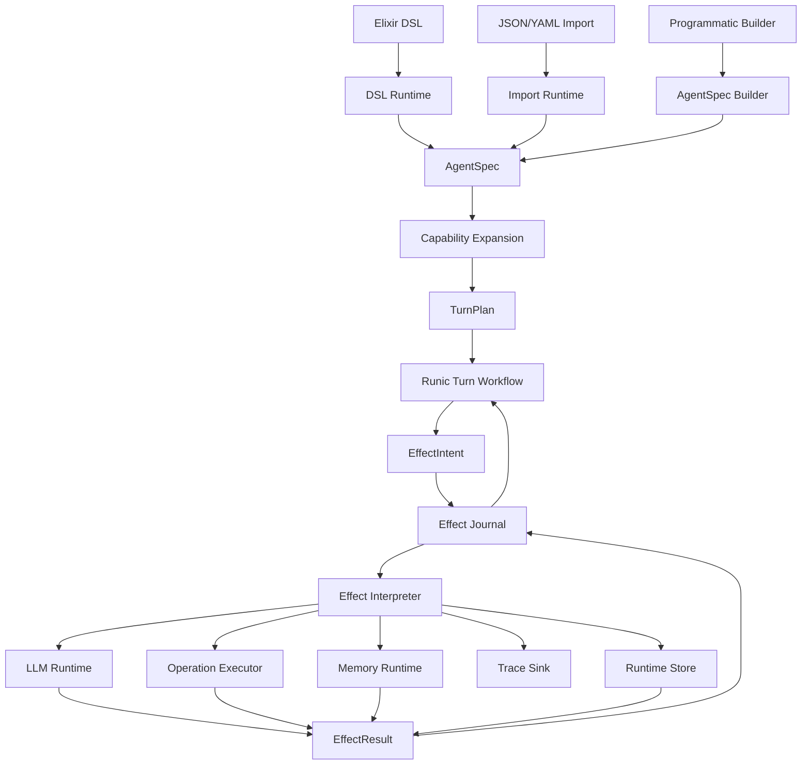

# Jidoka V2 Plan

Status: draft

Date: 2026-05-28

Scope: a hard-cut V2 architecture inside the current `jidoka` package. The
public module namespace remains `Jidoka`; V2 is an architectural generation,
not a public `JidokaV2` module family.

Implementation checkpoint:

- `Jidoka.Harness` exists as a thin execution boundary for `run_turn/3`,
  `resume/2`, runtime normalization, context validation, and checkpoint policy.
- `Jidoka.Runtime.TurnRunner` owns the current turn loop below the harness.
- `AgentSpec.model` is normalized to `%LLMDB.Model{}` through ReqLLM/LLMDB
  instead of carrying only a provider/model string.
- `AgentSpec.generation` carries permissive generation data with `params`,
  `provider_options`, and `extra`.
- `checkpoint: :after_each_phase` can now pause at the prompt boundary and
  before a planned operation effect.
- DSL `context` is now enforced before a turn runs when a context schema is
  present.

## Executive Summary

Jidoka V2 should start from one architectural center:

```text
DSL source       \
                  -> AgentSpec -> Runic turn workflow -> Effects/runtime
Imported spec    /
```

`AgentSpec` is the canonical data definition for an agent. The Elixir DSL,
JSON/YAML import path, tests, runtime, tracing, and inspection all speak this
same structure. The runtime does not rediscover feature state from Spark
entities, generated modules, process state, or compatibility maps.

Runic is the execution spine. A Jidoka agent turn is a constrained workflow of
typed values: request, context, prompt, model result, operation plan, operation
results, final result, memory writes, handoff decisions, trace events, and
continuation decisions. Capabilities plug into this workflow through declared
slots and typed contracts, not by editing one central resolver or lifecycle
registry.

The hard cut matters because V1 proved the product direction but accumulated a
mixed internal model:

- public DSL vocabulary moved toward `agent`, `tools`, `controls`, and
  `result`;
- imported specs still use `defaults`, `capabilities`, `lifecycle`, and
  `output`;
- internals still carry `guardrails`, `tool`, and `output` compatibility terms;
- feature resolution is still centralized around operation expansion;
- lifecycle ordering is explicit but manually enumerated;
- the lower runtime loop is partly hidden behind Jido.AI ReAct callbacks.

V2 should keep the Jidoka product promise and discard the mixed internal shape.

## References Reviewed

- Current `jidoka` package and README in this workspace.
- Current `jido_runic` package in this workspace.
- `zblanco/runic_ai`, cloned from `https://github.com/zblanco/runic_ai.git`
  at commit `9c7a20625b330b54476a8678677bee089fa25ddd`.
- RunicAI docs and source, especially its contract-first model, workflow-native
  recipes, external-state versus integrated-state split, tool contracts, runtime
  session specs, and deterministic testing patterns.

The GitHub web view for `zblanco/runic_ai` was not available through browser
search during this review, but `git ls-remote` and a shallow clone succeeded.

## V1 Learnings To Preserve

### Product Learnings

Jidoka's public concepts are right:

- `agent` describes identity, model, instructions, character, context, and
  structured result.
- `tools` describes model-callable operations and integrations.
- `controls` describes input, operation, and result policy.
- `session` is a descriptor, not a process abstraction.
- memory, compaction, schedules, hooks, handoffs, and workflow ownership are
  runtime concerns, not core DSL sections.
- imported agents are first-class and need parity, but their data format can
  remain more constrained than the Elixir DSL.

These choices should carry forward.

### Architecture Learnings

The current implementation shows several patterns worth keeping:

- Compile-time DSL validation improves DX.
- Strong runtime validation for imported specs is necessary.
- Zoi works well as the schema layer for public contracts.
- Runic is a better lifecycle shape than generated callback chains.
- Explicit phase names make tests and inspection much clearer.
- Generated runtime modules are useful when bridging into Jido/Jido.AI, but
  they should not be the canonical definition.
- AgentView, trace events, prompt preflight, and deterministic examples should
  remain part of the product.

### Failure Modes To Avoid

V2 should intentionally avoid these V1 failure modes:

- no second internal vocabulary for public terms;
- no separate DSL compiler and imported-agent compiler that happen to converge
  later;
- no giant central feature resolver;
- no lifecycle registry that every feature edits directly;
- no hidden ReAct loop as the true owner of turn control flow;
- no global `Application` test state for behavior-critical features;
- no in-memory runtime-critical ownership store without an explicit runtime
  contract;
- no "thin wrapper" architecture language once Jidoka owns orchestration.

## Core Thesis

Jidoka V2 is a data-driven, workflow-native agent system.

It has three layers:

1. **Authoring runtime** normalize DSL/imported/user input into `AgentSpec`.
2. **Workflow kernel** interprets `AgentSpec` through a constrained Runic turn
   workflow.
3. **Effect interpreter/runtime** journal effect intents, call LLM providers,
   operations, memory stores, MCP clients, Jido actions, schedulers, tracers,
   and durable stores, then return normalized effect results.

The core is process-agnostic. Applications can run one turn in a request, keep
state in a GenServer, run through a supervised session, persist workflow state,
or host a DSL agent under `Jido.AgentServer`. The semantic model does not
change.

## Functional Architecture

Jidoka should follow a functional-core, effect-shell architecture.

The core should be a set of pure transformations over immutable data:

```text
source data -> AgentSpec -> TurnPlan -> TurnState -> PhaseResult -> TurnState
```

External calls are not hidden inside arbitrary phase code. A phase that needs
the outside world returns an `EffectIntent`. A small runtime interpreter records
the intent, calls the runtime, records an `EffectResult`, and feeds that result
back into the next pure transition.

That gives the loop a simple algebra:

```elixir
@type phase_result ::
        {:continue, TurnState.t()}
        | {:effect, EffectIntent.t(), TurnState.t()}
        | {:decision, LoopDecision.t(), TurnState.t()}
        | {:error, Jidoka.Error.t(), TurnState.t()}
```

The preferred shape is not "Runic step directly mutates runtime state." It is:

1. normalize inputs into validated data;
2. reduce validated data through pure phase functions;
3. emit effect descriptions instead of performing effects inline;
4. interpret effects through explicit runtime;
5. checkpoint after every safe boundary;
6. resume by replaying data, not by resurrecting a process.

This makes testing direct: most tests call pure phase functions with fixed
structs and assert returned structs. Full workflow tests only need fake
runtime for the effect interpreter.

### Functional Invariants

- `AgentSpec` is immutable definition data.
- `TurnPlan` is immutable executable data compiled from `AgentSpec`.
- `TurnState` is an immutable value passed through the Runic graph.
- `AgentState` is durable semantic state, never process state.
- `EffectIntent` is data; `EffectResult` is data.
- Runtimes are the only impure shell.
- Idempotency keys are deterministic data derived before the runtime call.
- Replay never calls an runtime when a matching `EffectResult` already exists.

## Non-Goals For The First Cut

Do not start V2 by recreating every V1 feature.

The first working version should not include:

- MCP;
- Ash resources;
- subagents;
- handoffs;
- schedules;
- workflow exposure;
- Kino/Livebook surfaces;
- imported agent code generation;
- durable runtime storage;
- RLM/dynamic workflow generation.

Those features should return only after the `AgentSpec` and Runic turn kernel
prove they can carry a simple chat agent and a simple tool agent cleanly.

Durable storage is a non-goal for the first cut, but durable contracts are not.
From Phase 0 onward, core state values must be serializable and versioned so a
real store can be added later without reshaping the agent loop.

## Plan Critique And Corrections

This section records the main inconsistencies in the first draft and the
decisions that resolve them.

Bottom line: the V2 plan can produce a cleaner architecture, but only if the
fresh start removes the old ambiguity instead of renaming it. The critical
risks are public vocabulary leaking into internals, runtime dependencies
leaking into `AgentSpec`, and Phase 2 trying to solve production ownership
before the turn kernel is proven.

### 1. `tools` And `operations` Need A Hard Boundary

The first draft used both words correctly in places, but not explicitly enough.
V2 should make the boundary mechanical:

- **tools** is authoring vocabulary. Developers write `tools do ... end`
  because that is familiar and ergonomic.
- **operations** is the canonical internal and runtime vocabulary. Every
  action, MCP tool, web tool, subagent, workflow, handoff, Ash operation, and
  plugin-provided callable normalizes to `AgentSpec.Operation`.
- **capabilities** are contributors that add operations, prompt sections,
  controls, phases, runtime requirements, or diagnostics. They are not what
  the model calls.

No internal workflow step should branch on "tool" when it means operation. The
only allowed uses of `tool` in V2 core are provider-facing exports and public
DSL/import syntax.

### 2. State Ownership Should Be Staged, Not Ambiguous

The first draft said V2 should support external and integrated state "from the
beginning", then left that as an open question. The resolved decision:

- Phase 2 implements the external-state turn processor first.
- The contracts must be shaped so integrated state can reuse the same
  `AgentSpec`, `TurnRequest`, `AgentState`, `TurnState`, and `TurnResult`.
- Integrated runtime execution is not implemented until Phase 8.

This keeps the first kernel small while avoiding a second state vocabulary
later.

### 3. `AgentSpec` Should Not Hold Runtime Clients

The first draft allowed `AgentSpec.Model.client`. That undermines the
process-agnostic design. `AgentSpec` may hold model defaults and runtime
preferences, but effectful clients belong in per-run `AdapterSet` values.
`TurnPlan` may hold runtime requirements and non-effectful defaults, not live
clients.

The corrected rule:

- `AgentSpec` describes what the agent wants.
- `TurnPlan` describes how the workflow will execute that spec.
- runtime options provide concrete clients, stores, sinks, and executors
  through `AdapterSet`.

### 4. Generated Modules Are Runtime Artifacts

V1 generated nested runtime modules and generated operation modules as a core
implementation technique. V2 should not treat generated modules as canonical.

Generated modules are allowed only as runtime artifacts when an external
runtime requires a module boundary, such as a Jido action wrapper. The
canonical definition remains `AgentSpec`; the executable plan remains
`TurnPlan`.

### 5. Provider Choice Should Be Decided Enough To Start

The first draft left `ReqLLM` versus Jido.AI provider runtime fully open. That
is too loose for Phase 2.

The starting decision:

- define a `Jidoka.LLMRuntime` behaviour in Phase 2;
- ship a simple ReqLLM-backed runtime first;
- keep Jido.AI provider integration as a later runtime if it fits the same
  request/result contracts.

This lets V2 test deterministic provider behavior immediately without pulling
the old ReAct loop back into the center.

### 6. Serializable Spec Needs Two Views

`AgentSpec` will contain Elixir module refs for DSL-authored agents, controls,
and operations. That means the in-memory spec cannot always be pure JSON.

V2 should support two projections:

- an **internal spec** with Elixir refs and validated structs;
- an **external spec map** for import/export, inspection, hashing, docs, and
  replay metadata.

The external map should be stable and JSON-compatible where possible. It may
reference registry keys instead of module atoms.

### 7. Public Module Name Remains `Jidoka`

The earlier draft used `JidokaV2` as a clean-room namespace. That is useful for
thinking, but it is the wrong public shape if V2 is the next generation of this
package.

The corrected rule:

- public modules use `Jidoka`, `Jidoka.Agent`, `Jidoka.AgentSpec`,
  `Jidoka.run_turn/3`, and `Jidoka.chat/3`;
- V2-only work can happen on a branch, in a temporary package, or behind
  internal module names while it is being built;
- the delivered API should not ask users to migrate from `Jidoka` to
  `JidokaV2`.

This keeps the hard cut architectural without making the package look like it
has two competing public generations.

### 8. Durability Cannot Be Deferred Entirely

The first draft pushed durability to the production-runtime phase. Production
storage and supervised session ownership can wait, but hibernate/resume
semantics must shape the contracts immediately.

The corrected rule:

- every Runic phase boundary is a safe checkpoint boundary;
- every effect boundary records an intent before the effect and a result after
  the effect;
- snapshots store semantic Jidoka values, not Runic internals or live Elixir
  processes;
- runtime, PIDs, streams, anonymous functions, sockets, credentials, and
  provider clients are never part of a durable snapshot;
- resume rebuilds the Runic workflow from `AgentSpec`/`TurnPlan`, restores the
  latest `AgentSnapshot`, and continues from the next phase cursor.

"At any given moment" should mean "at any safe Runic boundary." Mid-function
or mid-HTTP-call serialization is not a coherent durability target. The right
model is cooperative hibernation before/after each phase and before/after each
external effect.

### 9. Workflow Flexibility Should Be Data-Driven, Not Arbitrary

Runic workflows are flexible: RunicAI builds different recipe graphs for chat,
tools, integrated agents, evaluation, and coding workflows. The question is
whether Jidoka should expose that flexibility directly.

The recommendation: do not expose arbitrary user-defined Runic DAGs in the
first V2. Make the default turn workflow a constrained semantic spine compiled
from data. It should be flexible through `TurnPlan`, `PhaseSpec`,
capabilities, policies, and workflow profiles, but not open-ended graph
authoring.

The levels of flexibility should be:

1. **Phase data**: capabilities add validated `PhaseSpec` values into fixed
   slots.
2. **Policy data**: controls, budgets, retries, operation selection, repair,
   and hibernation are data.
3. **Profile data**: `AgentSpec` can select a known workflow profile such as
   `:chat`, `:tool_loop`, or `:structured_result`.
4. **Advanced runtime**: later, expert users can provide a custom workflow
   compiler if they accept a lower-level contract.

This is still data-driven, but it keeps Jidoka from becoming a second general
workflow language before the agent loop is proven.

## One-Page Architecture



The important boundary is `AgentSpec`. Everything before it is authoring.
Everything after it is execution.

The diagram includes eventual runtime stores and memory runtime. The first
working kernel should use in-memory or no-op runtime unless persistence is the
feature under test.

## Canonical Data Model

### `Jidoka.AgentSpec`

`AgentSpec` is the full immutable definition of an agent. It is not a runtime
session, process, thread, or request.

Suggested shape:

```elixir
%Jidoka.AgentSpec{
  version: 2,
  id: "support_agent",
  name: "support_agent",
  description: nil,
  source: %AgentSpec.Source{},
  prompt: %AgentSpec.Prompt{},
  model: %AgentSpec.Model{},
  context: %AgentSpec.Context{},
  result: %AgentSpec.Result{},
  operations: %AgentSpec.OperationRegistry{},
  controls: %AgentSpec.Controls{},
  memory: %AgentSpec.Memory{},
  compaction: %AgentSpec.Compaction{},
  runtime_defaults: %AgentSpec.RuntimeDefaults{},
  observability: %AgentSpec.Observability{},
  capabilities: [%AgentSpec.Capability{}],
  metadata: %{}
}
```

Early phases may implement `Memory`, `Compaction`, `RuntimeDefaults`, and
`Observability` as empty validated structs. Keep the fields in the contract so
the shape is stable, but do not implement their behavior until the relevant
phase.

Each nested struct owns a Zoi schema and a constructor:

```elixir
defmodule Jidoka.AgentSpec.Prompt do
  @enforce_keys [:instructions]
  defstruct [:instructions, :character, sections: [], metadata: %{}]

  @schema Zoi.object(%{
    instructions: Zoi.any(),
    character: Zoi.any() |> Zoi.optional(),
    sections: Zoi.list(Zoi.map()) |> Zoi.default([]),
    metadata: Zoi.map() |> Zoi.default(%{})
  })

  def new(attrs), do: Jidoka.Contract.build(__MODULE__, @schema, attrs)
end
```

Do not make one unreadable 700-line schema module. Use nested contract modules
and a single public `AgentSpec.new/1` that validates the assembled whole.

### `AgentSpec.Source`

Captures provenance:

- `:kind` - `:dsl | :imported | :programmatic | :test`;
- `:module` - DSL module if present;
- `:file` and `:line` when Spark provides source metadata;
- `:import_format` - `:json | :yaml | nil`;
- `:raw_digest` - stable hash of the normalized source;
- `:metadata`.

This gives errors, traces, diffs, and generated docs a stable origin.

### `AgentSpec.SourceRef`

Captures source for one nested contribution:

- `:source_id` - reference to the parent `AgentSpec.Source`;
- `:path` - normalized path such as `[:tools, :action, 0]`;
- `:file` and `:line` when known;
- `:capability` - contributor such as `:action_operation` or `:controls`;
- `:metadata`.

Use source refs on operations, controls, prompt sections, phases, diagnostics,
and generated runtime artifacts. Do not make runtime behavior depend on Spark
metadata being present.

### `AgentSpec.Model`

Suggested fields:

- `:configured` - what the author wrote;
- `:resolved` - provider-ready model spec;
- `:policy` - routing, fallback, retry, budget hints;
- `:runtime_hint` - optional non-effectful preference such as `:req_llm`;
- `:metadata`.

Do not hide model policy in prompt text. Do not store live clients, function
callbacks, process ids, or runtime-owned credentials in `AgentSpec.Model`.
Concrete provider clients belong in the runtime set used to execute a
`TurnPlan`.

### `AgentSpec.Context`

Suggested fields:

- `:schema` - Zoi schema for caller-provided runtime context;
- `:defaults` - parsed defaults;
- `:merge` - shallow by default;
- `:reserved_keys` - Jidoka-owned context namespace;
- `:visibility` - what can be forwarded to tools/subagents;
- `:metadata`.

Runtime context remains caller-provided application data. It is separate from
workflow state, memory, and transcript.

### `AgentSpec.Result`

Suggested fields:

- `:schema` - Zoi or imported JSON Schema;
- `:schema_kind` - `:zoi | :json_schema`;
- `:repair_attempts`;
- `:on_validation_error` - `:repair | :error`;
- `:repair_model` and `:repair_policy`;
- `:metadata`.

Use `result` in public V2 vocabulary. If an runtime accepts V1 `output`, it
normalizes to `result` immediately and records a compatibility diagnostic.

### `AgentSpec.Operation`

Operations replace the current loose mix of actions, tools, generated modules,
web tools, subagents, workflows, and handoffs.

Suggested fields:

```elixir
%Jidoka.AgentSpec.Operation{
  id: "load_ticket",
  name: "load_ticket",
  kind: :action,
  description: "Load support ticket data.",
  input_schema: zoi_or_json_schema,
  output_schema: zoi_or_json_schema_or_nil,
  executor: %AgentSpec.Executor{},
  idempotency: %AgentSpec.IdempotencyPolicy{},
  visibility: %AgentSpec.OperationVisibility{},
  controls: [],
  credentials: [],
  risk: :low,
  source: %AgentSpec.SourceRef{},
  metadata: %{}
}
```

Operation kinds should be open internally but normalized:

- `:action`;
- `:mcp_tool`;
- `:web`;
- `:plugin_action`;
- `:ash_action`;
- `:subagent`;
- `:workflow`;
- `:handoff`.

The model sees a selected set of operation definitions. The workflow executes
operation requests through a single operation executor path.

`executor` is a declarative target, not a live runtime dependency. A
DSL-authored operation may name an Elixir module/action, but it should not
embed closures, provider clients, credentials, or process handles. The external
projection can replace module refs with registry keys.

Every operation must declare an idempotency policy. Do not pretend all effects
are exactly-once. The practical choices are:

- `:pure` - deterministic function of input; safe to recompute;
- `:idempotent` - safe to retry with the same idempotency key;
- `:dedupe` - return a previously recorded result for the same key;
- `:reconcile` - do not retry automatically; interrupt for reconciliation;
- `:unsafe_once` - allowed only behind explicit controls.

The operation planner computes the idempotency key before execution from stable
data such as agent id, session id, turn id, operation id, normalized arguments,
and operation policy. The operation runtime receives that key. The effect
journal uses it to prevent duplicate work on resume.

### `AgentSpec.Controls`

Suggested fields:

- `:input`;
- `:operation`;
- `:result`;
- `:handoff`;
- `:budget`;
- `:timeout`;
- `:metadata`.

Each control compiles to a typed `ControlSpec`:

```elixir
%Jidoka.AgentSpec.Control{
  id: "require_approval",
  point: :operation,
  ref: MyApp.RequireApproval,
  match: %{kind: :action, name: "refund_customer"},
  mode: :enforce,
  timeout: 5_000,
  source: %AgentSpec.SourceRef{}
}
```

The Runic workflow turns these into `ControlRequest` and `ControlDecision`
values at explicit control points.

### `AgentSpec.Capability`

Capabilities are authoring/runtime contributors. They are not the primary
runtime data model.

```elixir
%Jidoka.AgentSpec.Capability{
  kind: :web,
  id: "web.read_only",
  config: %{},
  operations: ["read_page", "snapshot_url"],
  phases: [:before_operation],
  diagnostics: [],
  metadata: %{}
}
```

Capabilities produce operations, prompt sections, controls, phases, generated
modules, or runtime requirements. The final `AgentSpec` should expose their
contribution explicitly.

## Vocabulary Rules

V2 should enforce vocabulary consistently:

| Public word | Internal word | Meaning |
| --- | --- | --- |
| `agent` | `AgentSpec` | The immutable definition of one agent. |
| `tools` | `operations` | Authoring block for model-callable work; canonical executable entries. |
| `controls` | `controls` | Policy around input, operations, result, budget, and review. |
| `result` | `result` | Final app-facing value after validation/repair. |
| `context` | `context` | Caller-provided runtime data for a turn. |
| `memory` | `memory` | Retrieved or stored facts outside the immediate transcript. |
| `compaction` | `compaction` | Summaries/projections of transcript context. |

Avoid these in new V2 internals:

- `output` when the app-facing value is meant;
- `guardrail` when a public policy control is meant;
- `tool` when the workflow-executable operation is meant;
- `capability` when the model-callable operation is meant.

Compatibility runtime may parse old words, but they normalize immediately and
record diagnostics.

## Agent Runtime Data

Keep definition data separate from runtime data.

### `Jidoka.TurnRequest`

One requested agent turn:

- target agent/session;
- user input;
- runtime context;
- conversation id;
- request id;
- stream preference;
- runtime opts;
- injected runtime for tests;
- trace policy.

### `Jidoka.AgentState`

Durable per-agent/session state:

- conversation/thread reference;
- recent messages;
- result of last turn;
- pending wait/review/handoff;
- memory cursor/snapshot refs;
- compaction snapshot refs;
- operation usage counters;
- metadata.

V2 should support one state contract across two ownership modes:

- **external state**: caller passes state in and stores returned state;
- **integrated state**: workflow/session owns state and reduces signals.

Phase 2 should implement external-state execution first. Phase 8 should add the
integrated runtime using the same contracts instead of introducing a second
agent-state model.

### `Jidoka.TurnState`

Ephemeral workflow value used during one turn:

```elixir
%Jidoka.TurnState{
  spec: %AgentSpec{},
  request: %TurnRequest{},
  agent_state: %AgentState{},
  context: %{},
  selected_operations: [],
  prompt: nil,
  llm_request: nil,
  llm_result: nil,
  interpreted: nil,
  operation_plan: nil,
  operation_results: [],
  result: nil,
  pending_effect: nil,
  decision: nil,
  traces: [],
  diagnostics: []
}
```

Runic steps should transform this value or emit typed child values. Do not let
arbitrary maps become the implicit internal language.

## Runic Turn Spine

The V2 kernel should own the agent turn loop. Jido/Jido.AI can remain runtime
targets, but the hidden ReAct callback chain should not be the true center of
control flow.

The base workflow is fixed in semantics but compiled from data. In other
words, Jidoka should hard-code the meaning of the turn spine, not the exact
list of every step forever. `TurnPlan` is the data that says which phases run,
in what slots, with which contracts, policies, and runtime requirements.

That gives the right compromise:

- stable enough to document, test, serialize, and resume;
- flexible enough for capabilities to add phases and policies;
- constrained enough that every agent remains inspectable as "a Jidoka agent";
- not a public arbitrary workflow engine.

### Base Turn Workflow

```mermaid
flowchart LR
  A["Normalize TurnRequest"] --> B["Load AgentState"]
  B --> C["Validate Context"]
  C --> D["Apply Input Controls"]
  D --> E["Assemble Context Bundle"]
  E --> F["Select Operations"]
  F --> G["Assemble Prompt"]
  G --> H["Plan Model Effect"]
  H --> HI["Journal/Interpret LLM Effect"]
  HI --> I["Apply Model Result"]
  I --> J{"Needs Operations?"}
  J -->|yes| K["Plan Operations"]
  K --> L["Apply Operation Controls"]
  L --> M["Plan Operation Effects"]
  M --> MI["Journal/Interpret Operation Effects"]
  MI --> N["Append Observations"]
  N --> G
  J -->|no| O["Validate/Repair Result"]
  O --> P["Apply Result Controls"]
  P --> Q["Capture Memory"]
  Q --> R["Persist State"]
  R --> S["Emit TurnResult"]
```



The operation loop is explicit. It should have visible limits:

- max model turns;
- max operation rounds;
- max operation calls;
- max elapsed time;
- budget policy;
- retry policy;
- review/wait/resume points.

### Is The Workflow Hard-Coded?

Recommendation: the initial workflow should be a fixed semantic spine with a
data-defined plan.

It is hard-coded at the level of invariants:

- a turn starts from a validated request;
- state is loaded or supplied;
- context is assembled before prompt generation;
- model output is interpreted before operation planning;
- external effects go through `EffectIntent`/`EffectResult`;
- operation observations feed back into a bounded loop;
- result validation and controls happen before completion;
- checkpoints happen at safe boundaries.

It is flexible at the level of data:

- capabilities contribute `PhaseSpec` values;
- policies change loop limits, retries, review points, and repair behavior;
- operation selection and visibility are data;
- model/provider/memory/runtime runtime are swappable;
- known workflow profiles can choose a different slot set or loop policy.

Arbitrary user-supplied workflow graphs should wait. Supporting them means
validating graph safety, serializability, resume cursors, effect idempotency,
trace semantics, and prompt preflight for a much larger state space. That is a
different product. Jidoka should first provide a very good agent loop, not a
general-purpose workflow compiler.

### Workflow Profiles

If the package needs multiple loop shapes, expose named workflow profiles as
data rather than arbitrary graphs:

```elixir
%Jidoka.AgentSpec.RuntimeDefaults{
  workflow_profile: :tool_loop,
  checkpoint: :after_each_phase,
  max_model_turns: 8,
  max_operation_rounds: 4
}
```

Initial profiles should be small:

- `:chat` - no operation loop, structured result optional;
- `:tool_loop` - bounded operation loop;
- `:structured_result` - chat plus result validation/repair;
- `:controlled_tool_loop` - operation loop with review/wait controls.

Each profile compiles to a `TurnPlan`. Profiles are data presets over the same
phase language, not separate hidden runtimes.

### Phase Slots

Capabilities may contribute phases, but only into fixed slots:

- `:normalize_request`;
- `:load_state`;
- `:validate_context`;
- `:before_input`;
- `:context`;
- `:before_prompt`;
- `:prompt`;
- `:before_model`;
- `:model`;
- `:interpret`;
- `:select_operations`;
- `:before_operation`;
- `:operation`;
- `:after_operation`;
- `:result`;
- `:after_result`;
- `:memory`;
- `:persist`;
- `:emit`.

Slots are stable. Capability modules can add named steps to a slot, but cannot
arbitrarily rewrite the whole graph in the first public V2.

### PhaseSpec V2

```elixir
%Jidoka.Workflow.PhaseSpec{
  slot: :before_operation,
  name: :operation_controls,
  capability: :controls,
  input: Jidoka.OperationPlan,
  output: Jidoka.OperationPlan,
  runner: {Jidoka.Controls.Operation, :run, []},
  order: 100,
  required?: true,
  metadata: %{}
}
```

The phase spec is data. The workflow compiler sorts and validates phase specs
before producing the Runic workflow.

### TurnPlan

Compile `AgentSpec` into a `TurnPlan` before execution:

```elixir
%Jidoka.TurnPlan{
  spec_id: "support_agent",
  workflow_name: :support_agent_turn,
  phases: [%PhaseSpec{}],
  operations: %OperationRegistry{},
  controls: %Controls{},
  runtime_requirements: %RuntimeRequirements{},
  metadata: %{}
}
```

`TurnPlan` is the executable plan. `AgentSpec` is the definition. This keeps
definition validation separate from runtime planning.

### RuntimeRequirements

`RuntimeRequirements` is the compile-time description of which effect
boundaries a turn plan needs. It contains no clients, closures, credentials, or
processes.

Suggested fields:

- `:llm` - model call requirement and runtime hint;
- `:operations` - selected executor kinds;
- `:memory` - recall/write requirement;
- `:runtime_store` - load/save requirement;
- `:trace_sink` - event capture requirement;
- `:approval` - review/wait/resume requirement;
- `:scheduler` - scheduled resume requirement;
- `:metadata`.

The workflow compiler merges capability-provided requirements into a single
validated value. `AdapterSet` satisfies that value at execution time.

### AdapterSet

`AdapterSet` is the runtime dependency bundle for one turn or session. It is
not part of the immutable `AgentSpec`. It should normally be supplied to
`run_turn/3`; defaults may be derived from `TurnPlan.runtime_requirements`.

Suggested fields:

- `:llm` - module/function implementing `LLMRuntime`;
- `:operations` - module/function implementing operation execution;
- `:memory` - memory recall/write runtime;
- `:runtime_store` - state load/save runtime;
- `:trace_sink` - trace/event runtime;
- `:approval` - review/wait/resume runtime;
- `:scheduler` - schedule/resume runtime;
- `:metadata`.

The default `AdapterSet` for early phases should be deterministic and local:
fake or ReqLLM-backed LLM, in-process operation execution, no-op memory,
in-memory state, and test-friendly trace capture.

### Effect Interpreter

The effect interpreter is the only part of the core loop that calls runtime.
It receives an `EffectIntent`, consults the `EffectJournal`, and either reuses
a recorded result or calls the required runtime.

Rules:

- never call an runtime before writing the intent;
- never call an runtime if a completed result exists for the same effect id;
- pass deterministic idempotency keys to runtime that support them;
- require reconciliation for unsafe incomplete effects;
- normalize every runtime response into `EffectResult`;
- feed `EffectResult` back into the Runic workflow as data.

This keeps phase logic referentially transparent: given the same
`TurnState` plus the same `EffectResult`, the next state is the same.

## Agentic Loop As A Runic Workflow

The agentic loop should be modeled as a bounded Runic reaction machine, not as
a recursive helper around an LLM call.

The loop state is explicit:

- `AgentSpec` defines what the agent is allowed to be;
- `TurnPlan` defines the compiled phase graph and effect requirements;
- `TurnRequest` is the current input signal;
- `AgentState` is durable conversation/session state;
- `TurnState` is the current in-flight workflow value;
- `TurnCursor` identifies the next safe phase to run;
- `EffectJournal` records external effect intents and results;
- `LoopDecision` decides whether to continue, execute operations, wait,
  review, hibernate, hand off, or finish.

The semantic loop is:

```text
input/resume signal
  -> load snapshot
  -> rebuild TurnPlan
  -> run next Runic phase
  -> checkpoint
  -> maybe emit EffectIntent
  -> journal and interpret effect
  -> checkpoint
  -> evaluate LoopDecision
  -> continue | interrupt | wait | hibernate | finish
```

Runic provides the composition and reaction model. Jidoka owns the semantic
contracts and loop policy. That distinction matters: the system should not need
to serialize a `Runic.Workflow` process or inspect Runic graph internals to
resume an agent. It should serialize Jidoka's own typed values and rebuild the
workflow from the immutable definition.

### Safe Points

Safe points are the only places where hibernate/resume is guaranteed:

- before a phase runs;
- after a phase succeeds;
- before an external effect starts;
- after an external effect completes;
- when a phase emits `Interrupt`, `Wait`, `ReviewRequest`, `Handoff`, or
  `TurnResult`.

Long-running effects should be wrapped in idempotency keys. If a process dies
after recording an effect intent but before recording the effect result, resume
must either retry through an idempotent runtime or enter a reconciliation
state. Silent duplicate tool calls are not acceptable.

### Loop Decisions

Use a typed `LoopDecision`, not booleans or special atoms:

```elixir
%Jidoka.LoopDecision{
  kind: :continue_model | :execute_operations | :wait | :review |
        :hibernate | :handoff | :finish | :error,
  reason: :model_requested_operations,
  next_cursor: %Jidoka.Runtime.TurnCursor{},
  checkpoint?: true,
  metadata: %{}
}
```

This makes control flow inspectable and gives tests a stable target. It also
lets the runtime hibernate proactively, for example after a large operation
batch, before waiting for human review, or when a budget policy says the agent
should yield.

## RunicAI Comparison

RunicAI is the right reference, but Jidoka should not copy it directly.
RunicAI is a workflow-native toolbox and recipe library. Jidoka should be an
opinionated agent product whose DSL/import formats compile into one canonical
agent definition.

| Topic | RunicAI | Jidoka V2 Position |
| --- | --- | --- |
| Authoring | Recipes and direct workflow construction. | DSL/import/programmatic builders normalize to `AgentSpec`. |
| Core shape | Typed contracts plus reusable Runic recipes. | One constrained Runic agent spine compiled from `AgentSpec` and `TurnPlan` data. |
| State models | External `Agent.State` and integrated `RuntimeState`. | Same split, but with `AgentState`, `AgentSnapshot`, and `TurnCursor` as first-class Jidoka contracts. |
| Runtime sessions | `SessionSpec`, harness sessions, backends, schedulers. | Adopt the idea later, but keep Phase 2 process-agnostic and snapshot-driven. |
| Tools | `Tool.*` contracts are central public vocabulary. | Public DSL can say `tools`; internals normalize to `Operation.*`. |
| Provider access | ReqLLM by default with injectable clients. | Same runtime direction: `LLMRuntime` over ReqLLM first, Jido.AI later if it fits. |
| Replay | Trajectories and persistence projections. | Trace plus `AgentSnapshot` plus `EffectJournal` should replay or resume deterministically. |
| Extensibility | Broad toolbox of recipes, guards, harnesses, evaluations. | Narrow capability slots and named workflow profiles first; arbitrary graphs later, if ever. |

### Ideas To Adopt From RunicAI

- contract-first values for every meaningful boundary;
- external-state first, integrated-state later;
- runtime sessions as an optional ownership layer, not the semantic core;
- typed resume signals for waits/reviews;
- trace trajectories that can become regression fixtures;
- injectable fake clients/runtime for deterministic tests;
- persistence projections that are safe to inspect and export.

### Ideas To Avoid Copying Directly

- making recipe modules the primary abstraction;
- exposing a broad toolbox before the core agent loop is stable;
- treating "serializable in practice" as good enough for durability;
- storing live module/client/runtime details in durable state;
- letting tool-specific vocabulary dominate the internal runtime.

The best synthesis is: RunicAI's operational model, Jidoka's authoring model.
RunicAI proves that agent workflows can be explicit Runic graphs. Jidoka should
make that graph the compiled runtime for a smaller, more consistent agent DSL.

## Harness Landscape Comparison

Reviewed May 28, 2026:

- [LangGraph persistence](https://docs.langchain.com/oss/python/langgraph/persistence)
  and [interrupts](https://docs.langchain.com/oss/python/langgraph/interrupts);
- [OpenAI Agents SDK running agents](https://openai.github.io/openai-agents-python/running_agents/)
  and [tracing](https://openai.github.io/openai-agents-python/tracing/);
- [Google ADK runtime](https://adk.dev/runtime/) and
  [sessions](https://google.github.io/adk-docs/sessions/session/);
- [AutoGen state management](https://microsoft.github.io/autogen/dev/user-guide/agentchat-user-guide/tutorial/state.html);
- [Pydantic AI durable execution](https://pydantic.dev/docs/ai/integrations/durable_execution/overview/)
  and [Pydantic AI Harness](https://pydantic.dev/docs/ai/harness/overview/);
- [Pydantic AI + Temporal](https://pydantic.dev/docs/ai/integrations/durable_execution/temporal/);
- [Restate AI/agents](https://docs.restate.dev/ai/index);
- [Mastra workflows](https://mastra.ai/ai-workflows);
- [LlamaIndex Workflows](https://developers.llamaindex.ai/python/llamaagents/workflows/);
- [Temporal platform docs](https://docs.temporal.io/).

### What State Of The Art Looks Like

The leading implementations are converging on a small set of runtime ideas:

- **Checkpointed execution**: LangGraph saves graph state as checkpoints and
  exposes state snapshots, history, time travel, and interrupt/resume. This is
  the clearest reference for graph-native agent durability.
- **Deterministic workflow plus impure activities**: Temporal and Pydantic AI's
  Temporal integration separate deterministic workflow code from model/tool/MCP
  activities. This maps very closely to Jidoka's proposed pure phase functions
  plus `EffectIntent`/`EffectResult`.
- **Durable agent wrappers**: OpenAI Agents SDK now points users to Temporal,
  Restate, DBOS, and Dapr integrations for durable long-running agents. Pydantic
  AI officially supports Temporal, DBOS, Prefect, and Restate for durable
  agents. The direction is clear: agent frameworks are not trying to reinvent
  every production runtime themselves.
- **Session services**: Google ADK has a `Runner` plus `SessionService` model
  where events update session state. OpenAI Agents SDK has sessions such as
  SQLite-backed conversation memory. AutoGen exposes `save_state`/`load_state`
  for agents and teams.
- **Human approval as suspension**: LangGraph interrupts, Restate approvals,
  and durable-execution integrations all treat human review as a pause/resume
  problem, not just a final validation step.
- **Tracing as a product surface**: OpenAI Agents SDK traces LLM generations,
  tool calls, handoffs, guardrails, and custom events. LangGraph exposes state
  history and time travel. Restate emphasizes step-by-step observability and
  control. This validates Jidoka's trace and prompt preflight direction.
- **Capability harnesses**: Pydantic AI Harness is especially relevant. Core
  keeps the agent loop and fundamental abstractions; a separate harness package
  holds faster-moving capabilities such as context management, memory,
  guardrails, file system access, code execution, and orchestration.
- **General workflow engines exist**: LangGraph, Mastra, LlamaIndex Workflows,
  Temporal, and Restate all let developers express broader workflow shapes.
  That argues against making Jidoka a general workflow engine too early.

### Where Jidoka V2 Aligns

Jidoka V2 is aligned with the strongest parts of the current landscape:

- `AgentSpec` is similar in spirit to Pydantic AI's spec/capability direction,
  but focused on a stable DSL/import target.
- `TurnPlan` plus `PhaseSpec` gives LangGraph-like inspectability without
  exposing arbitrary graph authoring as the primary user experience.
- `AgentSnapshot` and `TurnCursor` mirror LangGraph checkpoints and Temporal
  workflow progress, but keep the durable artifact in Jidoka's semantic model.
- `EffectIntent`/`EffectResult` matches Temporal's workflow/activity split and
  Restate's durable step model.
- `EffectJournal` plus idempotency policies goes beyond many agent frameworks,
  where duplicate side effects are often left to user discipline.
- named workflow profiles match the practical need for multiple loop shapes
  without turning the package into Mastra/LlamaIndex/LangGraph.

### Where Jidoka V2 Is Weaker Today

The V2 plan is still only a plan. Compared with current harnesses, it lacks:

- a real durable store runtime;
- a production runner/session process;
- visual execution inspection or time travel UI;
- a trace backend;
- a replay CLI;
- eval dataset/case tooling;
- human approval inbox UX;
- managed concurrency and backpressure;
- stable integrations with Temporal, Restate, DBOS, Oban, or another durable
  execution substrate.

These should not all land in core immediately, but the contracts should leave
room for them.

### Harness Implications For Jidoka

Jidoka should treat "harness" as the layer around the pure agent kernel:

```text
AgentSpec / TurnPlan / TurnState
  -> Harness Session
  -> Snapshot Store
  -> Effect Interpreter
  -> Trace Sink
  -> Replay / Eval / Approval Surfaces
```

Suggested harness modules:

- `Jidoka.Harness.Session` - caller-owned run artifact with queue, outputs,
  latest snapshot, trace cursor, and status;
- `Jidoka.Harness.Runner` - drives `run_turn`, `resume`, `drain`, and
  hibernate policies;
- `Jidoka.Harness.Case` - deterministic test/eval case with scripted model and
  operation results;
- `Jidoka.Harness.Replay` - reconstructs a run from `AgentSnapshot`,
  `EffectJournal`, and trace events;
- `Jidoka.Harness.Approval` - review request/response contract;
- `Jidoka.Harness.Store` - behaviour for snapshots, effect journals, traces,
  and session metadata.

This keeps core small while giving Jidoka a path to match the operational
surface of LangGraph/Pydantic/Restate-style systems.

### Formal Harness Boundary

`Jidoka.Harness` should be a formal module family, not an examples folder or
testing afterthought.

Its job is to make the pure kernel operable:

- own session-level run artifacts;
- queue user/resume/approval signals;
- drive the core `run_turn`/`resume` functions;
- persist and load snapshots through a store behaviour;
- expose outputs, traces, waits, review requests, and failures;
- provide replay and eval fixtures;
- coordinate approval and scheduler surfaces;
- keep runtime injectable and testable.

Its job is not to define what an agent means. The harness must not:

- compile DSL into `AgentSpec`;
- mutate `AgentSpec` or `TurnPlan`;
- hide a second ReAct loop;
- call LLMs or operations except through `EffectInterpreter`;
- depend on private Runic graph internals;
- require a production durable store for local deterministic tests.

The dependency direction should be strict:

```text
Jidoka.AgentSpec / Workflow / Runtime contracts
  <- Jidoka.Harness
  <- Production runtime runtime
```

Core should not depend on harness modules. Harness depends on core contracts.
Production runtimes depend on harness and store behaviours.

### Harness Contract Sketch

The harness should have a small public API:

```elixir
{:ok, session} = Jidoka.Harness.new(spec_or_plan, opts)
{:ok, session} = Jidoka.Harness.submit(session, %{user: "Hello"})
{:ok, session} = Jidoka.Harness.drain(session)
{:ok, session} = Jidoka.Harness.resume(session, resume_token, payload)
{:ok, snapshot} = Jidoka.Harness.snapshot(session)
{:ok, replay} = Jidoka.Harness.replay(snapshot_or_session, runtime: scripted)
```

The session artifact should be serializable:

```elixir
%Jidoka.Harness.Session{
  id: "session_123",
  status: :idle | :queued | :running | :waiting | :review | :completed | :error,
  spec_ref: %Jidoka.Runtime.SpecRef{},
  turn_plan_digest: "sha256:...",
  queue: [%Jidoka.Harness.Signal{}],
  outputs: [%Jidoka.TurnResult{}],
  latest_snapshot: %Jidoka.Runtime.AgentSnapshot{},
  pending_reviews: [%Jidoka.Harness.ApprovalRequest{}],
  trace_cursor: %Jidoka.Runtime.TraceCursor{},
  measurements: %{},
  metadata: %{}
}
```

`Jidoka.Harness.Runner` is the reducer over this session value. It should
accept a signal, call the core kernel, persist snapshots through
`Jidoka.Harness.Store`, append outputs, and return a new session value. That
makes the harness itself testable as data.

### Weak Spots To Build

The weak spots should be explicit backlog items, not hidden future work:

| Gap | Build Item | Owner Layer |
| --- | --- | --- |
| Durable store runtime | `Jidoka.Harness.Store` behaviour plus in-memory and file/SQLite implementations | Harness first, production runtime later |
| Production runner/session process | `Jidoka.Runtime.SessionServer` over `Jidoka.Harness.Runner` | Production runtime |
| Visual inspection/time travel | `Jidoka.Harness.Inspection` snapshots, state history, and diff helpers | Harness |
| Trace backend | `Jidoka.Trace.Sink` implementations for in-memory, logger, telemetry, and store-backed traces | Harness/runtime |
| Replay CLI | `mix jidoka.replay` over `Jidoka.Harness.Replay` | Harness tooling |
| Eval dataset/case tooling | `Jidoka.Harness.Case`, `EvalRun`, assertions, aggregate scoring | Harness |
| Human approval inbox | `Jidoka.Harness.ApprovalRequest`, `ApprovalResponse`, and store queries | Harness/application runtime |
| Concurrency/backpressure | queue policy, drain policy, max in-flight effects, cancellation signals | Harness/runtime |
| Durable runtime integrations | runtime for Oban first, then Temporal/Restate/DBOS if justified | Production runtime |

The first harness build should include only the pieces needed for deterministic
local operation: session, runner, in-memory store, replay from snapshots, and
approval request/response contracts. Durable process ownership and external
workflow-engine integrations can follow after those contracts are stable.

### Recommendation

Do not compete with LangGraph, Mastra, or LlamaIndex as an arbitrary workflow
builder. Do not compete with Temporal or Restate as a durable execution engine.

Instead, make Jidoka's differentiator:

```text
data-driven agent definition
  + constrained Runic semantic spine
  + functional core / effect shell
  + explicit idempotency
  + portable snapshots
  + optional harness/runtime runtime
```

The most important addition to the V2 plan is a first-class harness layer. It
should be separate enough to evolve quickly, like Pydantic AI Harness, but
grounded in the same `AgentSpec`, `TurnPlan`, `AgentSnapshot`, and
`EffectJournal` contracts as the core.

## Capability Spine

Each capability implements a small internal behaviour.

```elixir
defmodule Jidoka.Capability do
  @callback kind() :: atom()
  @callback dsl_entities() :: [Spark.Dsl.Entity.t()]
  @callback imported_schema() :: term()

  @callback normalize_dsl([struct()], BuildContext.t()) ::
              {:ok, AgentSpec.patch()} | {:error, term()}

  @callback normalize_imported(term(), BuildContext.t()) ::
              {:ok, AgentSpec.patch()} | {:error, term()}

  @callback operations(AgentSpec.t()) :: [AgentSpec.Operation.t()]
  @callback prompt_sections(AgentSpec.t()) :: [AgentSpec.PromptSection.t()]
  @callback phases(AgentSpec.t()) :: [Workflow.PhaseSpec.t()]
  @callback generated_modules(AgentSpec.t()) :: [Macro.t()]
  @callback runtime_requirements(AgentSpec.t()) ::
              [Workflow.RuntimeRequirement.t()]
  @callback projection(AgentSpec.t()) :: map()
end
```

Most callbacks can have defaults. A simple capability may only implement
`kind/0`, `dsl_entities/0`, `normalize_dsl/2`, and `operations/1`.

### Capability Patches

Capabilities should not mutate `AgentSpec` directly. They return validated
patches:

```elixir
%Jidoka.AgentSpec.Patch{
  operations: [%Operation{}],
  controls: [],
  prompt_sections: [],
  phases: [],
  runtime_requirements: [],
  diagnostics: [],
  metadata: %{capability: :web}
}
```

The spec builder merges patches deterministically and checks invariants once:

- unique agent id;
- unique operation names;
- valid schemas;
- valid source refs;
- valid control targets;
- valid capability dependencies;
- no unknown phase slots;
- no duplicate required phase names in a slot.

### First Capabilities

Implement capabilities in this order:

1. `CoreAgent` - id, description, model, instructions, character.
2. `Context` - runtime context schema/defaults.
3. `Result` - structured final result and repair policy.
4. `ActionOperation` - direct deterministic operation.
5. `Controls` - input, operation, result controls.
6. `ToolLoop` - model-visible tool calling through selected operations.

Only after these are stable:

7. `Memory`;
8. `Compaction`;
9. `Web`;
10. `MCP`;
11. `Plugin`;
12. `Ash`;
13. `Subagent`;
14. `Workflow`;
15. `Handoff`;
16. `Schedule`.

## DSL And Import Runtimes

### DSL Runtime

The Elixir DSL should stay small:

```elixir
defmodule MyApp.SupportAgent do
  use Jidoka.Agent

  agent :support_agent do
    model "openai:gpt-4o-mini"
    instructions "Help the support team."

    context Zoi.object(%{
      tenant: Zoi.string(),
      actor_id: Zoi.string()
    })

    result Zoi.object(%{
      summary: Zoi.string(),
      priority: Zoi.enum([:low, :normal, :high])
    })
  end

  tools do
    action MyApp.Actions.LoadTicket
  end

  controls do
    operation MyApp.Controls.RequireApproval,
      when: [kind: :action, name: :load_ticket]
  end
end
```

Model configuration is deliberately simple. Jidoka V2 should not ship model
aliases such as `:fast` or `:thinking`; those hide provider choice and make the
compiled spec less obvious. The `AgentSpec` always stores a concrete
provider/model string such as `"openai:gpt-4o-mini"`. If an agent omits
`model`, the compiler uses the application default:

```elixir
config :jidoka, default_model: "openai:gpt-4o-mini"
```

The DSL may override that default with `model "provider:model"`, but it should
not grow an alias registry unless a later package explicitly owns model
cataloging as data.

The macro should eventually generate:

- `__jidoka_spec__/0` in Phase 1;
- `__jidoka_turn_plan__/0` once `TurnPlan` exists;
- thin public helpers;
- optional generated runtime modules only when an external runtime requires
  module-shaped integration.

It should not generate feature-specific public helper functions for every
capability by default. Prefer `Jidoka.inspect_agent(MyAgent)` and
`AgentSpec` projections over a large helper surface.

### Imported Runtime

Imported JSON/YAML should normalize into the same `AgentSpec`.

V2 imported format should use V2 vocabulary:

```yaml
agent:
  id: support_agent
  description: Support triage assistant
model: openai:gpt-4o-mini
instructions: Help the support team.
context:
  schema:
    type: object
    properties:
      tenant:
        type: string
tools:
  actions:
    - load_ticket
controls:
  operation:
    - ref: require_approval
      when:
        kind: action
        name: load_ticket
result:
  schema:
    type: object
    properties:
      summary:
        type: string
```

If V1 import compatibility is needed, implement it as a separate
`Jidoka.Import.V1Compat` runtime that immediately translates:

- `defaults.instructions` -> `instructions`;
- `defaults.model` -> `model`;
- `capabilities.tools` -> `tools.actions`;
- `capabilities.*` -> V2 tools/capability fields;
- `lifecycle.guardrails` -> `controls`;
- `output` -> `result`.

Do not let V1 field names leak past the import runtime.

## Runtime Strategy

### Core Runtime

The core runtime should be pure and process-agnostic:

```elixir
Jidoka.run_turn(spec_or_plan, request, opts)
```

Returns:

```elixir
{:ok, %Jidoka.TurnResult{}}
{:interrupt, %Jidoka.Interrupt{}}
{:handoff, %Jidoka.Handoff{}}
{:wait, %Jidoka.Wait{}}
{:hibernate, %Jidoka.Runtime.AgentSnapshot{}}
{:error, %Jidoka.Error{}}
```

### Effect Runtimes

Runtimes are explicit dependencies:

- `LLMAdapter` - provider calls; the first default should use ReqLLM, with
  Jido.AI provider support added later only if it fits the same contract.
- `OperationAdapter` - Jidoka actions, Jido actions, MCP calls, web tools,
  Ash-generated operations.
- `MemoryAdapter` - recall/write.
- `RuntimeStore` - state load/save.
- `TraceSink` - event recording.
- `ApprovalAdapter` - review/wait/resume.
- `SchedulerAdapter` - future scheduled resumes.

Tests can inject function or module adapters. Avoid global `Application` state
for behavior-sensitive adapter selection.

### Relationship To Jido/Jido.AI

V2 should not begin as a wrapper around Jido.AI's ReAct loop. If the Runic
workflow owns the turn spine, then Jido/Jido.AI should be used as adapter
targets where they are strongest:

- Jido actions as operation executors;
- Jido signals as the process-hosted turn ingress;
- `Jido.AgentServer` as the default process host for DSL agents;
- Jido threads as an optional transcript store;
- Jido.AI provider/tool adapters if they fit the V2 contracts.

The V2 semantic loop should remain Jidoka-owned and inspectable. AgentServer
should route into the Jidoka harness and store status/result/snapshot data back
on the Jido agent state; it should not replace the Runic turn workflow.

## Hibernate And Resume

Durability should be designed around snapshots, not process serialization.

### Snapshot Contract

`AgentSnapshot` is the durable artifact for a hibernated or running agent.

Suggested shape:

```elixir
%Jidoka.Runtime.AgentSnapshot{
  version: 2,
  snapshot_id: "snap_01H...",
  agent_id: "support_agent",
  session_id: "session_123",
  spec_ref: %Jidoka.Runtime.SpecRef{},
  spec_digest: "sha256:...",
  turn_plan_digest: "sha256:...",
  status: :running,
  cursor: %Jidoka.Runtime.TurnCursor{},
  agent_state: %Jidoka.AgentState{},
  turn_state: %Jidoka.TurnState{},
  effect_journal: %Jidoka.Runtime.EffectJournal{},
  trace_cursor: %Jidoka.Runtime.TraceCursor{},
  resume_token: %Jidoka.Runtime.ResumeToken{},
  created_at: ~U[2026-05-28 00:00:00Z],
  metadata: %{}
}
```

The snapshot should include enough semantic state to continue without asking
Runic what happened. It should not include:

- live runtime;
- PIDs or process references;
- anonymous functions;
- open streams;
- sockets;
- provider clients;
- raw credentials;
- non-idempotent effect work in progress without a journal entry.

### Cursor Contract

`TurnCursor` points at the next safe phase, not at an arbitrary stack frame.

Suggested fields:

- `:phase` - current or next phase name;
- `:slot` - phase slot;
- `:loop_index` - model/operation loop counter;
- `:operation_index` - current operation within a batch;
- `:effect_id` - active effect intent when applicable;
- `:resume_kind` - `:normal | :after_effect | :wait | :review | :handoff`;
- `:metadata`.

On resume, Jidoka loads `AgentSpec`, recompiles or verifies `TurnPlan`, loads
the snapshot, validates the cursor, reconstructs the Runic workflow, and
continues from the cursor using restored `TurnState`.

### Effect Journal

External effects need a two-step journal:

```text
EffectIntent -> runtime call -> EffectResult
```

`EffectIntent` records the target, normalized request, idempotency key, timeout,
policy, and trace id before the runtime is called. `EffectResult` records the
normalized response or error after the runtime returns.

Resume behavior:

- intent with result: replay the result into the next phase;
- intent without result and idempotent runtime: retry with the same key;
- intent without result and non-idempotent runtime: enter reconciliation or
  return an interrupt;
- result recorded but state not advanced: replay from the recorded result,
  never call the effect again.

This is the durability line that prevents duplicated operations, duplicate
charges, or inconsistent review decisions.

### Idempotent Operation Semantics

Jidoka should promise deterministic replay, not magical exactly-once execution.
For every operation effect, the planner derives:

- `effect_id`;
- `operation_id`;
- normalized argument hash;
- idempotency key;
- idempotency policy;
- retry/reconcile policy;
- trace id.

The key should be stable across resume. A good default:

```text
sha256(agent_id, session_id, turn_id, loop_index, operation_id, args_hash)
```

Policy determines what happens after failure or resume:

| Policy | Retry? | Duplicate Handling |
| --- | --- | --- |
| `:pure` | yes | recompute or reuse recorded result |
| `:idempotent` | yes | runtime/provider dedupes by key |
| `:dedupe` | no runtime call if journal has result | return recorded result |
| `:reconcile` | no automatic retry | interrupt for application reconciliation |
| `:unsafe_once` | no automatic retry | requires explicit approval/control |

This makes the operation loop honest. Some operations can be made idempotent;
some cannot. The type system and plan should force that decision to be visible
before execution.

### Serialization Format

Support two snapshot encodings:

- **portable snapshot**: JSON-compatible maps for storage, inspection, replay,
  and cross-node compatibility;
- **trusted local snapshot**: Erlang external term format for local-only
  development or same-release handoff.

Portable snapshots are the production target. Trusted term snapshots are an
optimization and should never be the only supported durability story.

### Runtime APIs

Suggested APIs:

```elixir
{:ok, snapshot} = Jidoka.hibernate(result_or_session)
{:ok, result} = Jidoka.resume(snapshot, runtime: runtime)
{:ok, snapshot} = Jidoka.snapshot(session_or_turn)
{:ok, result} = Jidoka.run_turn(plan, request, checkpoint: :after_each_phase)
```

`checkpoint: :after_each_phase` should be available before production storage
exists. In early phases it can write to an in-memory or test runtime, but the
shape must be the same one a durable store will later persist.

## Observability And Replay

Every workflow boundary should emit typed events:

- `agent.spec.built`;
- `turn.started`;
- `context.validated`;
- `prompt.assembled`;
- `llm.requested`;
- `llm.completed`;
- `operation.planned`;
- `operation.started`;
- `operation.completed`;
- `control.requested`;
- `control.decided`;
- `result.validated`;
- `result.repaired`;
- `memory.recalled`;
- `memory.written`;
- `turn.completed`;
- `turn.failed`.

Trace events should point to typed values by id/hash when values are large.

Trace capture should be policy-driven. The workflow should always create typed
events at meaningful boundaries, but sinks may redact, sample, summarize, or
drop large payloads depending on runtime policy.

V2 should support replay from:

- `AgentSpec`;
- `AgentSnapshot`;
- initial `AgentState`;
- input `TurnRequest`;
- `EffectJournal`;
- scripted LLM responses;
- scripted operation results;
- recorded trace trajectory.

This is one of the strongest ideas from RunicAI: tests and operations use the
same contracts.

## Testing Strategy

### Test Pyramid

1. Contract constructor and validation tests.
2. Spec builder tests.
3. DSL-to-`AgentSpec` golden tests.
4. Import-to-`AgentSpec` golden tests.
5. Capability patch merge tests.
6. Runic step tests.
7. TurnPlan assembly tests.
8. Snapshot codec and resume cursor tests.
9. Full workflow deterministic tests with fake runtime.
10. Runtime runtime tests.
11. Cross-authoring parity tests.

### Golden Spec Tests

For every public example, assert the normalized `AgentSpec` shape.

The DSL and imported version of the same agent should normalize to equivalent
specs except for `source`, registry provenance, and runtime hints that cannot
be represented in portable imported specs.

```elixir
assert portable_spec(dsl_spec) == portable_spec(imported_spec)
```

### Order Independence

No test should rely on global mutable environment unless it owns cleanup
locally. Prefer injected runtime:

```elixir
Jidoka.run_turn(spec, request,
  llm: ScriptedLLM.new([...]),
  operations: ScriptedOperations.new([...])
)
```

### Acceptance Metrics

The V2 architecture is not "clean" until these are true:

- Adding a new operation-producing capability does not edit the core compiler,
  core Runic workflow, or public facade.
- DSL and import parity tests exist for every public feature.
- Every Runic step consumes and produces named contracts.
- Every effect boundary can be replaced with a fake runtime.
- Every safe phase boundary can produce a valid `AgentSnapshot`.
- Every operation has an explicit idempotency policy and deterministic key.
- The formal harness can run, pause, resume, replay, and inspect a session
  without production infrastructure.
- Every public feature appears in `AgentSpec` inspection.
- Full test suite passes with randomized order and no global state leaks.
- Prompt preflight and trace replay can explain how a final response happened.

## Proposed File Layout

```text
lib/jidoka/
  agent.ex
  agent_spec.ex
  loop_decision.ex
  agent_spec/
    source.ex
    source_ref.ex
    prompt.ex
    prompt_section.ex
    model.ex
    context.ex
    result.ex
    operation.ex
    operation_registry.ex
    executor.ex
    idempotency_policy.ex
    operation_visibility.ex
    control.ex
    controls.ex
    capability.ex
    patch.ex
    memory.ex
    compaction.ex
    runtime_defaults.ex
    observability.ex
  authoring/
    dsl.ex
    dsl/
      sections/
      entities.ex
      compiler.ex
    import.ex
    import/
      v2_schema.ex
      v1_compat.ex
      registry.ex
  capability/
    behaviour.ex
    core_agent.ex
    context.ex
    result.ex
    action_operation.ex
    controls.ex
    tool_loop.ex
  workflow/
    turn_plan.ex
    workflow_profile.ex
    workflow_profiles.ex
    phase_spec.ex
    phase_result.ex
    runtime_requirement.ex
    runtime_requirements.ex
    compiler.ex
    steps/
      normalize_request.ex
      load_state.ex
      validate_context.ex
      apply_controls.ex
      assemble_context.ex
      select_operations.ex
      assemble_prompt.ex
      plan_model_effect.ex
      apply_model_result.ex
      plan_operations.ex
      plan_operation_effects.ex
      apply_operation_results.ex
      validate_result.ex
      persist_state.ex
      emit_result.ex
  runtime/
    runtime_set.ex
    agent_snapshot.ex
    spec_ref.ex
    turn_cursor.ex
    effect_intent.ex
    effect_result.ex
    effect_journal.ex
    resume_token.ex
    trace_cursor.ex
    snapshot_codec.ex
    snapshot_store.ex
    effect_interpreter.ex
    runtime/
    external_state.ex
    integrated_state.ex
    session.ex
  harness/
    session.ex
    signal.ex
    runner.ex
    case.ex
    replay.ex
    approval.ex
    approval_request.ex
    approval_response.ex
    inspection.ex
    store.ex
    store/
      in_memory.ex
      file.ex
      sqlite.ex
    eval_run.ex
    eval_assertions.ex
  testing/
    scripted_llm.ex
    scripted_operations.ex
    spec_assertions.ex
```

## Implementation Phases

### Phase 0: Package Cut And Contracts

Goal: create the V2 contracts under the public `Jidoka` namespace with no V1
runtime dependencies.

Deliverables:

- `Jidoka.AgentSpec` and nested structs;
- `Jidoka.Runtime.AgentSnapshot`;
- `Jidoka.Runtime.TurnCursor`;
- portable projection and snapshot codec contracts;
- Zoi constructor/validation helper;
- idempotency policy contract;
- error contract;
- source/provenance contract;
- no DSL yet;
- no model calls yet;
- contract tests.

Exit criteria:

- can construct a valid `AgentSpec` programmatically;
- invalid specs return source-aware validation errors;
- spec can be encoded to a stable portable projection;
- empty/new snapshots can round-trip through the portable codec.

### Phase 1: Minimal Authoring

Goal: compile the smallest useful agent into `AgentSpec`.

Deliverables:

- Spark DSL with only `agent`;
- V2 imported schema with only identity, model, instructions, context, result;
- DSL/import parity tests;
- public `__jidoka_spec__/0`;
- no generated runtime module beyond introspection.

Exit criteria:

- first-agent DSL and imported spec normalize to equivalent `AgentSpec`;
- README examples can be represented as data.

### Phase 2: Runic Chat Kernel

Goal: run one model turn through a Runic workflow.

Deliverables:

- `TurnRequest`, `AgentState`, `TurnState`, `TurnResult`;
- `TurnPlan`;
- initial workflow profiles: `:chat`, `:tool_loop`, and
  `:structured_result`;
- `TurnCursor`;
- `AgentSnapshot`;
- `EffectJournal`;
- `EffectInterpreter`;
- `AdapterSet`;
- `Jidoka.run_turn/3`;
- `Jidoka.chat/3` as a thin helper over external-state `run_turn/3`;
- Runic steps for context validation, prompt assembly, model call,
  effect planning, effect result application, and result validation;
- external-state execution only;
- fake LLM runtime;
- ReqLLM-backed `LLMRuntime`;
- checkpoint policy with at least `:none`, `:phase_boundary`, and
  `:after_each_phase`;
- prompt preflight from the same workflow steps.

Exit criteria:

- deterministic chat test passes without provider credentials;
- live provider smoke can be enabled separately;
- trace shows each workflow boundary;
- a turn can hibernate after prompt assembly and resume to completion with a
  scripted LLM.

### Phase 3: Direct Actions And Operation Loop

Goal: support deterministic model-callable operations.

Deliverables:

- `AgentSpec.Operation`;
- operation registry and selection;
- direct action capability;
- operation request/result contracts;
- operation planning and execution steps;
- loop limits;
- scripted operation tests.

Exit criteria:

- model can request an action;
- operation plan includes deterministic idempotency keys;
- workflow executes action;
- observation is appended;
- model can finish on a later turn;
- all behavior is replayable.

### Phase 4: Controls And Structured Results

Goal: make policy and typed results first-class.

Deliverables:

- input, operation, and result control contracts;
- review/wait interrupt shape;
- result validation and bounded repair loop;
- budget/time limits;
- control trace events.

Exit criteria:

- risky operation can pause for approval;
- structured result can validate, repair, or fail deterministically;
- controls do not require special operation-specific code.

### Phase 5: Context, Memory, And Compaction

Goal: make long-running context manageable without hiding transcript truth.

Deliverables:

- context bundle contract;
- memory recall/write runtime;
- compaction snapshot contract;
- provenance from summary to source messages;
- fail-open/fail-closed policy as data.

Exit criteria:

- memory and compaction are visible in `TurnState` and trace;
- test failures are order-independent;
- no global summarizer configuration is required.

### Phase 6: Harness Layer

Goal: make the kernel operable without making core a production platform.

Deliverables:

- formal `Jidoka.Harness` facade;
- `Jidoka.Harness.Session`;
- `Jidoka.Harness.Signal`;
- `Jidoka.Harness.Runner`;
- `Jidoka.Harness.Case`;
- `Jidoka.Harness.Replay`;
- harness store behaviour;
- in-memory harness store;
- approval request/response contracts;
- inspection/history/diff helpers;
- deterministic eval run shape.

Exit criteria:

- a harness session can queue input, run, hibernate, resume, and expose
  outputs;
- the same session can round-trip through the in-memory store;
- replay can reconstruct a deterministic scripted run;
- approval requests can pause and resume without losing the snapshot;
- inspection can list snapshots and compare two state versions;
- harness code depends on core contracts, not private Runic internals.

### Phase 7: Advanced Capabilities

Goal: bring back V1 integrations through the capability spine.

Suggested order:

1. web;
2. MCP;
3. plugins;
4. Ash resources;
5. subagents;
6. workflows;
7. handoffs;
8. schedules.

Exit criteria for each:

- capability adds no core compiler edits;
- capability has DSL and imported coverage;
- operations/phases are visible in `AgentSpec`;
- traces and prompt preflight explain its contribution.

### Phase 8: Production Runtime And Durable Stores

Goal: support production ownership without changing the semantic core.

Deliverables:

- external-state runtime;
- integrated-state runtime;
- supervised session server;
- durable store behaviour;
- production store runtime, starting with Oban or application-provided Ecto;
- handoff owner store behaviour;
- scheduler behaviour;
- trace sink behaviour;
- replay CLI or Mix task;
- approval inbox runtime;
- concurrency/backpressure policy;
- optional Temporal/Restate/DBOS feasibility spike.

Exit criteria:

- a session can survive process restart when backed by a durable store;
- `AgentSnapshot` persistence works through the store behaviour;
- trace and replay data can be queried outside the current process;
- approval requests can be listed and resumed by an application UI;
- queue limits prevent unbounded concurrent effects;
- handoff ownership can use an application store;
- replay can reconstruct a failed turn.

## Public API Sketch

```elixir
defmodule MyApp.Assistant do
  use Jidoka.Agent

  agent :assistant do
    model "openai:gpt-4o-mini"
    instructions "Answer clearly."
  end
end

# `chat/3` is a convenience wrapper over the external-state turn processor,
# not a separate runtime or hidden ReAct loop.
{:ok, reply} = Jidoka.chat(MyApp.Assistant, "Hello")

spec = MyApp.Assistant.__jidoka_spec__()
plan = Jidoka.compile_turn_plan!(spec)

{:ok, result} =
  Jidoka.run_turn(plan,
    Jidoka.TurnRequest.new!(input: "Hello"),
    llm: scripted_llm
  )
```

Inspection:

```elixir
Jidoka.inspect_agent(MyApp.Assistant)
Jidoka.prompt_preflight(MyApp.Assistant, "What can you do?")
Jidoka.trace_turn(result)
```

Imported:

```elixir
{:ok, spec} = Jidoka.Import.load_file("agent.yaml", registries: registries)
{:ok, result} = Jidoka.chat(spec, "Hello", llm: scripted_llm)
```

## Migration Position

This should be a hard cut:

- same public namespace: `Jidoka`;
- new internal contracts;
- new docs;
- new tests;
- no V1 compatibility inside core modules;
- optional V1 import runtime only at the edge;
- no automatic migration of V1 compiled modules.

The current `jidoka` package remains the behavior reference and regression
source while V2 is built. It should not be gradually refactored into V2; V2
should replace the internals once the new spine is proven.

## Open Design Questions

1. Which fields belong in the stable external `AgentSpec` projection, and
   which remain internal or registry-only?
2. How much Spark source metadata can we preserve in `AgentSpec.SourceRef`
   without binding the whole spec to Spark?
3. Should operation schemas standardize on Zoi internally and export JSON
   Schema at the provider edge, or allow both internally?
4. Should V2 be developed on a temporary branch/worktree or in a temporary
   sibling package before replacing the current `Jidoka` internals?
5. Which V1 examples should become V2 acceptance fixtures, and which should be
   intentionally retired?
6. Which effect runtime can guarantee idempotent retry, and which require
   explicit reconciliation interrupts after an incomplete journal entry?
7. When, if ever, should Jidoka expose custom workflow compilers beyond named
   workflow profiles?
8. Should the first persistent harness store be file-based, SQLite-backed, or
   application-provided through a behaviour only?
9. Which weak-spot build items are required before V2 can replace the current
   internals, and which can remain optional harness/runtime packages?

## Recommended First Beadwork Epic

Create one epic with these children:


The first tasks should be small enough to complete without touching V1:

1. scaffold isolated V2 core modules under `lib/jidoka`;
2. implement `AgentSpec` contracts;
3. run a deterministic Runic chat turn from a programmatic spec;
4. hibernate/resume that turn from a phase-boundary snapshot.

That gives V2 a real center before the DSL, imports, and integrations return.
