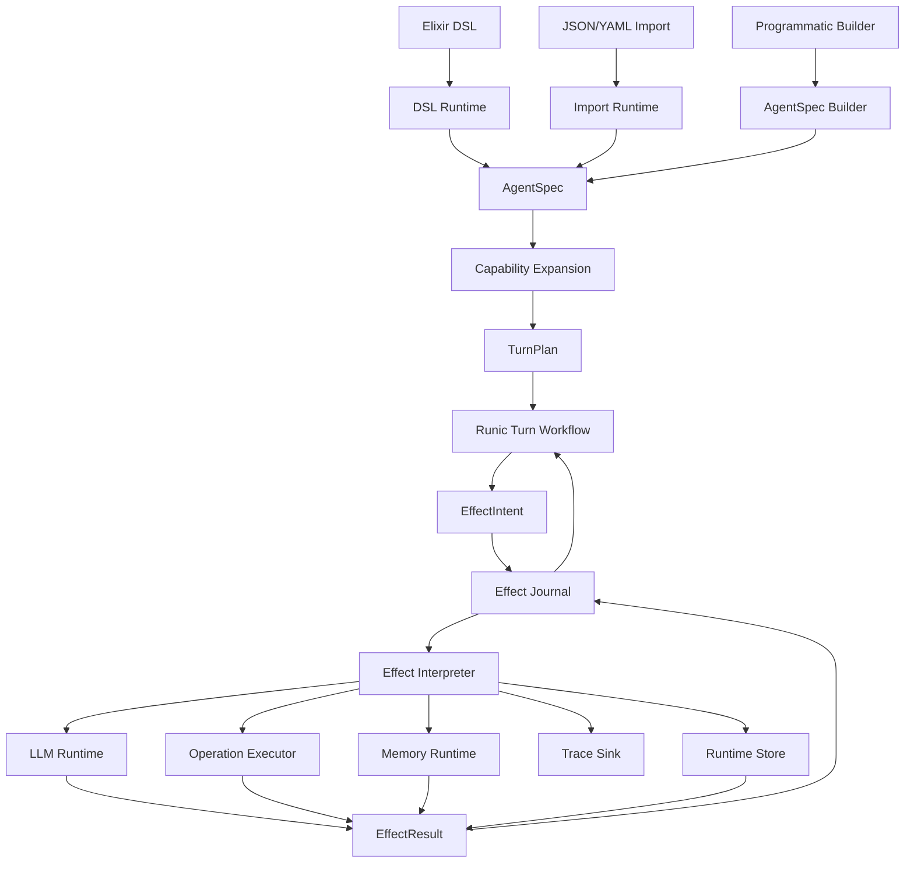

# Jidoka V2 Architecture And Competitive Landscape

Status: living design record

Original plan date: 2026-05-28

Last refreshed: 2026-07-16

Scope: a hard-cut V2 architecture inside the current `jidoka` package. The
public module namespace remains `Jidoka`; V2 is an architectural generation,
not a public `JidokaV2` module family.

Document posture:

- This file was restored from Git history at commit `19d24adc` after the
  original plan was removed during V2 stabilization.
- The implementation checkpoint and competitive landscape below describe the
  current `0.8.0-beta.1` tree. They supersede older future-tense statements in
  the historical plan sections.
- The rest of the document remains useful as an architectural decision record,
  but current code and guides are authoritative when an old plan statement and
  the shipped package differ.

Implementation checkpoint:

- The package is published as `0.8.0-beta.1`. Agent definitions authored with
  the Spark DSL, programmatic builders, or versioned JSON/YAML imports normalize
  to `Jidoka.Agent.Spec` and `Jidoka.Turn.Plan`; portable JSON/YAML export is
  also available.
- `Jidoka.Harness`, `Jidoka.Runtime.TurnRunner`, the Runic spine, and
  `Jidoka.Runtime.EffectInterpreter` own one bounded agent loop. LLM and
  operation effects are journaled with explicit idempotency policies and
  injectable capabilities.
- Public run surfaces now include synchronous chat/turn calls, asynchronous
  event streaming, multi-turn sessions, hibernate/resume, and process-hosted
  agents through `Jido.AgentServer`.
- Tool sources cover local handlers, Jido actions, Ash resources, catalogs,
  browser operations, MCP servers, skills, deterministic workflows, subagents,
  and ownership handoffs. All compile into the same operation/effect path.
- `Jidoka.Workflow` is now a general deterministic workflow surface with typed
  parameters, function and agent steps, gates and conditional routing, map and
  reduce, retries, bounded concurrency, Lua-backed policies, inspection, and
  exposure as an agent tool.
- Durability includes versioned semantic snapshots, checkpoint policies,
  serialized resume, durable session data, a store behaviour with an in-memory
  implementation, replay timelines, and replay diagnostics. Jidoka still does
  not ship a production database store or an external durable-runtime adapter.
- Human review is a typed operation-boundary interrupt. Applications can list
  pending reviews, approve or deny a specific operation, persist the snapshot,
  and resume without duplicating a recorded effect.
- Structured results are validated with Zoi and can enter a bounded repair
  loop. Input, operation, and output controls share typed runtime context.
- Memory is opt-in through a store behaviour with in-memory and `Jido.Memory`
  adapters. Recall is visible during preflight and injected before prompt
  assembly.
- Neutral events feed projection, trace timelines, redaction/sampling policy,
  an in-memory trace sink, request-level debug summaries, replay, and Kino
  notebook views. There is not yet a production OpenTelemetry exporter or a
  hosted trace/eval UI.
- `Jidoka.Eval` provides deterministic harness cases and a small assertion set
  for CI. It is not yet a dataset service, experiment tracker, online scorer,
  or model-graded evaluation platform.

Plan cursor:

- The V2 baseline is implemented and in beta rather than remaining a draft
  architecture.
- The immediate product question has shifted from “can Jidoka own its loop?” to
  “which operational and ecosystem surfaces should Jidoka own versus integrate?”
- The comparison matrix in this document is version `0.1`: it records verified
  public capabilities and exposes the next research and prioritization gaps.

## Executive Summary

Jidoka V2 should start from one architectural center:

```text
DSL source       \
                  -> AgentSpec -> Runic turn workflow -> Effects/runtime
Imported spec    /
```

`AgentSpec` is the canonical data definition for an agent. The Elixir DSL,
JSON/YAML import path, tests, runtime, tracing, and inspection all speak this
same structure. The runtime does not rediscover feature state from Spark
entities, generated modules, process state, or compatibility maps.

Runic is the execution spine. A Jidoka agent turn is a constrained workflow of
typed values: request, context, prompt, model result, operation plan, operation
results, final result, memory writes, handoff decisions, trace events, and
continuation decisions. Capabilities plug into this workflow through declared
slots and typed contracts, not by editing one central resolver or lifecycle
registry.

The hard cut matters because V1 proved the product direction but accumulated a
mixed internal model:

- public DSL vocabulary moved toward `agent`, `tools`, `controls`, and
  `result`;
- imported specs still use `defaults`, `capabilities`, `lifecycle`, and
  `output`;
- internals are being moved away from `guardrails`, `tool`, and `output`
  compatibility terms;
- feature resolution is still centralized around operation expansion;
- lifecycle ordering is explicit but manually enumerated;
- the lower runtime loop is partly hidden behind Jido.AI ReAct callbacks.

V2 should keep the Jidoka product promise and discard the mixed internal shape.

## References Reviewed

- Current `jidoka` package and README in this workspace.
- Current `jido_runic` package in this workspace.
- `zblanco/runic_ai`, cloned from `https://github.com/zblanco/runic_ai.git`
  at commit `9c7a20625b330b54476a8678677bee089fa25ddd`.
- RunicAI docs and source, especially its contract-first model, workflow-native
  recipes, external-state versus integrated-state split, tool contracts, runtime
  session specs, and deterministic testing patterns.

The GitHub web view for `zblanco/runic_ai` was not available through browser
search during this review, but `git ls-remote` and a shallow clone succeeded.

## V1 Learnings To Preserve

### Product Learnings

Jidoka's public concepts are right:

- `agent` describes identity, model, string instructions, context, and
  structured result.
- `tools` describes model-callable operations and integrations.
- `controls` describes input, operation, and output policy.
- `session` is a descriptor, not a process abstraction.
- memory, compaction, schedules, hooks, handoffs, and workflow ownership are
  runtime concerns, not core DSL sections.
- imported agents are first-class and need parity, but their data format can
  remain more constrained than the Elixir DSL.

These choices should carry forward.

### Architecture Learnings

The current implementation shows several patterns worth keeping:

- Compile-time DSL validation improves DX.
- Strong runtime validation for imported specs is necessary.
- Zoi works well as the schema layer for public contracts.
- Runic is a better lifecycle shape than generated callback chains.
- Explicit phase names make tests and inspection much clearer.
- Generated runtime modules are useful when bridging into Jido/Jido.AI, but
  they should not be the canonical definition.
- AgentView, trace events, prompt preflight, and deterministic examples should
  remain part of the product.

### Failure Modes To Avoid

V2 should intentionally avoid these V1 failure modes:

- no second internal vocabulary for public terms;
- no separate DSL compiler and imported-agent compiler that happen to converge
  later;
- no giant central feature resolver;
- no lifecycle registry that every feature edits directly;
- no hidden ReAct loop as the true owner of turn control flow;
- no global `Application` test state for behavior-critical features;
- no in-memory runtime-critical ownership store without an explicit runtime
  contract;
- no "thin wrapper" architecture language once Jidoka owns orchestration.

## Core Thesis

Jidoka V2 is a data-driven, workflow-native agent system.

It has three layers:

1. **Authoring runtime** normalize DSL/imported/user input into `AgentSpec`.
2. **Workflow kernel** interprets `AgentSpec` through a constrained Runic turn
   workflow.
3. **Effect interpreter/runtime** journal effect intents, call LLM providers,
   operations, memory stores, MCP clients, Jido actions, schedulers, tracers,
   and durable stores, then return normalized effect results.

The core is process-agnostic. Applications can run one turn in a request, keep
state in a GenServer, run through a supervised session, persist workflow state,
or host a DSL agent under `Jido.AgentServer`. The semantic model does not
change.

## Functional Architecture

Jidoka should follow a functional-core, effect-shell architecture.

The core should be a set of pure transformations over immutable data:

```text
source data -> AgentSpec -> TurnPlan -> TurnState -> PhaseResult -> TurnState
```

External calls are not hidden inside arbitrary phase code. A phase that needs
the outside world returns an `EffectIntent`. A small runtime interpreter records
the intent, calls the runtime, records an `EffectResult`, and feeds that result
back into the next pure transition.

That gives the loop a simple algebra:

```elixir
@type phase_result ::
        {:continue, TurnState.t()}
        | {:effect, EffectIntent.t(), TurnState.t()}
        | {:decision, LoopDecision.t(), TurnState.t()}
        | {:error, Jidoka.Error.t(), TurnState.t()}
```

The preferred shape is not "Runic step directly mutates runtime state." It is:

1. normalize inputs into validated data;
2. reduce validated data through pure phase functions;
3. emit effect descriptions instead of performing effects inline;
4. interpret effects through explicit runtime;
5. checkpoint after every safe boundary;
6. resume by replaying data, not by resurrecting a process.

This makes testing direct: most tests call pure phase functions with fixed
structs and assert returned structs. Full workflow tests only need fake
runtime for the effect interpreter.

### Functional Invariants

- `AgentSpec` is immutable definition data.
- `TurnPlan` is immutable executable data compiled from `AgentSpec`.
- `TurnState` is an immutable value passed through the Runic graph.
- `AgentState` is durable semantic state, never process state.
- `EffectIntent` is data; `EffectResult` is data.
- Runtimes are the only impure shell.
- Idempotency keys are deterministic data derived before the runtime call.
- Replay never calls an runtime when a matching `EffectResult` already exists.

## Non-Goals For The First Cut

Do not start V2 by recreating every V1 feature.

The first working version should not include:

- MCP;
- Ash resources;
- subagents;
- handoffs;
- schedules;
- workflow exposure;
- Kino/Livebook surfaces;
- imported agent code generation;
- durable runtime storage;
- RLM/dynamic workflow generation.

Those features should return only after the `AgentSpec` and Runic turn kernel
prove they can carry a simple chat agent and a simple tool agent cleanly.

Durable storage is a non-goal for the first cut, but durable contracts are not.
From Phase 0 onward, core state values must be serializable and versioned so a
real store can be added later without reshaping the agent loop.

## Plan Critique And Corrections

This section records the main inconsistencies in the first draft and the
decisions that resolve them.

Bottom line: the V2 plan can produce a cleaner architecture, but only if the
fresh start removes the old ambiguity instead of renaming it. The critical
risks are public vocabulary leaking into internals, runtime dependencies
leaking into `AgentSpec`, and Phase 2 trying to solve production ownership
before the turn kernel is proven.

### 1. `tools` And `operations` Need A Hard Boundary

The first draft used both words correctly in places, but not explicitly enough.
V2 should make the boundary mechanical:

- **tools** is authoring vocabulary. Developers write `tools do ... end`
  because that is familiar and ergonomic.
- **operations** is the canonical internal and runtime vocabulary. Every
  action, MCP tool, browser tool, subagent, workflow, handoff, Ash operation,
  and runtime/package-provided callable normalizes to `AgentSpec.Operation`.
- **capabilities** are contributors that add operations, prompt sections,
  controls, phases, runtime requirements, or diagnostics. They are not what
  the model calls.

No internal workflow step should branch on "tool" when it means operation. The
only allowed uses of `tool` in V2 core are provider-facing exports and public
DSL/import syntax.

### 2. State Ownership Should Be Staged, Not Ambiguous

The first draft said V2 should support external and integrated state "from the
beginning", then left that as an open question. The resolved decision:

- Phase 2 implements the external-state turn processor first.
- The contracts must be shaped so integrated state can reuse the same
  `AgentSpec`, `TurnRequest`, `AgentState`, `TurnState`, and `TurnResult`.
- Integrated runtime execution is not implemented until Phase 8.

This keeps the first kernel small while avoiding a second state vocabulary
later.

### 3. `AgentSpec` Should Not Hold Runtime Clients

The first draft allowed `AgentSpec.Model.client`. That undermines the
process-agnostic design. `AgentSpec` may hold model defaults and runtime
preferences, but effectful clients belong in per-run
`Jidoka.Runtime.Capabilities` values. `TurnPlan` may hold runtime requirements
and non-effectful defaults, not live clients.

The corrected rule:

- `AgentSpec` describes what the agent wants.
- `TurnPlan` describes how the workflow will execute that spec.
- runtime options provide concrete clients, stores, sinks, and executors
  through `Jidoka.Runtime.Capabilities`.

### 4. Generated Modules Are Runtime Artifacts

V1 generated nested runtime modules and generated operation modules as a core
implementation technique. V2 should not treat generated modules as canonical.

Generated modules are allowed only as runtime artifacts when an external
runtime requires a module boundary, such as a Jido action wrapper. The
canonical definition remains `AgentSpec`; the executable plan remains
`TurnPlan`.

### 5. Provider Choice Should Be Decided Enough To Start

The first draft left `ReqLLM` versus Jido.AI provider runtime fully open. That
is too loose for Phase 2.

The starting decision:

- define a `Jidoka.LLMRuntime` behaviour in Phase 2;
- ship a simple ReqLLM-backed runtime first;
- keep Jido.AI provider integration as a later runtime if it fits the same
  request/result contracts.

This lets V2 test deterministic provider behavior immediately without pulling
the old ReAct loop back into the center.

### 6. Serializable Spec Needs Two Views

`AgentSpec` will contain Elixir module refs for DSL-authored agents, controls,
and operations. That means the in-memory spec cannot always be pure JSON.

V2 should support two projections:

- an **internal spec** with Elixir refs and validated structs;
- an **external spec map** for import/export, inspection, hashing, docs, and
  replay metadata.

The external map should be stable and JSON-compatible where possible. It may
reference registry keys instead of module atoms.

### 7. Public Module Name Remains `Jidoka`

The earlier draft used `JidokaV2` as a clean-room namespace. That is useful for
thinking, but it is the wrong public shape if V2 is the next generation of this
package.

The corrected rule:

- public modules use `Jidoka`, `Jidoka.Agent`, `Jidoka.AgentSpec`,
  `Jidoka.run_turn/3`, and `Jidoka.chat/3`;
- V2-only work can happen on a branch, in a temporary package, or behind
  internal module names while it is being built;
- the delivered API should not ask users to migrate from `Jidoka` to
  `JidokaV2`.

This keeps the hard cut architectural without making the package look like it
has two competing public generations.

### 8. Durability Cannot Be Deferred Entirely

The first draft pushed durability to the production-runtime phase. Production
storage and supervised session ownership can wait, but hibernate/resume
semantics must shape the contracts immediately.

The corrected rule:

- every Runic phase boundary is a safe checkpoint boundary;
- every effect boundary records an intent before the effect and a result after
  the effect;
- snapshots store semantic Jidoka values, not Runic internals or live Elixir
  processes;
- runtime, PIDs, streams, anonymous functions, sockets, credentials, and
  provider clients are never part of a durable snapshot;
- resume rebuilds the Runic workflow from `AgentSpec`/`TurnPlan`, restores the
  latest `AgentSnapshot`, and continues from the next phase cursor.

"At any given moment" should mean "at any safe Runic boundary." Mid-function
or mid-HTTP-call serialization is not a coherent durability target. The right
model is cooperative hibernation before/after each phase and before/after each
external effect.

### 9. Workflow Flexibility Should Be Data-Driven, Not Arbitrary

Runic workflows are flexible: RunicAI builds different recipe graphs for chat,
tools, integrated agents, evaluation, and coding workflows. The question is
whether Jidoka should expose that flexibility directly.

The recommendation: do not expose arbitrary user-defined Runic DAGs in the
first V2. Make the default turn workflow a constrained semantic spine compiled
from data. It should be flexible through `TurnPlan`, `PhaseSpec`,
capabilities, policies, and workflow profiles, but not open-ended graph
authoring.

The levels of flexibility should be:

1. **Phase data**: capabilities add validated `PhaseSpec` values into fixed
   slots.
2. **Policy data**: controls, budgets, retries, operation selection, repair,
   and hibernation are data.
3. **Profile data**: `AgentSpec` can select a known workflow profile such as
   `:chat`, `:tool_loop`, or `:structured_result`.
4. **Advanced runtime**: later, expert users can provide a custom workflow
   compiler if they accept a lower-level contract.

This is still data-driven, but it keeps Jidoka from becoming a second general
workflow language before the agent loop is proven.

## One-Page Architecture


```mermaid
flowchart TB
  DSL["Elixir DSL"] --> DSLRuntime["DSL Runtime"]
  Import["JSON/YAML Import"] --> ImportRuntime["Import Runtime"]
  Programmatic["Programmatic Builder"] --> Builder["AgentSpec Builder"]

  DSLRuntime --> Spec["AgentSpec"]
  ImportRuntime --> Spec
  Builder --> Spec

  Spec --> Compile["Capability Expansion"]
  Compile --> Plan["TurnPlan"]
  Plan --> Workflow["Runic Turn Workflow"]

  Workflow --> Intent["EffectIntent"]
  Intent --> Journal["Effect Journal"]
  Journal --> Interpreter["Effect Interpreter"]
  Interpreter --> LLM["LLM Runtime"]
  Interpreter --> Ops["Operation Executor"]
  Interpreter --> Memory["Memory Runtime"]
  Interpreter --> Trace["Trace Sink"]
  Interpreter --> Runtime["Runtime Store"]

  LLM --> Result["EffectResult"]
  Ops --> Result
  Memory --> Result
  Runtime --> Result
  Result --> Journal
  Journal --> Workflow
```

The important boundary is `AgentSpec`. Everything before it is authoring.
Everything after it is execution.

The diagram includes eventual runtime stores and memory runtime. The first
working kernel should use in-memory or no-op runtime unless persistence is the
feature under test.

## Canonical Data Model

### `Jidoka.AgentSpec`

`AgentSpec` is the full immutable definition of an agent. It is not a runtime
session, process, thread, or request.

Suggested shape:

```elixir
%Jidoka.AgentSpec{
  version: 2,
  id: "support_agent",
  name: "support_agent",
  description: nil,
  source: %AgentSpec.Source{},
  prompt: %AgentSpec.Prompt{},
  model: %AgentSpec.Model{},
  context: %AgentSpec.Context{},
  result: %AgentSpec.Result{},
  operations: %AgentSpec.OperationRegistry{},
  controls: %AgentSpec.Controls{},
  memory: %AgentSpec.Memory{},
  compaction: %AgentSpec.Compaction{},
  runtime_defaults: %AgentSpec.RuntimeDefaults{},
  observability: %AgentSpec.Observability{},
  capabilities: [%AgentSpec.Capability{}],
  metadata: %{}
}
```

Early phases may implement `Memory`, `Compaction`, `RuntimeDefaults`, and
`Observability` as empty validated structs. Keep the fields in the contract so
the shape is stable, but do not implement their behavior until the relevant
phase.

Each nested struct owns a Zoi schema and a constructor:

```elixir
defmodule Jidoka.AgentSpec.Prompt do
  @enforce_keys [:instructions]
  defstruct [:instructions, sections: [], metadata: %{}]

  @schema Zoi.object(%{
    instructions: Zoi.string(),
    sections: Zoi.list(Zoi.map()) |> Zoi.default([]),
    metadata: Zoi.map() |> Zoi.default(%{})
  })

  def new(attrs), do: Jidoka.Contract.build(__MODULE__, @schema, attrs)
end
```

Do not make one unreadable 700-line schema module. Use nested contract modules
and a single public `AgentSpec.new/1` that validates the assembled whole.

### `AgentSpec.Source`

Captures provenance:

- `:kind` - `:dsl | :imported | :programmatic | :test`;
- `:module` - DSL module if present;
- `:file` and `:line` when Spark provides source metadata;
- `:import_format` - `:json | :yaml | nil`;
- `:raw_digest` - stable hash of the normalized source;
- `:metadata`.

This gives errors, traces, diffs, and generated docs a stable origin.

### `AgentSpec.SourceRef`

Captures source for one nested contribution:

- `:source_id` - reference to the parent `AgentSpec.Source`;
- `:path` - normalized path such as `[:tools, :action, 0]`;
- `:file` and `:line` when known;
- `:capability` - contributor such as `:action_operation` or `:controls`;
- `:metadata`.

Use source refs on operations, controls, prompt sections, phases, diagnostics,
and generated runtime artifacts. Do not make runtime behavior depend on Spark
metadata being present.

### `AgentSpec.Model`

Suggested fields:

- `:configured` - what the author wrote;
- `:resolved` - provider-ready model spec;
- `:policy` - routing, fallback, retry, budget hints;
- `:runtime_hint` - optional non-effectful preference such as `:req_llm`;
- `:metadata`.

Do not hide model policy in prompt text. Do not store live clients, function
callbacks, process ids, or runtime-owned credentials in `AgentSpec.Model`.
Concrete provider clients belong in the runtime set used to execute a
`TurnPlan`.

### `AgentSpec.Context`

Suggested fields:

- `:schema` - Zoi schema for caller-provided runtime context;
- `:defaults` - parsed defaults;
- `:merge` - shallow by default;
- `:reserved_keys` - Jidoka-owned context namespace;
- `:visibility` - what can be forwarded to tools/subagents;
- `:metadata`.

Runtime context remains caller-provided application data. It is separate from
workflow state, memory, and transcript.

### `AgentSpec.Result`

Suggested fields:

- `:schema` - Zoi or imported JSON Schema;
- `:schema_kind` - `:zoi | :json_schema`;
- `:repair_attempts`;
- `:on_validation_error` - `:repair | :error`;
- `:repair_model` and `:repair_policy`;
- `:metadata`.

Use `result` in public V2 vocabulary. If an runtime accepts V1 `output`, it
normalizes to `result` immediately and records a compatibility diagnostic.

### `AgentSpec.Operation`

Operations replace the current loose mix of actions, tools, generated modules,
web tools, subagents, workflows, and handoffs.

Suggested fields:

```elixir
%Jidoka.AgentSpec.Operation{
  id: "load_ticket",
  name: "load_ticket",
  kind: :action,
  description: "Load support ticket data.",
  input_schema: zoi_or_json_schema,
  output_schema: zoi_or_json_schema_or_nil,
  executor: %AgentSpec.Executor{},
  idempotency: %AgentSpec.IdempotencyPolicy{},
  visibility: %AgentSpec.OperationVisibility{},
  controls: [],
  credentials: [],
  risk: :low,
  source: %AgentSpec.SourceRef{},
  metadata: %{}
}
```

Operation kinds should be open internally but normalized:

- `:action`;
- `:mcp_tool`;
- `:browser`;
- `:catalog`;
- `:ash_resource`;
- `:subagent`;
- `:workflow`;
- `:handoff`.

The model sees a selected set of operation definitions. The workflow executes
operation requests through a single operation executor path.

`executor` is a declarative target, not a live runtime dependency. A
DSL-authored operation may name an Elixir module/action, but it should not
embed closures, provider clients, credentials, or process handles. The external
projection can replace module refs with registry keys.

Every operation must declare an idempotency policy. Do not pretend all effects
are exactly-once. The practical choices are:

- `:pure` - deterministic function of input; safe to recompute;
- `:idempotent` - safe to retry with the same idempotency key;
- `:dedupe` - return a previously recorded result for the same key;
- `:reconcile` - do not retry automatically; interrupt for reconciliation;
- `:unsafe_once` - allowed only behind explicit controls.

The operation planner computes the idempotency key before execution from stable
data such as agent id, session id, turn id, operation id, normalized arguments,
and operation policy. The operation runtime receives that key. The effect
journal uses it to prevent duplicate work on resume.

### `AgentSpec.Controls`

Suggested fields:

- `:input`;
- `:operation`;
- `:result`;
- `:handoff`;
- `:budget`;
- `:timeout`;
- `:metadata`.

Each control compiles to a typed `ControlSpec`:

```elixir
%Jidoka.AgentSpec.Control{
  id: "require_approval",
  point: :operation,
  ref: MyApp.RequireApproval,
  match: %{kind: :action, name: "refund_customer"},
  mode: :enforce,
  timeout: 5_000,
  source: %AgentSpec.SourceRef{}
}
```

The Runic workflow turns these into `ControlRequest` and `ControlDecision`
values at explicit control points.

### `AgentSpec.Capability`

Capabilities are authoring/runtime contributors. They are not the primary
runtime data model.

```elixir
%Jidoka.AgentSpec.Capability{
  kind: :web,
  id: "web.read_only",
  config: %{},
  operations: ["read_page", "snapshot_url"],
  phases: [:before_operation],
  diagnostics: [],
  metadata: %{}
}
```

Capabilities produce operations, prompt sections, controls, phases, generated
modules, or runtime requirements. The final `AgentSpec` should expose their
contribution explicitly.

## Vocabulary Rules

V2 should enforce vocabulary consistently:

| Public word | Internal word | Meaning |
| --- | --- | --- |
| `agent` | `AgentSpec` | The immutable definition of one agent. |
| `tools` | `operations` | Authoring block for model-callable work; canonical executable entries. |
| `controls` | `controls` | Policy around input, operations, output, budget, and review. |
| `result` | `result` | Final app-facing value after validation/repair. |
| `context` | `context` | Caller-provided runtime data for a turn. |
| `memory` | `memory` | Retrieved or stored facts outside the immediate transcript. |
| `compaction` | `compaction` | Summaries/projections of transcript context. |

Avoid these in new V2 internals:

- `output` when the app-facing value is meant;
- `guardrail` when a public policy control is meant;
- `tool` when the workflow-executable operation is meant;
- `capability` when the model-callable operation is meant.

Compatibility runtime may parse old words, but they normalize immediately and
record diagnostics.

## Agent Runtime Data

Keep definition data separate from runtime data.

### `Jidoka.TurnRequest`

One requested agent turn:

- target agent/session;
- user input;
- runtime context;
- conversation id;
- request id;
- stream preference;
- runtime opts;
- injected runtime for tests;
- trace policy.

### `Jidoka.AgentState`

Durable per-agent/session state:

- conversation/thread reference;
- recent messages;
- result of last turn;
- pending wait/review/handoff;
- memory cursor/snapshot refs;
- compaction snapshot refs;
- operation usage counters;
- metadata.

V2 should support one state contract across two ownership modes:

- **external state**: caller passes state in and stores returned state;
- **integrated state**: workflow/session owns state and reduces signals.

Phase 2 should implement external-state execution first. Phase 8 should add the
integrated runtime using the same contracts instead of introducing a second
agent-state model.

### `Jidoka.TurnState`

Ephemeral workflow value used during one turn:

```elixir
%Jidoka.TurnState{
  spec: %AgentSpec{},
  request: %TurnRequest{},
  agent_state: %AgentState{},
  context: %{},
  selected_operations: [],
  prompt: nil,
  llm_request: nil,
  llm_result: nil,
  interpreted: nil,
  operation_plan: nil,
  operation_results: [],
  result: nil,
  pending_effect: nil,
  decision: nil,
  events: [],
  diagnostics: []
}
```

Runic steps should transform this value or emit typed child values. Do not let
arbitrary maps become the implicit internal language.

## Runic Turn Spine

The V2 kernel should own the agent turn loop. Jido/Jido.AI can remain runtime
targets, but the hidden ReAct callback chain should not be the true center of
control flow.

The base workflow is fixed in semantics but compiled from data. In other
words, Jidoka should hard-code the meaning of the turn spine, not the exact
list of every step forever. `TurnPlan` is the data that says which phases run,
in what slots, with which contracts, policies, and runtime requirements.

That gives the right compromise:

- stable enough to document, test, serialize, and resume;
- flexible enough for capabilities to add phases and policies;
- constrained enough that every agent remains inspectable as "a Jidoka agent";
- not a public arbitrary workflow engine.

### Base Turn Workflow


```mermaid
flowchart LR
  A["Normalize TurnRequest"] --> B["Load AgentState"]
  B --> C["Validate Context"]
  C --> D["Apply Input Controls"]
  D --> E["Assemble Context Bundle"]
  E --> F["Select Operations"]
  F --> G["Assemble Prompt"]
  G --> H["Plan Model Effect"]
  H --> HI["Journal/Interpret LLM Effect"]
  HI --> I["Apply Model Result"]
  I --> J{"Needs Operations?"}
  J -->|yes| K["Plan Operations"]
  K --> L["Apply Operation Controls"]
  L --> M["Plan Operation Effects"]
  M --> MI["Journal/Interpret Operation Effects"]
  MI --> N["Append Observations"]
  N --> G
  J -->|no| O["Validate/Repair Result"]
  O --> P["Apply Result Controls"]
  P --> Q["Capture Memory"]
  Q --> R["Persist State"]
  R --> S["Emit TurnResult"]
```

The operation loop is explicit. It should have visible limits:

- max model turns;
- max operation rounds;
- max operation calls;
- max elapsed time;
- budget policy;
- retry policy;
- review/wait/resume points.

### Is The Workflow Hard-Coded?

Historical recommendation: the initial agent-turn workflow should be a fixed
semantic spine with a data-defined plan. This still describes the internal turn
kernel; it no longer describes the package's full workflow product surface.

It is hard-coded at the level of invariants:

- a turn starts from a validated request;
- state is loaded or supplied;
- context is assembled before prompt generation;
- model output is interpreted before operation planning;
- external effects go through `EffectIntent`/`EffectResult`;
- operation observations feed back into a bounded loop;
- result validation and output controls happen before completion;
- checkpoints happen at safe boundaries.

It is flexible at the level of data:

- capabilities contribute `PhaseSpec` values;
- policies change loop limits, retries, review points, and repair behavior;
- operation selection and visibility are data;
- model/provider/memory/runtime runtime are swappable;
- known workflow profiles can choose a different slot set or loop policy.

This initial-cut recommendation to defer arbitrary user-authored graphs is now
superseded. `Jidoka.Workflow` ships a general deterministic workflow surface
with typed parameters, function and agent steps, branching, gates, map/reduce,
bounded concurrency, retries, and Lua-backed policies. The fixed semantic spine
still owns an individual agent turn; general workflows compose agents and
functions outside that spine. Durable checkpoint/resume for an in-flight
general workflow remains an open production gap.

### Workflow Profiles

If the package needs multiple loop shapes, expose named workflow profiles as
data rather than arbitrary graphs:

```elixir
%Jidoka.AgentSpec.RuntimeDefaults{
  workflow_profile: :tool_loop,
  checkpoint: :after_each_phase,
  max_model_turns: 8,
  max_operation_rounds: 4
}
```

Initial profiles should be small:

- `:chat` - no operation loop, structured result optional;
- `:tool_loop` - bounded operation loop;
- `:structured_result` - chat plus result validation/repair;
- `:controlled_tool_loop` - operation loop with review/wait controls.

Each profile compiles to a `TurnPlan`. Profiles are data presets over the same
phase language, not separate hidden runtimes.

### Phase Slots

Capabilities may contribute phases, but only into fixed slots:

- `:normalize_request`;
- `:load_state`;
- `:validate_context`;
- `:before_input`;
- `:context`;
- `:before_prompt`;
- `:prompt`;
- `:before_model`;
- `:model`;
- `:interpret`;
- `:select_operations`;
- `:before_operation`;
- `:operation`;
- `:after_operation`;
- `:result`;
- `:after_result`;
- `:memory`;
- `:persist`;
- `:emit`.

Slots are stable. Capability modules can add named steps to a slot, but cannot
arbitrarily rewrite the whole graph in the first public V2.

### PhaseSpec V2

```elixir
%Jidoka.Workflow.PhaseSpec{
  slot: :before_operation,
  name: :operation_controls,
  capability: :controls,
  input: Jidoka.OperationPlan,
  output: Jidoka.OperationPlan,
  runner: {Jidoka.Controls.Operation, :run, []},
  order: 100,
  required?: true,
  metadata: %{}
}
```

The phase spec is data. The workflow compiler sorts and validates phase specs
before producing the Runic workflow.

### TurnPlan

Compile `AgentSpec` into a `TurnPlan` before execution:

```elixir
%Jidoka.TurnPlan{
  spec_id: "support_agent",
  workflow_name: :support_agent_turn,
  phases: [%PhaseSpec{}],
  operations: %OperationRegistry{},
  controls: %Controls{},
  runtime_requirements: %RuntimeRequirements{},
  metadata: %{}
}
```

`TurnPlan` is the executable plan. `AgentSpec` is the definition. This keeps
definition validation separate from runtime planning.

### RuntimeRequirements

`RuntimeRequirements` is the compile-time description of which effect
boundaries a turn plan needs. It contains no clients, closures, credentials, or
processes.

Suggested fields:

- `:llm` - model call requirement and runtime hint;
- `:operations` - selected executor kinds;
- `:memory` - recall/write requirement;
- `:runtime_store` - load/save requirement;
- `:trace_sink` - event capture requirement;
- `:approval` - review/wait/resume requirement;
- `:scheduler` - scheduled resume requirement;
- `:metadata`.

The workflow compiler merges capability-provided requirements into a single
validated value. `Jidoka.Runtime.Capabilities` satisfies that value at
execution time.

### Runtime Capabilities

`Jidoka.Runtime.Capabilities` is the runtime dependency bundle for one turn or
session. It is not part of the immutable `AgentSpec`. It should normally be
supplied to `run_turn/3`; defaults may be derived from
`TurnPlan.runtime_requirements`.

Suggested fields:

- `:llm` - module/function implementing `LLMRuntime`;
- `:operations` - module/function implementing operation execution;
- `:memory` - memory recall/write runtime;
- `:runtime_store` - state load/save runtime;
- `:trace_sink` - trace/event runtime;
- `:approval` - review/wait/resume runtime;
- `:scheduler` - schedule/resume runtime;
- `:metadata`.

The default capabilities for early phases should be deterministic and local:
fake or ReqLLM-backed LLM, in-process operation execution, no-op memory,
in-memory state, and test-friendly trace capture.

### Effect Interpreter

The effect interpreter is the only part of the core loop that calls runtime.
It receives an `EffectIntent`, consults the `EffectJournal`, and either reuses
a recorded result or calls the required runtime.

Rules:

- never call an runtime before writing the intent;
- never call an runtime if a completed result exists for the same effect id;
- pass deterministic idempotency keys to runtime that support them;
- require reconciliation for unsafe incomplete effects;
- normalize every runtime response into `EffectResult`;
- feed `EffectResult` back into the Runic workflow as data.

This keeps phase logic referentially transparent: given the same
`TurnState` plus the same `EffectResult`, the next state is the same.

## Agentic Loop As A Runic Workflow

The agentic loop should be modeled as a bounded Runic reaction machine, not as
a recursive helper around an LLM call.

The loop state is explicit:

- `AgentSpec` defines what the agent is allowed to be;
- `TurnPlan` defines the compiled phase graph and effect requirements;
- `TurnRequest` is the current input signal;
- `AgentState` is durable conversation/session state;
- `TurnState` is the current in-flight workflow value;
- `TurnCursor` identifies the next safe phase to run;
- `EffectJournal` records external effect intents and results;
- `LoopDecision` decides whether to continue, execute operations, wait,
  review, hibernate, hand off, or finish.

The semantic loop is:

```text
input/resume signal
  -> load snapshot
  -> rebuild TurnPlan
  -> run next Runic phase
  -> checkpoint
  -> maybe emit EffectIntent
  -> journal and interpret effect
  -> checkpoint
  -> evaluate LoopDecision
  -> continue | interrupt | wait | hibernate | finish
```

Runic provides the composition and reaction model. Jidoka owns the semantic
contracts and loop policy. That distinction matters: the system should not need
to serialize a `Runic.Workflow` process or inspect Runic graph internals to
resume an agent. It should serialize Jidoka's own typed values and rebuild the
workflow from the immutable definition.

### Safe Points

Safe points are the only places where hibernate/resume is guaranteed:

- before a phase runs;
- after a phase succeeds;
- before an external effect starts;
- after an external effect completes;
- when a phase emits `Interrupt`, `Wait`, `ReviewRequest`, `Handoff`, or
  `TurnResult`.

Long-running effects should be wrapped in idempotency keys. If a process dies
after recording an effect intent but before recording the effect result, resume
must either retry through an idempotent runtime or enter a reconciliation
state. Silent duplicate tool calls are not acceptable.

### Loop Decisions

Use a typed `LoopDecision`, not booleans or special atoms:

```elixir
%Jidoka.LoopDecision{
  kind: :continue_model | :execute_operations | :wait | :review |
        :hibernate | :handoff | :finish | :error,
  reason: :model_requested_operations,
  next_cursor: %Jidoka.Runtime.TurnCursor{},
  checkpoint?: true,
  metadata: %{}
}
```

This makes control flow inspectable and gives tests a stable target. It also
lets the runtime hibernate proactively, for example after a large operation
batch, before waiting for human review, or when a budget policy says the agent
should yield.

## RunicAI Comparison

RunicAI is the right reference, but Jidoka should not copy it directly.
RunicAI is a workflow-native toolbox and recipe library. Jidoka should be an
opinionated agent product whose DSL/import formats compile into one canonical
agent definition.

| Topic | RunicAI | Jidoka V2 Position |
| --- | --- | --- |
| Authoring | Recipes and direct workflow construction. | DSL/import/programmatic builders normalize to `AgentSpec`. |
| Core shape | Typed contracts plus reusable Runic recipes. | One constrained Runic agent spine compiled from `AgentSpec` and `TurnPlan` data. |
| State models | External `Agent.State` and integrated `RuntimeState`. | Same split, but with `AgentState`, `AgentSnapshot`, and `TurnCursor` as first-class Jidoka contracts. |
| Runtime sessions | `SessionSpec`, harness sessions, backends, schedulers. | Adopt the idea later, but keep Phase 2 process-agnostic and snapshot-driven. |
| Tools | `Tool.*` contracts are central public vocabulary. | Public DSL can say `tools`; internals normalize to `Operation.*`. |
| Provider access | ReqLLM by default with injectable clients. | Same runtime direction: `LLMRuntime` over ReqLLM first, Jido.AI later if it fits. |
| Replay | Trajectories and persistence projections. | Trace plus `AgentSnapshot` plus `EffectJournal` should replay or resume deterministically. |
| Extensibility | Broad toolbox of recipes, guards, harnesses, evaluations. | Narrow capability slots and named workflow profiles first; arbitrary graphs later, if ever. |

### Ideas To Adopt From RunicAI

- contract-first values for every meaningful boundary;
- external-state first, integrated-state later;
- runtime sessions as an optional ownership layer, not the semantic core;
- typed resume signals for waits/reviews;
- trace trajectories that can become regression fixtures;
- injectable fake clients/runtime for deterministic tests;
- persistence projections that are safe to inspect and export.

### Ideas To Avoid Copying Directly

- making recipe modules the primary abstraction;
- exposing a broad toolbox before the core agent loop is stable;
- treating "serializable in practice" as good enough for durability;
- storing live module/client/runtime details in durable state;
- letting tool-specific vocabulary dominate the internal runtime.

The best synthesis is: RunicAI's operational model, Jidoka's authoring model.
RunicAI proves that agent workflows can be explicit Runic graphs. Jidoka should
make that graph the compiled runtime for a smaller, more consistent agent DSL.

## Agent Framework Landscape And Feature Comparison

Reviewed July 16, 2026.

This is comparison matrix version 0.1. It uses current public documentation and
the current Jidoka tree, not roadmap announcements alone. Product names in the
tables describe the open-source framework unless a cell explicitly names a
hosted companion such as LangSmith, Mastra Platform, or Google Agent Runtime.

Evidence labels:

- **Shipped** means the reviewed documentation exposes a public implementation.
- **Partial** means the capability is narrower than the row implies or requires
  application-owned assembly.
- **External** means the framework documents an official integration with a
  separate runtime or platform.
- **Not established** means the reviewed sources did not establish the
  capability. It is not proof that no implementation exists.

### Official Sources Reviewed

- Mastra: [agents](https://mastra.ai/ai-agents),
  [workflows](https://mastra.ai/docs/workflows/overview),
  [structured output](https://mastra.ai/docs/agents/structured-output),
  [workflow snapshots](https://mastra.ai/en/reference/workflows/snapshots),
  [memory](https://mastra.ai/docs/memory/overview),
  [MCP tools](https://mastra.ai/docs/agents/mcp-guide), and
  [observability](https://mastra.ai/docs/observability/overview).
- LangGraph and LangChain:
  [agents](https://docs.langchain.com/oss/python/langchain/agents),
  [workflows](https://docs.langchain.com/oss/python/langgraph/workflows-agents),
  [persistence](https://docs.langchain.com/oss/python/langgraph/persistence),
  [interrupts](https://docs.langchain.com/oss/python/langgraph/interrupts),
  [MCP](https://docs.langchain.com/oss/python/langchain/mcp), and
  [LangSmith evaluation](https://docs.langchain.com/langsmith/evaluation).
- Pydantic AI:
  [agents](https://pydantic.dev/docs/ai/core-concepts/agent/),
  [multi-agent patterns](https://pydantic.dev/docs/ai/guides/multi-agent-applications/),
  [MCP](https://pydantic.dev/docs/ai/mcp/overview/),
  [durable execution](https://pydantic.dev/docs/ai/integrations/durable_execution/overview/),
  [evals](https://pydantic.dev/docs/ai/evals/evals/), and
  [Logfire](https://pydantic.dev/docs/ai/integrations/logfire/).
- OpenAI Agents SDK:
  [overview](https://openai.github.io/openai-agents-python/),
  [agents](https://openai.github.io/openai-agents-python/agents/),
  [running agents](https://openai.github.io/openai-agents-python/running_agents/),
  [human approval](https://openai.github.io/openai-agents-python/human_in_the_loop/),
  [sessions](https://openai.github.io/openai-agents-python/sessions/),
  [MCP](https://openai.github.io/openai-agents-python/mcp/), and
  [tracing](https://openai.github.io/openai-agents-python/tracing/).
- Google ADK:
  [agents](https://adk.dev/agents/),
  [graph workflows](https://adk.dev/graphs/),
  [human input](https://adk.dev/graphs/human-input/),
  [sessions](https://adk.dev/sessions/session/),
  [resume](https://adk.dev/runtime/resume/), and
  [evaluation](https://adk.dev/evaluate/).
- LlamaIndex and LlamaAgents:
  [agent workflows](https://developers.llamaindex.ai/python/llamaagents/workflows/),
  [human input](https://developers.llamaindex.ai/python/llamaagents/workflows/human_in_the_loop/),
  [durable workflows](https://developers.llamaindex.ai/python/llamaagents/workflows/durable_workflows/),
  [observability](https://developers.llamaindex.ai/python/llamaagents/workflows/observability/),
  and [MCP](https://developers.llamaindex.ai/python/framework/module_guides/mcp/).
- AutoGen AgentChat and Core:
  [agents](https://microsoft.github.io/autogen/stable/user-guide/agentchat-user-guide/tutorial/agents.html),
  [teams](https://microsoft.github.io/autogen/stable/user-guide/agentchat-user-guide/tutorial/teams.html),
  [state](https://microsoft.github.io/autogen/dev/user-guide/agentchat-user-guide/tutorial/state.html),
  [human input](https://microsoft.github.io/autogen/stable/user-guide/agentchat-user-guide/tutorial/human-in-the-loop.html),
  [tools and MCP](https://microsoft.github.io/autogen/stable/user-guide/core-user-guide/components/tools.html),
  and [tracing](https://microsoft.github.io/autogen/stable/user-guide/agentchat-user-guide/tracing.html).

### Matrix A: Authoring And Execution

| Framework | Agent authoring | Deterministic workflow model | Structured result | Tools and protocols | Multi-agent model |
| --- | --- | --- | --- | --- | --- |
| **Jidoka 0.8 beta** | **Shipped.** Spark DSL, programmatic builder, versioned JSON/YAML import and export converge on Agent.Spec. See [Agent DSL](guides/agent-dsl.md) and [Import](guides/import-json-yaml.md). | **Shipped.** Typed workflow DSL with function and agent steps, gates, branching, map/reduce, retry, bounded concurrency, Lua policies, and tool exposure. See [Workflows](guides/workflows.md). | **Shipped.** Zoi schemas, typed result data, validation, and bounded repair. See [Structured Results](guides/structured-results.md). | **Shipped.** Jido actions, Ash resources, browser, MCP client tools, catalogs, skills, workflows, subagents, and handoffs normalize to operations. See [Tools](guides/tools-and-operations.md). | **Shipped.** Subagents execute bounded delegated tasks; handoffs persist future-turn ownership. See [Orchestration](guides/agent-orchestration.md). |
| **Mastra** | **Shipped.** TypeScript Agent configuration with models, instructions, tools, processors, memory, and skills. | **Shipped.** Typed sequential, parallel, branch, loop, map, and suspend/resume workflow composition. | **Shipped.** Standard JSON Schema, Zod and other schema libraries, streaming objects, fallback strategies, and optional second-model structuring. | **Shipped.** Typed tools plus MCP client and server support; agents can be exposed as MCP tools. | **Shipped.** Supervisor agents, agent networks, agents as workflow steps, and delegated subagents. |
| **LangGraph / LangChain** | **Shipped.** LangChain agents run on LangGraph and accept tools, middleware, state, and response formats. | **Shipped.** Low-level state graphs and functional APIs support branching, loops, parallel work, subgraphs, and arbitrary state transitions. | **Shipped.** Provider-native or tool-based response strategies validate Pydantic, dataclass, TypedDict, and JSON Schema outputs. | **Shipped.** LangChain tools and MCP adapters feed agents or graphs. | **Shipped.** Subgraphs and supervisor/swarm patterns compose multiple actors and agent graphs. |
| **Pydantic AI** | **Shipped.** Typed Python Agent objects bind dependencies, models, tools/toolsets, capabilities, and output types. | **Shipped.** Pydantic Graph and ordinary Python support steps, decisions, joins/reducers, parallel work, and complex application workflows. | **Shipped.** Output types are validated and returned as typed Python values with model retry/self-correction support. | **Shipped.** Function tools, toolsets, deferred tools, native tools, and MCP client/server support. | **Shipped.** Agent delegation, agents as tools, programmatic handoff, graph control flow, and harness subagents. |
| **OpenAI Agents SDK** | **Shipped.** Python Agent plus Runner owns the tool loop, guardrails, sessions, handoffs, and output types. | **Partial.** Python-first orchestration and agent composition are documented; the reviewed SDK surface does not present a general-purpose workflow graph DSL. | **Shipped.** Agent output types provide Pydantic-backed structured final output. | **Shipped.** Function, hosted, local runtime, agent-as-tool, and MCP tool families. | **Shipped.** Agents as tools and conversation-transferring handoffs are first-class. |
| **Google ADK** | **Shipped.** Agents combine model, instructions, tools, artifacts, skills, callbacks, and plugins across Python, TypeScript, Go, Java, and Kotlin surfaces. | **Shipped.** Graph workflows, dynamic workflows, and sequential/parallel/loop workflow agents combine deterministic code and agents. Graph support varies by language. | **Shipped.** Agents and graph nodes accept typed input/output schemas. | **Shipped.** Function, MCP, OpenAPI, managed, and ecosystem tools; A2A support is documented separately. | **Shipped.** Collaborative workflows, routing, template workflows, agent teams, and A2A interoperability. |
| **LlamaIndex / Workflows** | **Shipped.** Agents build on LlamaIndex tools, retrieval, memory, and structured-output primitives. | **Shipped.** Event-driven typed steps support branches, loops, fan-out/fan-in, concurrency, dynamic events, shared state, and standalone installation. | **Shipped.** Agent structured output and Pydantic-based extraction are part of the framework. | **Shipped.** LlamaIndex tools, data/RAG integrations, and MCP conversion/client support. | **Shipped.** Agent workflows and multi-agent patterns compose agents through events and workflow steps. |
| **AutoGen AgentChat** | **Shipped.** AssistantAgent and custom agents combine model clients, tools/workbenches, memory, and streaming. | **Shipped.** AgentChat teams, GraphFlow, and the event-driven distributed Core provide several orchestration levels. | **Shipped.** Pydantic output_content_type produces validated StructuredMessage results. | **Shipped.** Function and built-in tools plus MCP workbench/client adapters. | **Shipped.** Round-robin, selector, swarm, Magentic-One, graph teams, nested teams, and distributed actors. |

### Matrix B: Operations, Safety, And Product Surface

| Framework | Persistence and resume | Human review | Sessions and memory | Tracing and evals | Runtime, deployment, and UI |
| --- | --- | --- | --- | --- | --- |
| **Jidoka 0.8 beta** | **Partial.** Versioned snapshots, safe checkpoints, effect journals, replay, and session/store behaviours ship; only an in-memory harness store ships today. See [Snapshots](guides/snapshots-and-resume.md). | **Shipped.** Typed operation interrupts, pending-review listing, approval/denial, expiration, persisted snapshots, and duplicate-effect protection. See [Human In The Loop](guides/human-in-the-loop.md). | **Partial.** Durable session data and memory store contracts ship with in-memory and Jido.Memory adapters; semantic retrieval and context compaction are not built in. | **Partial.** Neutral events, timelines, redaction/sampling, in-memory sink, replay diagnostics, and deterministic eval cases ship. OpenTelemetry export, datasets, model graders, experiment comparison, and online evals do not. | **Partial.** Jido process hosting, streaming APIs, Livebook/Kino views, and an example Phoenix app ship. There is no managed deployment, production agent server product, or Studio-class web UI. |
| **Mastra** | **Shipped.** Workflow snapshots persist suspended execution through configured storage; durable-agent and background-task surfaces are also documented. | **Shipped.** Agents can pause before tool calls and workflows can suspend at steps, then resume from stored state. | **Shipped.** Persistent message history, observational memory, working memory, semantic recall, processors, and multi-user threads. | **Shipped.** Automatic tracing, OpenTelemetry export, stored logs/metrics, Studio/Platform views, asynchronous scorers, CI and live evaluation. | **Shipped.** Local Studio, server APIs, deployers, background work, and hosted platform surfaces. |
| **LangGraph / LangChain** | **Shipped.** Checkpointers save graph state at each step and enable restart, pending writes, state history, time travel, and production database backends. | **Shipped.** Dynamic interrupts can surface JSON data, wait indefinitely, edit/approve state, and resume by thread id. | **Shipped.** Thread checkpoints provide short-term memory; Store implementations support cross-thread long-term memory and semantic search. | **Shipped with LangSmith.** Framework tracing integrates with LangSmith datasets, offline/online evaluators, experiment comparison, monitoring, and deployment. | **Shipped with LangSmith/Agent Server.** Local graph execution is open source; managed or self-hosted server and Studio surfaces are companion platform capabilities. |
| **Pydantic AI** | **External.** Official durable integrations cover Temporal, DBOS, Prefect, and Restate; harness step persistence is a separate capability. | **Shipped/External.** Deferred tool and durable-runtime patterns support approval and long-running human input, depending on the selected runtime. | **Partial.** Typed message history and harness memory ship, while applications choose their conversation and durable storage strategy. | **Shipped.** Pydantic Evals includes datasets, built-in/custom/LLM judges, span evaluators, multi-run and online evaluation; Logfire provides tracing. | **Partial.** UI event protocols and web examples ship, but the core framework is a library and relies on application or durable-runtime deployment. |
| **OpenAI Agents SDK** | **Partial/External.** RunState can be serialized for interrupted runs; sessions persist conversation state; the docs point to Restate for lightweight durable agents rather than a general built-in workflow store. | **Shipped.** Tool approval interruptions cross handoffs and nested agent tools, serialize to RunState, and resume in streaming or non-streaming runs. | **Shipped.** Session implementations maintain conversation history across runs, including SQLite and OpenAI-managed options. | **Shipped.** Tracing records generations, tools, handoffs, guardrails, audio, and custom spans with an OpenAI dashboard and custom processors; evaluation is supplied through the broader OpenAI platform. | **Partial.** The SDK is application-hosted and offers dashboard tracing; it does not position itself as a general deployment platform. |
| **Google ADK** | **Shipped.** Session services, resumable agent runs, rewind/migration surfaces, database/Vertex session options, and Agent Runtime support are documented. | **Shipped.** Graph human-input nodes and tool action confirmations support approval-style flows. | **Shipped.** Sessions, state, event history, memory services, context caching, and context compression are first-class. | **Shipped.** Logging, metrics, traces, criteria, user/environment simulation, custom metrics, and optimization are documented. | **Shipped.** Local web/visual builder, CLI and API server plus Agent Runtime, Cloud Run, and GKE deployment paths. |
| **LlamaIndex / Workflows** | **Shipped/External.** Workflow Context snapshots resume across processes with at-least-once semantics; DBOS can own persistence and recovery through a runtime plugin. | **Shipped.** InputRequiredEvent/HumanResponseEvent and restorable context support request-boundary human input. | **Shipped.** Workflow state plus LlamaIndex agent memory, chat stores, vector stores, and retrieval infrastructure. | **Shipped.** Step instrumentation and OpenTelemetry export integrate with external observability products; the wider LlamaIndex framework includes evaluation modules. | **Shipped/External.** WorkflowServer, Python client, llamactl, UI hooks, LlamaCloud builder, and deployment paths are documented. |
| **AutoGen AgentChat** | **Partial.** Agents, teams, termination conditions, and workbenches can save/load portable state, but the reviewed AgentChat docs do not establish transactional step checkpointing comparable to LangGraph. | **Partial.** UserProxyAgent can block a live team or feedback can arrive on a later run; the docs warn that in-run blocking state cannot be safely saved/resumed. | **Shipped.** Stateful agents/teams and memory/RAG components are available; persistence remains application-owned. | **Partial.** OpenTelemetry-based runtime tracing ships. A first-party AgentChat eval/dataset product was not established in the reviewed core docs. | **Shipped/Partial.** AutoGen Studio provides a team builder and playground; AutoGen Core targets distributed actors, while production topology remains application-owned. |

### What Changed Since The May 2026 Review

The competitive baseline moved in ways that invalidate several old assumptions:

- **Durable pause/resume is becoming framework-level.** LangGraph remains the
  deepest built-in checkpoint implementation, but Mastra now persists workflow
  snapshots, LlamaIndex documents restorable workflow contexts, OpenAI exposes
  serializable RunState for approvals, and Pydantic AI maintains official
  durable-runtime integrations.
- **Human review is converging on resumable data.** Tool-level approvals and
  workflow-level human input are common. A framework that only blocks a live
  process is now materially behind one that emits a portable interruption.
- **Deterministic workflows are table stakes.** Mastra, LangGraph, Pydantic
  Graph, Google ADK, LlamaIndex Workflows, and AutoGen all expose explicit
  orchestration beyond a single agent loop. Jidoka's shipped Workflow surface
  means the earlier recommendation to avoid workflow authoring is obsolete.
- **MCP client support is no longer differentiating.** Most peers consume MCP
  tools, and several also expose agents or tools as MCP servers. Protocol
  directionality, lifecycle, authentication, and approval now matter more than
  a simple MCP yes/no.
- **Memory has become a product subsystem.** Mastra and LangGraph distinguish
  thread history from long-term, cross-thread, or semantic memory. Jidoka has
  the right store boundary but not comparable retrieval, compaction, or policy.
- **Observability and evaluation are product surfaces, not trace helpers.**
  Mastra Platform, LangSmith, Pydantic Evals/Logfire, and Google ADK pair traces
  with datasets, graders, experiments, production sampling, and UI.
- **Deployment and visual tooling influence adoption.** Mastra Studio,
  LangSmith Studio/Agent Server, Google ADK's builder/runtime, AutoGen Studio,
  and LlamaCloud reduce the distance from library to operated agent.

### Where Jidoka Is Strong

Jidoka now has credible, shipped positions rather than only compatible
contracts:

- **Portable, data-first definitions.** DSL, programmatic construction, import,
  export, inspection, and execution converge on Agent.Spec instead of treating
  a live agent object as the only source of truth.
- **Functional core and explicit effect shell.** Pure Runic transitions are
  separated from external effects, and runtime capabilities are injectable.
- **Effect-level replay safety.** The journal and explicit pure, idempotent,
  dedupe, reconcile, and unsafe-once policies make retry risk visible before
  execution. The reviewed peers often document idempotent side effects as an
  application rule rather than a first-class operation contract.
- **Typed, portable review.** Approval is attached to the pending operation and
  snapshot rather than to a live UI callback.
- **One operation path for a broad Elixir ecosystem.** Jido actions, Ash,
  browser tools, MCP, workflows, skills, subagents, and handoffs compile to the
  same plan and journal semantics.
- **OTP-native hosting.** Jido.AgentServer and supervision are a meaningful
  language/runtime differentiator that Python and TypeScript frameworks do not
  reproduce directly.
- **Deterministic local testing.** Fake model and operation capabilities,
  projections, replay diagnostics, and eval cases exercise the production
  harness without network calls.

### Where Jidoka Is Behind

The largest gaps are operational depth and ecosystem surface:

| Priority | Gap | Current Jidoka baseline | Competitive evidence |
| --- | --- | --- | --- |
| **P0** | Production persistence | Store behaviour and in-memory store; versioned snapshots and sessions | LangGraph ships multiple production checkpointers; Mastra ships storage-backed workflow snapshots; ADK offers database/Vertex session services |
| **P0** | Trace export and run analysis | Events, trace policy, replay, in-memory sink, Kino views | Mastra, LangSmith, Pydantic Logfire, LlamaIndex, and AutoGen expose OpenTelemetry or hosted trace analysis |
| **P0** | Evaluation depth | Deterministic cases with contains/equals/operation-called assertions | Peers offer datasets, model judges, experiment comparison, span evaluators, online sampling, and production feedback loops |
| **P0** | Workflow durability | Agent-turn snapshots are safe; workflow-agent hibernation is currently an error | LangGraph checkpoints graph steps; Mastra persists workflow snapshots; LlamaIndex snapshots in-flight workflow context |
| **P1** | Memory retrieval and compaction | Store contract, scoped recall, and prompt injection | Mastra ships observational/working/semantic memory; LangGraph stores cross-thread searchable memories; ADK exposes compression and caching |
| **P1** | Protocol directionality | MCP client tools | Mastra and Pydantic AI also expose MCP servers; Google ADK adds A2A interoperability |
| **P1** | Visual development and operations | Inspection maps, AgentView, Kino, example Phoenix UI | Mastra Studio, LangSmith Studio, Google ADK builder, AutoGen Studio, and LlamaCloud provide richer graph/run views |
| **P2** | Managed deployment | OTP/Jido process hosting is application-owned | Mastra, LangSmith, Google Agent Runtime, and LlamaCloud document packaged deployment products |
| **P2** | Rich media and sandbox capabilities | Browser and text-oriented tools | Several peers ship multimodal, voice, hosted code execution, computer use, or sandbox-agent surfaces |

### Matrix Research Backlog

Version 0.2 should add evidence that cannot be responsibly reduced to a
documentation yes/no:

1. Pin framework and package versions, release dates, licenses, and support
   policies.
2. Separate open-source features from paid hosted products and record the
   minimum external services required for each row.
3. Build executable parity scenarios: structured extraction, unsafe tool
   approval, crash/resume, workflow fan-out, multi-agent delegation, MCP tool
   discovery, and trace/eval export.
4. Compare retry and replay semantics, especially what reruns after a crash and
   which systems make side-effect idempotency an explicit contract.
5. Measure setup complexity, cold start, throughput, memory growth, checkpoint
   size, and failure recovery rather than relying on feature presence.
6. Compare security boundaries: secret redaction, tool allowlists, remote MCP
   authentication, tenant isolation, sandboxing, and audit retention.
7. Add ecosystem evidence: model/provider coverage, connectors, deployment
   targets, community activity, and documentation maturity.
8. Validate every **Partial** and **Not established** cell against source code or
   a maintainer-confirmed example before using the matrix in marketing.

### Updated Product Recommendation

Jidoka should not try to win on raw feature count. The defensible position is:

- the Elixir/OTP-native agent and workflow runtime for the Jido ecosystem;
- portable, inspectable agent definitions instead of configuration trapped in a
  live runtime object;
- deterministic workflow and turn state with an explicit effect boundary;
- first-class idempotency, review, snapshots, replay, and application-owned
  safety policy;
- one operation contract across Jido, Ash, MCP, browser, skills, workflows,
  subagents, and handoffs.

Jidoka should keep the general Workflow surface it now ships, but compete on
safe composition and operability rather than matching every graph primitive in
every framework. The next investments should make current strengths production
credible: a database-backed store, OpenTelemetry export, workflow checkpoints,
and a materially stronger eval runner. Those four items close more competitive
distance than adding another tool-source type.

## Capability Spine

Each capability implements a small internal behaviour.

```elixir
defmodule Jidoka.Capability do
  @callback kind() :: atom()
  @callback dsl_entities() :: [Spark.Dsl.Entity.t()]
  @callback imported_schema() :: term()

  @callback normalize_dsl([struct()], BuildContext.t()) ::
              {:ok, AgentSpec.patch()} | {:error, term()}

  @callback normalize_imported(term(), BuildContext.t()) ::
              {:ok, AgentSpec.patch()} | {:error, term()}

  @callback operations(AgentSpec.t()) :: [AgentSpec.Operation.t()]
  @callback prompt_sections(AgentSpec.t()) :: [AgentSpec.PromptSection.t()]
  @callback phases(AgentSpec.t()) :: [Workflow.PhaseSpec.t()]
  @callback generated_modules(AgentSpec.t()) :: [Macro.t()]
  @callback runtime_requirements(AgentSpec.t()) ::
              [Workflow.RuntimeRequirement.t()]
  @callback projection(AgentSpec.t()) :: map()
end
```

Most callbacks can have defaults. A simple capability may only implement
`kind/0`, `dsl_entities/0`, `normalize_dsl/2`, and `operations/1`.

### Capability Patches

Capabilities should not mutate `AgentSpec` directly. They return validated
patches:

```elixir
%Jidoka.AgentSpec.Patch{
  operations: [%Operation{}],
  controls: [],
  prompt_sections: [],
  phases: [],
  runtime_requirements: [],
  diagnostics: [],
  metadata: %{capability: :web}
}
```

The spec builder merges patches deterministically and checks invariants once:

- unique agent id;
- unique operation names;
- valid schemas;
- valid source refs;
- valid control targets;
- valid capability dependencies;
- no unknown phase slots;
- no duplicate required phase names in a slot.

### First Capabilities

Implement capabilities in this order:

1. `CoreAgent` - id, description, model, string instructions.
2. `Context` - runtime context schema/defaults.
3. `Result` - structured final result and repair policy.
4. `ActionOperation` - direct deterministic operation.
5. `Controls` - input, operation, output controls.
6. `ToolLoop` - model-visible tool calling through selected operations.

Only after these are stable:

7. `Memory`;
8. `Compaction`;
9. `Web`;
10. `MCP`;
11. `Plugin`;
12. `Ash`;
13. `Subagent`;
14. `Workflow`;
15. `Handoff`;
16. `Schedule`.

## DSL And Import Runtimes

### DSL Runtime

The Elixir DSL should stay small:

```elixir
defmodule MyApp.SupportAgent do
  use Jidoka.Agent

  agent :support_agent do
    model "openai:gpt-4o-mini"
    instructions "Help the support team."

    context Zoi.object(%{
      tenant: Zoi.string(),
      actor_id: Zoi.string()
    })

    result Zoi.object(%{
      summary: Zoi.string(),
      priority: Zoi.enum([:low, :normal, :high])
    })
  end

  tools do
    action MyApp.Actions.LoadTicket
  end

  controls do
    operation MyApp.Controls.RequireApproval,
      when: [kind: :action, name: :load_ticket]
  end
end
```

Model configuration is deliberately simple. Jidoka V2 should not ship model
aliases such as `:fast` or `:thinking`; those hide provider choice and make the
compiled spec less obvious. The `AgentSpec` always stores a normalized
`%LLMDB.Model{}`. Public DSL/import input may use a string such as
`"openai:gpt-4o-mini"` or an inline model map, but normalization happens before
the spec reaches runtime. If an agent omits `model`, the compiler uses the
application default:

```elixir
config :jidoka, default_model: "openai:gpt-4o-mini"
```

The DSL may override that default with `model "provider:model"`, but it should
not grow an alias registry unless a later package explicitly owns model
cataloging as data.

The macro should generate:

- `spec/0` in Phase 1;
- thin public helpers such as `chat/2`, `run_turn/2`, and `start/1`;
- optional generated runtime modules only when an external runtime requires
  module-shaped integration.

It should not generate feature-specific public helper functions for every
capability by default. Prefer compact root helpers such as
`Jidoka.inspect(MyAgent)`, `Jidoka.preflight(MyAgent, input)`, and
`AgentSpec` projections over a large helper surface.

### Imported Runtime

Imported JSON/YAML should normalize into the same `AgentSpec`. The root public
API is string-only:

```elixir
{:ok, spec} = Jidoka.import(agent_yaml, registries: registries)
```

Callers may read files themselves before calling `Jidoka.import/2`; Jidoka does
not expose a separate file-import facade.

V2 imported format should use V2 vocabulary:

```yaml
agent:
  id: support_agent
  model: openai:gpt-4o-mini
  instructions: Help the support team.
  context:
    ref: support_context
tools:
  actions:
    - load_ticket
```

Executable values stay out of the portable document. Action refs and Zoi
context schema refs are resolved only through explicit registries. The import
runtime should not resolve arbitrary module strings or create atoms from
untrusted strings.

If V1 import compatibility is needed, implement it as a separate
`Jidoka.Import.V1Compat` runtime that immediately translates:

- `defaults.instructions` -> `instructions`;
- `defaults.model` -> `model`;
- `capabilities.tools` -> `tools.actions`;
- `capabilities.*` -> V2 tools/capability fields;
- `lifecycle.guardrails` -> `controls`;
- `output` -> `result`.

Do not let V1 field names leak past the import runtime.

## Runtime Strategy

### Core Runtime

The core runtime should be pure and process-agnostic:

```elixir
Jidoka.run_turn(spec_or_plan, request, opts)
```

Returns:

```elixir
{:ok, %Jidoka.TurnResult{}}
{:interrupt, %Jidoka.Review.Interrupt{}}
{:handoff, %Jidoka.Handoff{}}
{:wait, %Jidoka.Wait{}}
{:hibernate, %Jidoka.Runtime.AgentSnapshot{}}
{:error, %Jidoka.Error{}}
```

### Effect Runtimes

Runtimes are explicit dependencies:

- `LLMAdapter` - provider calls; the first default should use ReqLLM, with
  Jido.AI provider support added later only if it fits the same contract.
- `OperationAdapter` - Jidoka actions, Jido actions, MCP calls, web tools,
  Ash-generated operations.
- `MemoryAdapter` - recall/write.
- `RuntimeStore` - state load/save.
- `TraceSink` - event recording.
- `ApprovalAdapter` - review/wait/resume.
- `SchedulerAdapter` - future scheduled resumes.

Tests can inject function or module adapters. Avoid global `Application` state
for behavior-sensitive adapter selection.

### Relationship To Jido/Jido.AI

V2 should not begin as a wrapper around Jido.AI's ReAct loop. If the Runic
workflow owns the turn spine, then Jido/Jido.AI should be used as adapter
targets where they are strongest:

- Jido actions as operation executors;
- Jido signals as the process-hosted turn ingress;
- `Jido.AgentServer` as the default process host for DSL agents;
- Jido threads as an optional transcript store;
- Jido.AI provider/tool adapters if they fit the V2 contracts.

The V2 semantic loop should remain Jidoka-owned and inspectable. AgentServer
should route into the Jidoka harness and store status/result/snapshot data back
on the Jido agent state; it should not replace the Runic turn workflow.

## Hibernate And Resume

Durability should be designed around snapshots, not process serialization.

### Snapshot Contract

`AgentSnapshot` is the durable artifact for a hibernated or running agent.

Suggested shape:

```elixir
%Jidoka.Runtime.AgentSnapshot{
  version: 2,
  snapshot_id: "snap_01H...",
  agent_id: "support_agent",
  session_id: "session_123",
  spec_ref: %Jidoka.Runtime.SpecRef{},
  spec_digest: "sha256:...",
  turn_plan_digest: "sha256:...",
  status: :running,
  cursor: %Jidoka.Runtime.TurnCursor{},
  agent_state: %Jidoka.AgentState{},
  turn_state: %Jidoka.TurnState{},
  effect_journal: %Jidoka.Runtime.EffectJournal{},
  trace_cursor: %Jidoka.Runtime.TraceCursor{},
  resume_token: %Jidoka.Runtime.ResumeToken{},
  created_at: ~U[2026-05-28 00:00:00Z],
  metadata: %{}
}
```

The snapshot should include enough semantic state to continue without asking
Runic what happened. It should not include:

- live runtime;
- PIDs or process references;
- anonymous functions;
- open streams;
- sockets;
- provider clients;
- raw credentials;
- non-idempotent effect work in progress without a journal entry.

### Cursor Contract

`TurnCursor` points at the next safe phase, not at an arbitrary stack frame.

Suggested fields:

- `:phase` - current or next phase name;
- `:slot` - phase slot;
- `:loop_index` - model/operation loop counter;
- `:operation_index` - current operation within a batch;
- `:effect_id` - active effect intent when applicable;
- `:resume_kind` - `:normal | :after_effect | :wait | :review | :handoff`;
- `:metadata`.

On resume, Jidoka loads `AgentSpec`, recompiles or verifies `TurnPlan`, loads
the snapshot, validates the cursor, reconstructs the Runic workflow, and
continues from the cursor using restored `TurnState`.

### Effect Journal

External effects need a two-step journal:

```text
EffectIntent -> runtime call -> EffectResult
```

`EffectIntent` records the target, normalized request, idempotency key, timeout,
policy, and trace id before the runtime is called. `EffectResult` records the
normalized response or error after the runtime returns.

Resume behavior:

- intent with result: replay the result into the next phase;
- intent without result and idempotent runtime: retry with the same key;
- intent without result and non-idempotent runtime: enter reconciliation or
  return an interrupt;
- result recorded but state not advanced: replay from the recorded result,
  never call the effect again.

This is the durability line that prevents duplicated operations, duplicate
charges, or inconsistent review decisions.

### Idempotent Operation Semantics

Jidoka should promise deterministic replay, not magical exactly-once execution.
For every operation effect, the planner derives:

- `effect_id`;
- `operation_id`;
- normalized argument hash;
- idempotency key;
- idempotency policy;
- retry/reconcile policy;
- trace id.

The key should be stable across resume. A good default:

```text
sha256(agent_id, session_id, turn_id, loop_index, operation_id, args_hash)
```

Policy determines what happens after failure or resume:

| Policy | Retry? | Duplicate Handling |
| --- | --- | --- |
| `:pure` | yes | recompute or reuse recorded result |
| `:idempotent` | yes | runtime/provider dedupes by key |
| `:dedupe` | no runtime call if journal has result | return recorded result |
| `:reconcile` | no automatic retry | interrupt for application reconciliation |
| `:unsafe_once` | no automatic retry | requires explicit approval/control |

This makes the operation loop honest. Some operations can be made idempotent;
some cannot. The type system and plan should force that decision to be visible
before execution.

### Serialization Format

Support two snapshot encodings:

- **portable snapshot**: JSON-compatible maps for storage, inspection, replay,
  and cross-node compatibility;
- **trusted local snapshot**: Erlang external term format for local-only
  development or same-release handoff.

Portable snapshots are the production target. Trusted term snapshots are an
optimization and should never be the only supported durability story.

### Runtime APIs

Suggested APIs:

```elixir
{:ok, snapshot} = Jidoka.hibernate(result_or_session)
{:ok, result} = Jidoka.resume(snapshot, runtime: runtime)
{:ok, snapshot} = Jidoka.snapshot(session_or_turn)
{:ok, result} = Jidoka.run_turn(plan, request, checkpoint: :after_each_phase)
```

`checkpoint: :after_each_phase` should be available before production storage
exists. In early phases it can write to an in-memory or test runtime, but the
shape must be the same one a durable store will later persist.

## Observability And Replay

Every workflow boundary should emit typed events:

- `agent.spec.built`;
- `turn.started`;
- `context.validated`;
- `prompt.assembled`;
- `llm.requested`;
- `llm.completed`;
- `operation.planned`;
- `operation.started`;
- `operation.completed`;
- `control.requested`;
- `control.decided`;
- `result.validated`;
- `result.repaired`;
- `memory.recalled`;
- `memory.written`;
- `turn.completed`;
- `turn.failed`.

Core events should point to typed values by id/hash when values are large.

Trace projection and capture should be policy-driven. The workflow should
always create typed core events at meaningful boundaries, but sinks may redact,
sample, summarize, or drop large payloads depending on runtime policy.

Current implementation checkpoint:

- `Jidoka.Event` is the neutral event contract emitted by the turn spine.
- `Jidoka.Trace.Policy` controls enablement, sampling, redaction, and omitted
  payload keys.
- `Jidoka.Trace.Sink` is the optional sink behaviour, with
  `Jidoka.Trace.Sink.InMemory` as the deterministic test/example sink.
- `Jidoka.inspect/1` has stable views for turns, snapshots, sessions, replay,
  effect journals, review objects, memory results, and eval runs.
- `Jidoka.Eval.Case` / `Jidoka.Eval.Run` provide deterministic harness eval
  fixtures without introducing a second runtime path.

V2 should support replay from:

- `AgentSpec`;
- `AgentSnapshot`;
- initial `AgentState`;
- input `TurnRequest`;
- `EffectJournal`;
- scripted LLM responses;
- scripted operation results;
- recorded trace trajectory.

This is one of the strongest ideas from RunicAI: tests and operations use the
same contracts.

## Testing Strategy

### Test Pyramid

1. Contract constructor and validation tests.
2. Spec builder tests.
3. DSL-to-`AgentSpec` golden tests.
4. Import-to-`AgentSpec` golden tests.
5. Capability patch merge tests.
6. Runic step tests.
7. TurnPlan assembly tests.
8. Snapshot codec and resume cursor tests.
9. Full workflow deterministic tests with fake runtime.
10. Runtime runtime tests.
11. Cross-authoring parity tests.

### Golden Spec Tests

For every public example, assert the normalized `AgentSpec` shape.

The DSL and imported version of the same agent should normalize to equivalent
specs except for `source`, registry provenance, and runtime hints that cannot
be represented in portable imported specs.

```elixir
assert portable_spec(dsl_spec) == portable_spec(imported_spec)
```

### Order Independence

No test should rely on global mutable environment unless it owns cleanup
locally. Prefer injected runtime:

```elixir
Jidoka.run_turn(spec, request,
  llm: ScriptedLLM.new([...]),
  operations: ScriptedOperations.new([...])
)
```

### Acceptance Metrics

The V2 architecture is not "clean" until these are true:

- Adding a new operation-producing capability does not edit the core compiler,
  core Runic workflow, or public facade.
- DSL and import parity tests exist for every public feature.
- Every Runic step consumes and produces named contracts.
- Every effect boundary can be replaced with a fake runtime.
- Every safe phase boundary can produce a valid `AgentSnapshot`.
- Every operation has an explicit idempotency policy and deterministic key.
- The formal harness can run, pause, resume, replay, and inspect a session
  without production infrastructure.
- Every public feature appears in `AgentSpec` inspection.
- Full test suite passes with randomized order and no global state leaks.
- Prompt preflight and trace replay can explain how a final response happened.

## Proposed File Layout

```text
lib/jidoka/
  agent.ex
  agent_spec.ex
  loop_decision.ex
  agent_spec/
    source.ex
    source_ref.ex
    prompt.ex
    prompt_section.ex
    model.ex
    context.ex
    result.ex
    operation.ex
    operation_registry.ex
    executor.ex
    idempotency_policy.ex
    operation_visibility.ex
    control.ex
    controls.ex
    capability.ex
    patch.ex
    memory.ex
    compaction.ex
    runtime_defaults.ex
    observability.ex
  authoring/
    dsl.ex
    dsl/
      sections/
      entities.ex
      compiler.ex
    import.ex
    import/
      v2_schema.ex
      v1_compat.ex
      registry.ex
  capability/
    behaviour.ex
    core_agent.ex
    context.ex
    result.ex
    action_operation.ex
    controls.ex
    tool_loop.ex
  workflow/
    turn_plan.ex
    workflow_profile.ex
    workflow_profiles.ex
    phase_spec.ex
    phase_result.ex
    runtime_requirement.ex
    runtime_requirements.ex
    compiler.ex
    steps/
      normalize_request.ex
      load_state.ex
      validate_context.ex
      apply_controls.ex
      assemble_context.ex
      select_operations.ex
      assemble_prompt.ex
      plan_model_effect.ex
      apply_model_result.ex
      plan_operations.ex
      plan_operation_effects.ex
      apply_operation_results.ex
      validate_result.ex
      persist_state.ex
      emit_result.ex
  runtime/
    runtime_set.ex
    agent_snapshot.ex
    spec_ref.ex
    turn_cursor.ex
    effect_intent.ex
    effect_result.ex
    effect_journal.ex
    resume_token.ex
    trace_cursor.ex
    snapshot_codec.ex
    snapshot_store.ex
    effect_interpreter.ex
    runtime/
    external_state.ex
    integrated_state.ex
    session.ex
  harness/
    session.ex
    signal.ex
    runner.ex
    case.ex
    replay.ex
    review.ex
    review/
      interrupt.ex
      request.ex
      response.ex
    inspection.ex
    store.ex
    store/
      in_memory.ex
      file.ex
      sqlite.ex
    eval_run.ex
    eval_assertions.ex
  testing/
    scripted_llm.ex
    scripted_operations.ex
    spec_assertions.ex
```

## Implementation Phases

### Phase 0: Package Cut And Contracts

Goal: create the V2 contracts under the public `Jidoka` namespace with no V1
runtime dependencies.

Deliverables:

- `Jidoka.AgentSpec` and nested structs;
- `Jidoka.Runtime.AgentSnapshot`;
- `Jidoka.Runtime.TurnCursor`;
- portable projection and snapshot codec contracts;
- Zoi constructor/validation helper;
- idempotency policy contract;
- error contract;
- source/provenance contract;
- no DSL yet;
- no model calls yet;
- contract tests.

Exit criteria:

- can construct a valid `AgentSpec` programmatically;
- invalid specs return source-aware validation errors;
- spec can be encoded to a stable portable projection;
- empty/new snapshots can round-trip through the portable codec.

### Phase 1: Minimal Authoring

Goal: compile the smallest useful agent into `AgentSpec`.

Current checkpoint: the Spark DSL and JSON/YAML import runtime both compile
into `Jidoka.Agent.Spec`. Import parity currently covers agent id, model,
generation, default instructions, context schema refs, direct operations, Jido
action refs resolved through registries, and the `controls` surface for
`input`, `operation`, `output`, `max_turns`, and `timeout`. Operation controls
are durable spec data and execute before operation capabilities; input and
output controls execute at runtime as well. The root import API is
`Jidoka.import/2` for document strings, with
`Jidoka.Import.load/2` retained for already-decoded maps.

Deliverables:

- [x] Spark DSL with `agent` and optional `tools`;
- [x] V2 imported JSON/YAML string runtime with identity, model, instructions,
  generation, context refs, direct operations, action refs, and operation
  control refs;
- [x] DSL/import parity tests;
- [x] public `spec/0` for DSL modules;
- [x] no generated runtime module beyond Jido integration and introspection.

Exit criteria:

- [x] first-agent DSL and imported spec normalize to equivalent `AgentSpec`;
- [x] README examples can be represented as data.

Residual hardening:

- [x] add stable public projections for `Jidoka.Agent.Spec`, `Turn.Plan`,
  `Turn.State`, `Effect.Journal`, `Turn.Result`, and `AgentSnapshot`;
- decide whether `description` belongs in `Agent.Spec` or remains only a DSL
  bridge into Jido agent metadata;
- keep imported `result` and JSON-schema-shaped context out of Phase 1 until
  the corresponding runtime contracts exist.

### Phase 2: Runic Chat Kernel

Goal: run one model turn through a Runic workflow.

Current checkpoint: the Runic chat/tool loop runs through `Jidoka.Harness` and
`Jidoka.Runtime.TurnRunner`. The remaining Phase 2 work is mostly visibility
and contract hardening, not basic execution.

Deliverables:

- [x] `Turn.Request`, `Agent.State`, `Turn.State`, `Turn.Result`;
- [x] `Turn.Plan`;
- [x] `Turn.Cursor`;
- [x] `AgentSnapshot`;
- [x] `Effect.Journal`;
- [x] `EffectInterpreter`;
- [x] `Jidoka.Runtime.Capabilities`;
- [x] `Jidoka.run_turn/3`;
- [x] `Jidoka.chat/3` as a thin helper over external-state `run_turn/3`;
- [x] Runic steps for prompt assembly, model effect planning, model result
  application, operation effect planning, and operation result application;
- [x] external-state execution;
- [x] scripted/fake LLM capability through injected functions;
- [x] ReqLLM-backed runtime capability;
- [x] checkpoint policy with `:none`, `:after_prompt`, `:before_each_effect`,
  and `:after_each_phase`;
- [x] prompt preflight from the same workflow steps;
- [x] neutral core events for the current workflow/effect boundaries, including
  capability start/end/failure and journal replay;
- [x] trace extension projection over core events;
- [ ] formal workflow profiles beyond the current `:tool_loop` plan;
- [x] optional trace sinks/policy outside the in-memory turn state.

Exit criteria:

- [x] deterministic chat test passes without provider credentials;
- [x] live provider smoke can be enabled separately;
- [x] trace shows each current workflow/effect boundary;
- [x] a turn can hibernate after prompt assembly and resume to completion with
  a scripted LLM.

### Phase 3: Direct Actions And Operation Loop

Goal: support deterministic model-callable operations.

Current checkpoint: Jido actions can be exposed as tools, model decisions can
request an operation, operation effects are journaled, and the model can finish
on a later loop. Operation request/result structs now define the runtime
boundary, unsafe policies are validated before planning, and journaled
operation results replay without duplicate execution.

Deliverables:

- [x] `AgentSpec.Operation`;
- [x] operation registry via Jido action refs and explicit operations;
- [x] direct action capability through `Jidoka.Runtime.JidoActions`;
- [x] operation request/result contracts beyond raw effect payload maps;
- [x] operation planning and execution steps;
- [x] unsafe-once operation policy validation;
- [x] operation effect replay from `Effect.Journal`;
- [x] loop limits;
- [x] scripted operation tests.

Exit criteria:

- [x] model can request an action;
- [x] operation plan includes deterministic idempotency keys;
- [x] workflow executes action;
- [x] observation is appended;
- [x] model can finish on a later turn;
- [x] operation effects replay through the effect journal without duplicate
  execution.
- [x] full harness/session replay can reconstruct an entire run outside the
  current process.

### Phase 4: Controls And Structured Results

Goal: make policy and typed results first-class.

Current checkpoint: input, operation, and output controls execute with typed
runtime context. Operation review produces a portable interrupt and snapshot,
and public approve/deny helpers resume the exact pending operation. Structured
results validate with Zoi and enter a bounded repair loop when configured.

Deliverables:

- [x] operation controls as spec/import/DSL data;
- [x] operation control runtime execution;
- [x] input and output control contracts;
- [x] review/wait interrupt shape;
- [x] result validation and bounded repair loop;
- [x] budget/time limits for `max_turns` and wall-clock timeout;
- [x] control trace events for currently executed input/output controls.

Exit criteria:

- [x] risky operation can pause for approval;
- [x] structured result can validate, repair, or fail deterministically;
- [x] controls do not require special operation-specific code.

### Phase 5: Context, Memory, And Compaction

Goal: make long-running context manageable without hiding transcript truth.

Current checkpoint: memory has explicit spec policy, recall/write contracts,
an in-memory store, harness write/recall helpers, prompt/preflight visibility,
and a compaction snapshot data contract with source-message provenance.

Deliverables:

- context bundle contract;
- [x] memory recall/write runtime;
- [x] compaction snapshot contract;
- [x] provenance from summary to source messages;
- fail-open/fail-closed policy as data.

Exit criteria:

- [x] memory is visible in `TurnState` and trace;
- [ ] runtime compaction decisions are visible in trace;
- [x] test failures are order-independent;
- [x] no global summarizer configuration is required.

### Phase 6: Harness Layer

Goal: make the kernel operable without making core a production platform.

Current checkpoint: the harness now has a serializable session envelope, a
small store behaviour, an in-memory store for tests/examples, session
run/resume APIs, pending-review listing, and a replay projection over stored
snapshots, journals, and trace events.

Deliverables:

- formal `Jidoka.Harness` facade;
- [x] `Jidoka.Harness.Session`;
- `Jidoka.Harness.Signal`;
- `Jidoka.Harness.Runner`;
- [x] `Jidoka.Eval.Case` / `Jidoka.Eval.Run`;
- [x] `Jidoka.Harness.Replay`;
- [x] harness store behaviour;
- [x] in-memory harness store;
- [x] approval request/response contracts;
- [x] inspection helpers for sessions, replay, effects, approvals, memory, and
  eval runs;
- [x] deterministic eval run shape.

Exit criteria:

- a harness session can queue input, run, hibernate, resume, and expose
  outputs;
- [x] the same session can round-trip through the in-memory store;
- [x] replay can reconstruct stored trace/history projections;
- [x] approval requests can pause and resume without losing the snapshot;
- [x] inspection can list session snapshots and replay timeline data;
- harness code depends on core contracts, not private Runic internals.

### Phase 7: Advanced Capabilities

Goal: bring back V1 integrations through the capability spine.

Current checkpoint: `Jidoka.Operation.Source` is the shared operation-source
contract. Browser, MCP client, Ash resource, catalog, skill, workflow,
subagent, and handoff sources now compile into `Agent.Spec.Operation` data and
execute through the existing operation effect path. Scheduling remains outside
the current package surface.

Integration status:

1. [x] browser;
2. [x] MCP client;
3. [x] Ash resources;
4. [x] catalogs;
5. [x] skills;
6. [x] subagents;
7. [x] workflows;
8. [x] handoffs;
9. [ ] schedules.

Exit criteria for each:

- capability adds no core compiler edits;
- capability has DSL and imported coverage;
- operations/phases are visible in `AgentSpec`;
- traces and prompt preflight explain its contribution.

### Phase 8: Production Runtime And Durable Stores

Goal: support production ownership without changing the semantic core.

Current checkpoint: external-state execution, process-hosted agents, portable
snapshots, session and owner-store behaviours, an in-memory session store,
trace-sink behaviour, replay diagnostics, and approval listing/resume all ship.
The phase is not complete because production persistence, workflow-level
durability, trace export, packaged deployment, and operational UI remain
application-owned.

Deliverables:

- [x] external-state runtime;
- [x] process-hosted runtime through Jido;
- supervised session server;
- [x] durable store behaviour;
- production store runtime, starting with Oban or application-provided Ecto;
- [x] handoff owner store behaviour;
- scheduler behaviour;
- [x] trace sink behaviour;
- replay CLI or Mix task;
- [x] approval listing and resume APIs;
- concurrency/backpressure policy;
- optional Temporal/Restate/DBOS feasibility spike.

Exit criteria:

- a session can survive process restart when backed by a durable store;
- `AgentSnapshot` persistence works through the store behaviour;
- trace and replay data can be queried outside the current process;
- approval requests can be listed and resumed by an application UI;
- queue limits prevent unbounded concurrent effects;
- handoff ownership can use an application store;
- replay can reconstruct a failed turn.

## Public API Sketch

```elixir
defmodule MyApp.Assistant do
  use Jidoka.Agent

  agent :assistant do
    model "openai:gpt-4o-mini"
    instructions "Answer clearly."
  end
end

# `chat/3` is a convenience wrapper over the external-state turn processor,
# not a separate runtime or hidden ReAct loop.
{:ok, reply} = Jidoka.chat(MyApp.Assistant, "Hello")

spec = MyApp.Assistant.spec()
plan = Jidoka.plan!(spec)

{:ok, result} =
  Jidoka.run_turn(plan, "Hello", llm: scripted_llm)
```

Inspection:

```elixir
Jidoka.inspect(MyApp.Assistant)
{:ok, preflight} = Jidoka.preflight(MyApp.Assistant, "What can you do?")
Jidoka.inspect(result)
```

Imported:

```elixir
{:ok, spec} = Jidoka.import(agent_yaml, registries: registries)
{:ok, result} = Jidoka.chat(spec, "Hello", llm: scripted_llm)
```

## Migration Position

This should be a hard cut:

- same public namespace: `Jidoka`;
- new internal contracts;
- new docs;
- new tests;
- no V1 compatibility inside core modules;
- optional V1 import runtime only at the edge;
- no automatic migration of V1 compiled modules.

The current `jidoka` package remains the behavior reference and regression
source while V2 is built. It should not be gradually refactored into V2; V2
should replace the internals once the new spine is proven.

## Open Design Questions

The architecture is no longer waiting on basic V2 shape. The unresolved
questions are production and product-boundary decisions:

1. Which database adapter should become the first supported production
   `Harness.Store`: application-provided Ecto, a package-owned SQLite adapter,
   or both?
2. Should workflow durability extend the existing snapshot/journal format or
   delegate execution to a durable runtime such as Temporal, Restate, or DBOS?
3. Which OpenTelemetry semantic conventions should Jidoka adopt, and how should
   neutral events map to spans without coupling core execution to one backend?
4. How far should `Jidoka.Eval` go beyond deterministic CI cases: datasets,
   model judges, experiment tracking, online sampling, or integrations with
   existing eval platforms?
5. Should memory retrieval, semantic indexing, and compaction live in Jidoka or
   remain adapter contracts implemented by Jido.Memory and applications?
6. Is MCP server exposure the next protocol priority, or is A2A-style agent
   interoperability more important for the Jido ecosystem?
7. What is the minimum operational UI Jidoka should own: inspection only,
   approval inbox, trace explorer, workflow builder, or none of these?
8. Which pieces belong in the open-source library versus optional runtime or
   hosted products?

## Recommended Next Epic

The original epics proved the semantic core. The next epic should make the
shipped runtime production-operable without changing that core.


```mermaid
graph LR
  A["Database-backed Store"] --> B["Workflow Checkpoints"]
  B --> C["OpenTelemetry Export"]
  C --> D["Dataset Eval Runner"]
  D --> E["Operational Inspection"]
```

Next tasks:

1. Implement and exercise one database-backed `Harness.Store` through process
   restarts, pending approvals, replay, and versioned session migration.
2. Define workflow checkpoint semantics that reuse the effect journal and make
   retry/idempotency behavior explicit.
3. Add OpenTelemetry export as an adapter over neutral events, with redaction
   and sampling tested before export.
4. Expand `Jidoka.Eval` around versioned datasets, run comparison, pluggable
   evaluators, and trace-linked results while preserving deterministic local
   tests.
5. Expose those capabilities through inspection APIs before committing to a
   Studio-class UI or managed deployment product.

This keeps the next work aligned with the V2 thesis: portable data definitions,
deterministic transitions, and explicit effects. It turns the matrix's P0 gaps
into one coherent operability track instead of adding breadth to an already
broad integration surface.
