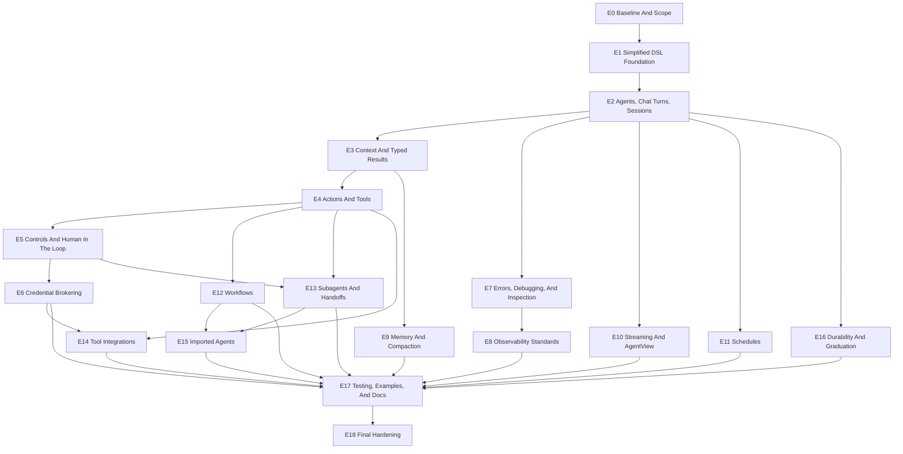

# Milestone V3: Simplified DSL And Feature Closure

This milestone turns the V2/V3 DSL direction into the canonical Jidoka surface,
then walks the `FEATURES.md` list in order and closes each feature with
implementation review, tests, docs, and a focused refactor pass.

## Milestone Goal

Ship a coherent V3 beta surface where:

- the DSL is simplified and internally consistent
- each feature in `FEATURES.md` is implemented, verified, and documented
- every feature has focused tests and a review/refactor pass
- examples and docs teach the same feature order as the README
- Jidoka remains a thin, friendly authoring layer over a solid runtime foundation

Jidoka is alpha/unreleased. V3 is a clean-surface milestone: prefer the final
shape over aliases, shims, migrations, or preserving old names.

## Operating Rules

- Work one epic at a time.
- Every feature epic starts with an audit of current behavior and test coverage.
- Every feature epic ends with a review/refactor task before the epic closes.
- Prefer deleting or collapsing concepts over carrying overlapping API names.
- Rename aggressively when a better noun clarifies the mental model.
- Do not add aliases for discarded DSL or public API names.
- Remove tests that only protect discarded behavior; replace them with
  tests for the final V3 contract.
- Keep beginner-facing docs dependency-light; mention lower-level foundations only
  when explaining graduation paths.
- Do not rebuild guides, examples, or Livebooks wholesale until the DSL foundation
  is stable.
- Keep each epic independently mergeable. Do not carry a multi-epic branch.
- Do not let docs wait until the end. Each feature epic updates the local docs
  stub or README wording it invalidates; E17 rebuilds the full teaching surface.
- Treat credential brokering, large catalogs, and durability as boundary-setting
  work unless a small implementation proves itself quickly.

## Plan Critique And Refinements

The first draft had the right feature order, but it was too linear. Some work
can and should proceed in parallel once the DSL foundation is stable:

- E7/E8 debugging and observability can run after E2 because they need the core
  turn model, not the whole feature set.
- E10 schedules and AgentView can run after sessions are stable.
- E12 workflows and E13 subagents/handoffs can run after actions and controls
  are stable, without waiting on memory or compaction.
- E6 credential brokering should be a decision gate. A safe data model and
  redaction contract is valuable even if full broker execution is deferred.
- E16 durability should be a graduation story first. Do not build a persistence
  layer in Jidoka unless the audit proves the lower-level runtime cannot cover
  the need cleanly.

The plan also needs stronger anti-scope controls:

- If an epic requires changing the underlying runtime, stop and write the
  upstream issue/PR plan before editing Jidoka around it.
- If a feature needs live provider calls, tests must still have a provider-free
  path and a clearly tagged live smoke test.
- If a refactor touches more than one feature area, split it into a prerequisite
  cleanup task or defer it to E18.
- If an API name is unclear after two review passes, prefer fewer nouns and a
  narrower feature over an alias.

## Phase Gates

Use these phase gates to avoid a "big rewrite, late proof" milestone.

### Gate A: DSL Freeze

Required epics: E0, E1.

Exit criteria:

- canonical DSL syntax is documented
- pre-V3 syntax is removed rather than carried forward
- generated agent API is stable enough for downstream epics
- compile-time error messages are source-aware and readable

### Gate B: Core Runtime Freeze

Required epics: E2, E3, E4, E5.

Exit criteria:

- `Jidoka.chat/3` remains the one public turn primitive
- session addressing, context, typed results, actions, and controls are stable
- human-in-the-loop is proven through controls and interrupts
- all feature epics can build on the same runtime contract

### Gate C: Operations And State Freeze

Required epics: E7, E8, E9, E10, E11.

Exit criteria:

- local debugging and production telemetry share correlation IDs
- memory and compaction are distinct and tested
- streaming, AgentView, and schedules work with sessions
- operational features are bounded, redacted, and inspectable

### Gate D: Orchestration And Portability Freeze

Required epics: E12, E13, E14, E15, E16.

Exit criteria:

- workflows, subagents, handoffs, integrations, imported agents, and durability
  graduation all fit the V3 DSL vocabulary
- any deferred credential/durability/catalog work has explicit contracts and
  follow-up issues

### Gate E: Teaching And Release Readiness

Required epics: E17, E18.

Exit criteria:

- README, examples, guides, and Livebooks teach the same progression
- every canonical example has a smoke test
- full verification passes
- remaining gaps are documented as post-V3 work

## Epic DAG



## Universal Feature Closure Checklist

Use this checklist inside every feature epic:

- Audit current modules, public API, DSL entities, docs, and tests.
- Classify the feature as `ship`, `reshape`, `document`, or `defer with
  contract`.
- Decide the ideal V3 shape first, then delete or rename anything that does not
  support it.
- Define the beginner mental model in one paragraph before changing code.
- Implement the smallest coherent feature surface.
- Add unit tests for parsing, validation, and public API behavior.
- Add runtime tests for success, failure, interruption, and edge cases.
- Add provider-free tests first; live-provider tests are optional and tagged.
- Add inspection/trace assertions when the feature affects runtime behavior.
- Update README/feature-map wording if the concept changes.
- Update or create one minimal example snippet for the feature.
- Run focused tests for the feature.
- Run `mix format --check-formatted`.
- Run `mix compile --warnings-as-errors`.
- Run `mix test` before closing the epic.
- Do a review/refactor pass: naming, file layout, cycles, large files, docs,
  confusing abstractions, and test quality.

## Epics And Tasks

### E0: Baseline And Scope

Purpose: establish the state of `main` before V3 work starts.

Tasks:

- Record current public API, DSL entities, and generated agent functions.
- Record current test coverage by feature area.
- Build a feature-to-test matrix from `FEATURES.md`.
- Record xref cycles, largest modules, and confusing naming hotspots.
- Record current docs/examples/Livebook coverage, even though these trees are
  being rebuilt.
- Record which tests require live providers and which are deterministic.
- Confirm which support trees stay deleted during the refactor.
- Create the V3 beadwork epic and child epics from this document.
- Define the release gate for the V3 beta branch.
- Add a short "V3 decision log" section to this document or beadwork root epic.

Done when:

- there is a baseline report attached to the beadwork epic
- the V3 epic DAG is represented in beadwork dependencies
- the feature-to-test matrix exists
- no implementation work starts without a baseline

### E1: Simplified DSL Foundation

Purpose: make the V3 DSL canonical before validating features.

Tasks:

- Implement `agent :id do ... end` as the primary entrypoint.
- Move agent-owned configuration inside `agent do` where it belongs.
- Keep tool/action definitions outside the agent block.
- Decide final nouns for agent, context, result, actions, controls, memory,
  compaction, schedules, workflows, subagents, handoffs, and imports.
- Collapse overlapping guardrail/hook/middleware concepts into `controls`.
- Define the operation return contract for controls.
- Define conditional control syntax:

  ```elixir
  operation MyApp.Controls.RequireApproval,
    when: [kind: :action, name: :refund_customer]
  ```

- Replace pre-V3 DSL terms in docs and tests.
- Remove dead verifiers/entities created only for discarded DSL shapes.
- Add compile-time validation tests for every supported DSL section.
- Add negative tests for ambiguous syntax that might confuse users.
- Review generated code and source-aware error messages.
- Run formatter support checks for the final DSL.

Done when:

- the simplified DSL is the only documented DSL
- pre-V3 DSL shapes are removed
- DSL tests cover success, failure, and error-message quality

### E2: Agents, Chat Turns, And Sessions

Purpose: finalize the core turn model.

Tasks:

- Verify agent identity, model aliases, instructions, and generated functions.
- Verify instructions and characters use one coherent "agent voice" story.
- Verify `Jidoka.chat/3` works for module, pid, id, and session targets.
- Verify `Jidoka.Session` is a plain descriptor, not a process or store.
- Confirm session context, conversation id, agent id, handoff owner, trace, and
  snapshot helpers.
- Remove any duplicate chat/session APIs that do not add value.
- Add tests for multi-turn behavior and session reuse.
- Add tests for invalid ids, invalid context, stopped agents, and missing agents.
- Review error shapes for beginner readability.
- Review process ownership docs for direct supervision, session-scoped runtime,
  and app-owned runtime.

Done when:

- `chat/3` is the one public turn primitive
- sessions are clearly addressing, not durability
- session and chat tests cover happy paths and edge cases

### E3: Context And Typed Results

Purpose: make runtime input and application-facing output feel obvious.

Tasks:

- Verify naked context maps work without a schema.
- Verify context schemas validate and normalize caller-provided context.
- Refine the naming distinction between context, agent state, memory, and
  compaction.
- Verify typed result DSL and runtime finalization.
- Decide whether public docs should say `result` while internal modules still
  use `output`, or whether code should rename to match the DSL.
- Verify output validation, repair, bypass, metadata, and guardrail ordering.
- Add tests for schema coercion, missing required context, malformed output,
  invalid repair, and `output: :raw`.
- Review generated `context/0`, `context_schema/0`, `output/0`, and
  `output_schema/0`.

Done when:

- new users can pass a naked map first and add schema later
- typed results are stable enough for app code
- context/result docs avoid conflating state, memory, and output

### E4: Actions And Tools

Purpose: finalize deterministic operations as the agent's capability surface.

Tasks:

- Standardize V3 naming around `action`; use `tool` only where model/provider
  terminology requires it.
- Verify action schemas, descriptions, names, and generated tool metadata.
- Decide where inline action/workflow definitions are allowed, if anywhere.
- Verify direct actions, workflows-as-tools, web tools, MCP tools, skills,
  plugins, and catalogs all fit the same mental model.
- Remove or hide low-level tool machinery from beginner docs.
- Add tests for duplicate names, invalid schemas, metadata rendering, and tool
  execution failures.
- Review file layout for action/tool adapters.

Done when:

- the public DSL reads as actions/capabilities, not plumbing
- all operation surfaces have consistent validation and inspection
- tests cover duplicate/invalid operation registration

### E5: Controls And Human In The Loop

Purpose: collapse hooks/guardrails/middleware into one teachable policy model.

Tasks:

- Design final V3 `controls do ... end` syntax.
- Replace input/output/tool guardrails with input/result/operation controls.
- Delete hook-like concepts unless they have a clear lifecycle purpose in the
  V3 model.
- Finalize control return types for allow, transform, block, interrupt, and
  error.
- Define control execution order and short-circuit semantics.
- Define how controls interact with typed results, retries, schedules,
  subagents, workflows, and handoffs.
- Make human-in-the-loop a named feature using interrupts and approvals.
- Add tests for input controls, operation controls, result controls, ordering,
  conditional matching, interruption, approval resume, and raising controls.
- Decide whether `Jidoka.Hook` and `Jidoka.Guardrail` modules are deleted,
  renamed, or made private implementation details.

Done when:

- Controls are the one public policy concept
- human-in-the-loop is demonstrated without new runtime machinery
- raising controls cannot crash the agent process

### E6: Credential Brokering

Purpose: plan and implement the first secure credential boundary.

Tasks:

- Decide whether V3 ships full credential brokering or only the data model and
  control hooks. Prefer interface contract over unsafe execution.
- Define credential reference fields: provider, account, actor, tenant, scopes,
  lease id, expires at, risk, confirmation requirement, and audit metadata.
- Ensure raw secrets never enter prompts, transcripts, traces, or tool args.
- Add control matching for credential metadata.
- Add tracing that records credential references without secret values.
- Add tests for redaction, context merging, audit metadata, and blocked
  credential use.
- Add a negative test that intentionally passes a raw secret and proves the
  system redacts or rejects it.
- Document how brokers/proxies/connect layers inject real credentials at
  execution time.

Done when:

- credential brokering has either a working minimal implementation or a
  deliberately documented interface contract with follow-up issues
- the security invariant is tested: no raw credential values leak

### E7: Errors, Debugging, And Inspection

Purpose: make local runtime debugging a product feature.

Tasks:

- Audit `Jidoka.Error` categories and ensure user-facing errors are normalized.
- Verify `inspect_agent`, `inspect_request`, `inspect_trace`,
  `inspect_compaction`, and AgentView snapshots.
- Add prompt-preview inspection if missing or incomplete.
- Add call graph, timeline, request summary, and state/context projections.
- Ensure inspection output is bounded and redacted.
- Ensure errors include enough context for debugging without leaking prompts,
  raw provider responses, or secrets.
- Add tests for missing agents, running agents, completed requests, interrupted
  requests, failed requests, and redaction.
- Review Kino helpers for beginner use.

Done when:

- users can answer what happened in a turn without reading logs
- errors are normalized, readable, and safe to display
- debugging output is structured, bounded, and safe by default

### E8: Observability Standards

Purpose: align production telemetry with standards-friendly backends.

Tasks:

- Audit emitted telemetry and trace metadata.
- Verify correlation IDs: session, conversation, request, run, trace, span.
- Verify model/action/request events align with the underlying telemetry
  foundation.
- Document how host apps attach exporters without making it a beginner concern.
- Add tests for emitted event metadata and redaction.
- Add tests that correlation fields are stable across chat, action, control,
  workflow, subagent, handoff, schedule, memory, and compaction events.
- Add an integration smoke test that can run without external services.

Done when:

- local Jidoka traces and production telemetry share correlation fields
- observability docs remain standards-friendly and dependency-light

### E9: Memory And Compaction

Purpose: keep state helpers distinct and understandable.

Tasks:

- Audit memory capture, retrieval, namespace, shared namespace, and inspection.
- Audit compaction modes, thresholding, prompt override, manual compaction, and
  provider-facing message trimming.
- Decide whether memory configuration lives under `agent` in V3 and which manual
  memory APIs belong in the public surface.
- Verify memory recalls facts while compaction manages prompt-window pressure.
- Add tests for memory capture/retrieve, namespace validation, compaction skip,
  compaction summarize, retained tail, boundary safety, failure-open behavior,
  and custom prompt behavior.
- Review redaction and summary previews.

Done when:

- memory and compaction have separate, crisp docs and tests
- compaction does not mutate the canonical transcript

### E10: Streaming And AgentView

Purpose: finalize UI-facing runtime projection.

Tasks:

- Verify `chat_stream/3`, `stream: true`, stream await, and error behavior.
- Verify AgentView default projections for sessions, pids, raw agents, and
  custom view modules.
- Decide whether `AgentView` should be renamed or repositioned for beginner
  clarity.
- Add tests for streaming chunks, completion, failure, cancellation, and
  projection consistency.
- Review Phoenix/LiveView guidance for process ownership and UI state.
- Ensure AgentView is projection-only and not a second persistence layer.

Done when:

- streaming and AgentView support a clean UI story
- projected state matches the canonical runtime state

### E11: Schedules

Purpose: finalize first-class scheduled agent/workflow runs.

Tasks:

- Verify schedule DSL placement and generated schedule metadata.
- Decide whether schedule definitions live inside `agent :id do ... end` in V3.
- Verify manual run, recurring run, cancellation, listing, history, and error
  handling.
- Verify schedules accept sessions as targets.
- Add tests for prompt requirement, context merging, timezone handling,
  duplicate ids, disabled schedules, and failed runs.
- Review whether schedule manager state needs durability hooks or explicit
  non-durability docs.

Done when:

- schedules are clearly first-class Jidoka features
- tests cover agent targets, session targets, and workflow targets

### E12: Workflows

Purpose: finalize deterministic multi-step processes.

Tasks:

- Audit workflow DSL and relationship to agent tools.
- Decide whether workflow syntax should mirror action syntax or remain a
  separate `use Jidoka.Workflow` surface.
- Verify workflow steps execute in order and expose the workflow as an action.
- Verify functions, tools, agents, imported agents, context, inputs, outputs,
  and failure handling.
- Add tests for dependency ordering, cycles, missing refs, partial failures,
  context propagation, and trace events.
- Review whether workflow terminology needs simplification for beginners.

Done when:

- workflows are deterministic and testable without model calls
- workflow-as-action execution is documented and verified

### E13: Subagents And Handoffs

Purpose: finalize delegation and ownership transfer.

Tasks:

- Verify subagent calls, context forwarding, peer/runtime start behavior,
  timeout/error handling, and trace events.
- Verify handoff ownership, reset, routing, session integration, and future-turn
  behavior.
- Add tests for missing child agent, failed child start, child interrupt,
  invalid return, forwarding modes, and handoff reset.
- Add tests for human-in-the-loop interactions across subagent and handoff
  boundaries.
- Review language: subagent is bounded delegation; handoff is conversation
  ownership transfer.

Done when:

- delegation and ownership transfer are separate concepts in code and docs
- handoff routing works cleanly with sessions

### E14: Tool Integrations

Purpose: finalize external capability integration.

Tasks:

- Audit Ash actions, web tools, MCP tools, skills, plugins, and catalog/connect
  integration points.
- Split integrations into `core`, `extension`, and `external package` buckets.
- Verify each integration can be tested without live external services.
- Add tests for safe URL handling, MCP sync metadata, skill load paths, plugin
  registration, and adapter failure.
- Define how catalogs scale tool discovery without loading every tool into the
  prompt.
- Review which integrations belong in core Jidoka versus companion packages.

Done when:

- core integrations are tested and safe by default
- large catalog support has a clear extension boundary
- anything that should move to a companion package has an issue or explicit
  contract

### E15: Imported Agents

Purpose: finalize portable agent specs and registries.

Tasks:

- Verify JSON/YAML codec round-trips every supported feature.
- Decide whether imported specs are part of V3 beta or should be marked
  experimental until the DSL settles.
- Verify registry mapping for actions, subagents, workflows, handoffs, and
  output schemas.
- Add tests for registry collisions, unsafe modules, unsupported specs,
  structured output, compaction, memory, and YAML parity.
- Review generated module naming and cleanup behavior.
- Document imported agents as constrained portability, not arbitrary code
  loading.

Done when:

- JSON and YAML import/export preserve the supported contract
- registries are explicit, safe, and collision-resistant

### E16: Durability And Graduation

Purpose: make the persistence boundary honest and useful.

Tasks:

- Document what Jidoka owns: session addressing, runtime context, inspection,
  tracing, and compaction snapshots.
- Document what durable runtime storage owns: process restore, journals,
  checkpoints, hibernate/thaw, and storage adapters.
- Verify generated `runtime_module/0` supports the graduation story.
- Add tests or examples that prove a Jidoka-authored agent can run in an
  app-owned durable runtime.
- Decide whether Jidoka needs thin adapter helpers or docs are enough for V3.
- Add a negative statement: Jidoka does not own durable transcript storage in V3
  unless a separate durability epic is created.

Done when:

- users understand when sessions stop being enough
- the graduation path is tested or explicitly documented as a runtime concern
- no public API implies session persistence unless it exists

### E17: Testing, Examples, And Docs

Purpose: rebuild the teaching surface after the implementation settles.

Tasks:

- Build a V3 testing guide around contract, context, action, control, result,
  workflow, trace, schedule, and live-provider tests.
- Rebuild examples in the `FEATURES.md` teaching order.
- Rebuild Livebooks only after the DSL is stable.
- Keep every example minimal and feature-focused; avoid restoring a large demo
  tree until the final DSL proves itself.
- Add smoke tests for each canonical example.
- Add one advanced "kitchen sink" Livebook after all feature docs are stable.
- Add docs for test doubles, deterministic actions, trace assertions, and
  provider-gated live tests.

Done when:

- docs, examples, and Livebooks teach the same progression
- every shipped example has an automated smoke test

### E18: Final Hardening

Purpose: close the milestone with a full-package review.

Tasks:

- Run full verification:
  - `mix format --check-formatted`
  - `mix compile --warnings-as-errors`
  - `mix test`
  - `mix doctor --raise`
- Run coverage and identify remaining weak areas.
- Run xref cycle checks and clean remaining cycles where practical.
- Run Credo/custom checks if configured.
- Run docs build with warnings as errors.
- Run a package build dry run if Hex/package metadata is in scope.
- Review docs for dependency-heavy language, stale examples, and naming drift.
- Review public API docs and ExDoc groups.
- Review package metadata and Hex readiness separately from feature readiness.

Done when:

- all verification passes
- remaining known gaps are documented as post-V3 work
- the package has one coherent V3 story from README to tests

## Beadwork Loading Plan

Create one root epic, then create each epic above as a child. Add dependency
edges matching the DAG.

Do not load every bullet as a beadwork issue at once. Start with one epic issue
per E-number. For the current active epic, create 3-6 child tasks:

- audit and decision record
- implementation/refactor
- tests
- docs/examples
- review/refactor gate

This keeps beadwork useful without creating a hundred stale tickets before the
DSL shape settles.

Suggested titles:

- `V3: simplified DSL and feature closure`
- `V3 E0: Baseline and scope`
- `V3 E1: Simplified DSL foundation`
- `V3 E2: Agents, chat turns, and sessions`
- `V3 E3: Context and typed results`
- `V3 E4: Actions and tools`
- `V3 E5: Controls and human in the loop`
- `V3 E6: Credential brokering`
- `V3 E7: Errors, debugging, and inspection`
- `V3 E8: Observability standards`
- `V3 E9: Memory and compaction`
- `V3 E10: Streaming and AgentView`
- `V3 E11: Schedules`
- `V3 E12: Workflows`
- `V3 E13: Subagents and handoffs`
- `V3 E14: Tool integrations`
- `V3 E15: Imported agents`
- `V3 E16: Durability and graduation`
- `V3 E17: Testing, examples, and docs`
- `V3 E18: Final hardening`

Suggested dependency edges:

```text
E0 blocks E1
E1 blocks E2
E2 blocks E3
E3 blocks E4
E4 blocks E5
E5 blocks E6
E2 blocks E7
E7 blocks E8
E3 blocks E9
E2 blocks E10
E2 blocks E11
E4 blocks E12
E4 blocks E13
E5 blocks E13
E4 blocks E14
E6 blocks E14
E12 blocks E15
E13 blocks E15
E2 blocks E16
E6 blocks E17
E8 blocks E17
E9 blocks E17
E10 blocks E17
E11 blocks E17
E12 blocks E17
E13 blocks E17
E14 blocks E17
E15 blocks E17
E16 blocks E17
E17 blocks E18
```

For each epic, create child tasks from that epic's task list. The review/refactor
task should be the final child task for every epic.

## Risk Register

## V3 Decision Log

- V3 is a clean-surface milestone. No aliases, shims, or migrations for
  discarded alpha APIs or DSL shapes.
- `Jidoka.chat/3` remains the public turn primitive unless E2 proves a smaller
  or clearer surface.
- `Jidoka.Session` is conversation addressing, not durable storage.
- Controls are the intended public policy noun. Hooks and guardrails are
  candidates for deletion, renaming, or private implementation details.
- Memory configuration belongs inside `agent :id do ... end` in the V3 DSL.
  Memory is part of how an agent maintains continuity, not a generic lifecycle
  callback block.
- Jidoka should not add public manual `remember`/`recall` APIs for V3. The
  public surface is declarative memory config, generated `Agent.memory/0`
  metadata, request/agent inspection, and trace events. Manual memory writes,
  deletes, and semantic searches belong to the configured memory store or the
  lower-level runtime boundary.
- Memory retrieval is a before-turn dependency and may fail the request when
  the configured namespace/store cannot be read. Memory capture is after-turn
  bookkeeping and must not fail an already completed request; capture problems
  belong in request metadata, traces, and inspection.
- Compaction remains a Jidoka-owned manual API because it is a deterministic
  runtime maintenance operation over the agent transcript. V3 keeps
  `Jidoka.compact/2` and `Jidoka.inspect_compaction/2`; automatic compaction
  stays fail-open and must only trim provider-facing messages, never the
  canonical thread.
- Credential brokering must prove the no-secret-leak invariant before shipping
  execution behavior.
- Durability is a graduation path unless a separate persistence implementation
  is created and tested.
- The old `dev`, `examples`, `guides`, and `livebook` trees stay deleted until
  the V3 DSL and core runtime freeze.

### R1: The DSL Rewrite Expands Into Runtime Rewrite

Risk: V3 starts changing lower-level runtime behavior instead of simplifying the
Jidoka authoring surface.

Mitigation: Any lower-level runtime change requires an upstream issue/PR plan
before Jidoka code adapts around it.

### R2: Controls Become A Bigger Concept Than Hooks And Guardrails

Risk: `controls` collapses terminology but expands semantics, making the system
harder to understand.

Mitigation: Controls only get three beginner-facing insertion points: input,
operation, and result. Everything else must justify itself as advanced runtime
plumbing or be removed.

### R3: Credential Brokering Ships Too Early

Risk: a partial broker gives a false sense of security.

Mitigation: V3 may ship only credential references, redaction guarantees,
control matching, tracing metadata, and integration boundaries. Real secret
injection can remain a companion-layer responsibility until proven.

### R4: Durability Story Is Mistaken For Durability Feature

Risk: users think `Jidoka.Session` persists conversations.

Mitigation: docs and APIs must say sessions are addresses. Durable storage is a
graduation path unless a separate persistence layer is explicitly built and
tested.

### R5: Examples Reintroduce Old Complexity

Risk: rebuilding examples restores the same kitchen-sink sprawl that this
refactor is trying to clear.

Mitigation: each example teaches one primary feature, has a smoke test, and uses
the same DSL vocabulary as README. The kitchen sink is last and advanced-only.

### R6: Tests Overfit Implementation Details

Risk: tests lock in current internals while the DSL is still moving.

Mitigation: each epic has contract tests at the public API/DSL boundary and only
uses internal assertions for safety invariants, redaction, ordering, or
observability fields.

### R7: Live Provider Tests Become Required For Confidence

Risk: the suite depends on API keys or network behavior.

Mitigation: every feature must have provider-free tests. Live provider checks
are tagged smoke tests, not the primary correctness proof.
