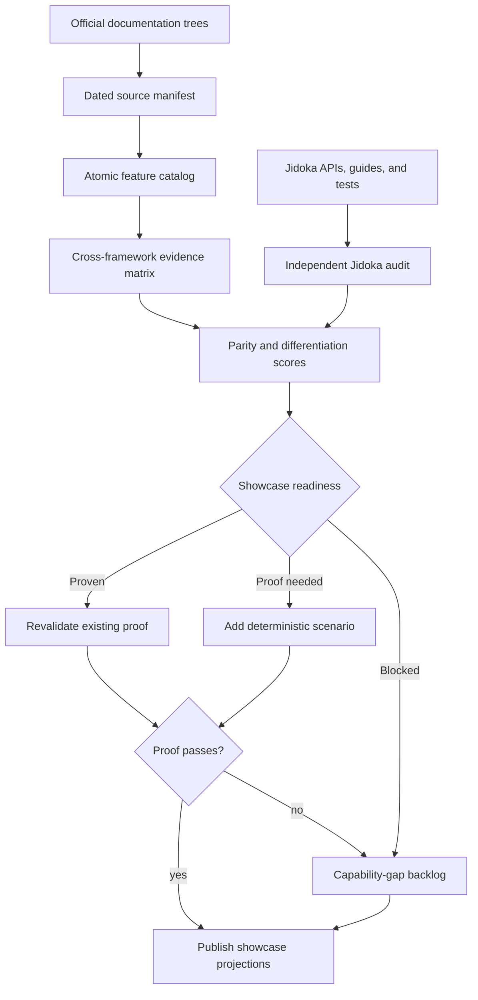
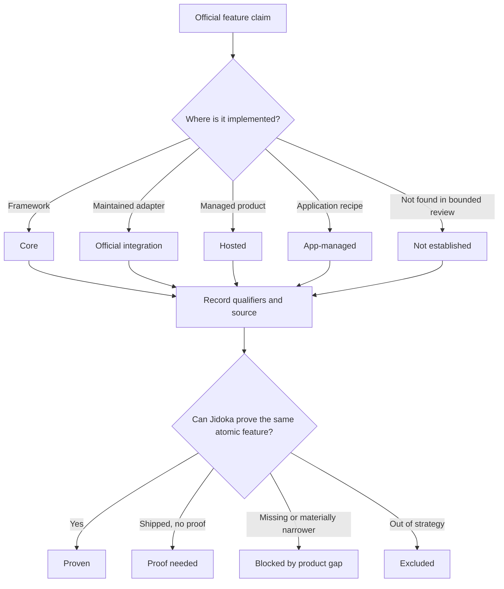

# feat: Build the agent framework parity showcase

## Summary

Build a source-backed map of agent-framework features, rank the best Jidoka
showcase opportunities, and turn the first showcase wave into deterministic,
use-case-driven examples with evidence that proves each capability ran.

---

## Problem Frame

`JIDOKA_V2.md` has a useful framework-level comparison, but its cells are too
broad to choose examples safely. Terms such as workflow, memory, durability,
human-in-the-loop, multi-agent, tracing, and MCP conceal different semantics
across Mastra, LangGraph/LangChain, Pydantic AI, OpenAI Agents SDK, Google ADK,
LlamaIndex/LlamaAgents, and AutoGen.

Jidoka already has ten runnable Phoenix examples, four Livebooks, and a strong
provider-free integration-test surface. The missing layer is a dated evidence
catalog that connects atomic competitor features to Jidoka capability status,
proof locations, showcase readiness, and priority. Without that layer, a model
response or a broad feature label can be mistaken for demonstrated parity.

The work should select examples from evidence, reuse the current example
ladder, and preserve the package's functional-core/effect-shell boundary. It
should not add product capabilities merely to make the matrix look complete.

---

## Requirements

### Research and evidence

- R1. Review the public feature documentation for the seven named framework
  ecosystems against recorded taxonomy and navigation boundaries, and record
  every relevant official page within those boundaries in a dated source
  manifest, including the product, package, language, docs channel or version,
  access tier, canonical effective URL, publisher-controlled domain, page title,
  supporting heading or anchor, access date, per-source freshness, and any
  intentionally skipped duplicate API references.
- R2. Normalize broad framework concepts into atomic features with stable IDs,
  separating semantic collisions such as MCP client/server, session
  history/checkpoint state/semantic memory, and serializable state/crash-safe
  execution.
- R3. Classify each evidence record as Core, Official integration, Hosted,
  App-managed, or Not established; a single feature/package cell may retain
  multiple records when core and hosted surfaces differ.
- R4. Link every positive or partial claim to official documentation and attach
  a qualifier for preview status, language limits, external services, or paid
  tiers when applicable.
- R5. Treat Not established as a bounded research result as of the review date,
  never as proof that a framework does not support the feature; an unreachable
  or conflicting page must be marked for revalidation instead.

### Jidoka comparison and prioritization

- R6. Audit Jidoka independently from competitor terminology using current
  public APIs, guides, projections, tests, and runnable examples as evidence.
- R7. Record Jidoka capability status separately from showcase readiness so a
  shipped contract, production-grade implementation, and teachable proof are
  not conflated.
- R8. Produce reproducible parity and differentiation rankings from visible
  factor scores rather than an unexplained priority label.
- R9. Map every high-priority feature to an existing proof, a proof that must be
  added, an explicit product gap, or an exclusion with rationale.
- R10. Keep framework/library features separate from companion packages and
  hosted platforms throughout the matrix and rankings.

### Showcase execution

- R11. Build consolidated, use-case-driven Jidoka scenarios rather than one
  route per competitor tutorial or matrix row.
- R12. Prefer hardening existing Phoenix examples, Livebooks, and integration
  tests before introducing a new route.
- R13. Prove showcased behavior with operation results, journals, events,
  snapshots, persisted memory, ownership state, or stable inspection
  projections exposed through public APIs; model-authored prose and private
  runtime fields are not proof.
- R14. Keep every showcase scenario deterministic with injected model and
  operation capabilities, while leaving live-provider execution optional.
- R15. Update the architecture comparison and Agent Ladder only after their
  claims are backed by the canonical evidence map and deterministic proof; a
  failed scenario must demote or exclude the claim before publication.

---

## Scope Boundaries

### In scope

- Official documentation for Mastra, LangGraph/LangChain, Pydantic AI, OpenAI
  Agents SDK, Google ADK, LlamaIndex/LlamaAgents Workflows, and AutoGen
  AgentChat/Core.
- Agent authoring, execution, workflows, tools/protocols, multi-agent models,
  state/memory, safety/review, observability/evals, runtime/deployment, and
  developer tooling.
- A canonical research artifact, two priority rankings, showcase waves, and a
  capability-gap backlog.
- Deterministic proof for the first showcase wave using the existing example
  app, Livebooks, and integration-test conventions.

### Deferred to follow-up work

- Adding more frameworks after the initial taxonomy stabilizes.
- Automating source crawling, link freshness, or scheduled re-scoring.
- Performance, throughput, ecosystem-size, security, and developer-experience
  benchmarks beyond feature support evidence.
- Implementing production database storage, OpenTelemetry export, workflow
  durability, semantic memory, richer eval infrastructure, managed deployment,
  or a Studio-class UI.

### Outside this work

- Marketing claims based on raw feature counts.
- One-to-one ports of vendor tutorials.
- New core runtime branches that bypass `Jidoka.Effect.Intent` and
  `Jidoka.Runtime.EffectInterpreter`.
- Treating roadmap prose, a model's final answer, or a serialized struct alone
  as proof of operational parity.

---

## Key Technical Decisions

- KTD1. **Keep evidence records separate from derived views.**
  `docs/research/agent-framework-feature-map.md` will own atomic features,
  framework claims and sources, the independent Jidoka audit, and executable
  proof references. Matrices, scores, and showcase waves are derived views;
  `JIDOKA_V2.md` remains a concise projection rather than a second authority.
- KTD2. **Use stable atomic feature IDs with an invalidation lifecycle.** The
  cross-framework matrix will stay scannable while an adjacent evidence
  register carries semantics, limitations, URLs, and per-claim freshness.
  Feature splits or merges deprecate IDs and name successors; unreachable,
  superseded, stale, or conflicting evidence invalidates dependent cells and
  rankings until reverified.
- KTD3. **Classify implementation locus, not perceived quality.** Core,
  Official integration, Hosted, App-managed, and Not established identify
  where behavior lives. Maturity and limitations remain explicit qualifiers.
- KTD4. **Use a second state machine for Jidoka proof.** Jidoka capability
  status will be Shipped core, Official adapter, App-managed, Partial, or Not
  established; showcase readiness will be Proven, Proof needed, Blocked by
  product gap, or Excluded. Proven is reserved for deterministic execution
  through public results, journals, events, cursors, inspection, and stable
  projections.
- KTD5. **Maintain two rankings.** Parity priority will combine prevalence,
  developer value, demo clarity, Jidoka readiness, and demonstration cost.
  Differentiation priority will combine strategic fit, distinctiveness, proof
  strength, Jidoka readiness, and demonstration cost. Every factor uses a
  documented 1-5 rubric; the totals are the sum of positive factors minus
  cost.
- KTD6. **Treat the showcase as a suite.** Focused Phoenix routes teach use
  cases, Livebooks expose inspectable contracts, and provider-free tests prove
  semantics. The Kitchen Sink remains an integration stress surface rather
  than the onboarding example.
- KTD7. **Derive proof from runtime evidence.** A selected feature must map to
  an assertion over effects, operations, events, snapshots, memory, handoff
  state, or stable projections. Structured output may summarize that evidence
  but cannot create it. A failed proof updates the two Jidoka axes separately:
  capability becomes Partial only when runtime evidence proves materially
  narrower behavior; readiness becomes Proof needed when proof is incomplete,
  Blocked by product gap when behavior is missing or narrower, or Excluded when
  the feature is out of strategy. Only passing proof sets readiness to Proven.
  Any required core correction becomes separately scoped follow-up work rather
  than an example-layer emulation.
- KTD8. **Start with capabilities already supported by the evidence.** The
  initial showcase wave targets resumable operation approval, deterministic
  workflows, bounded delegation versus ownership handoff, MCP consumption, and
  session/memory continuity. Structured-result repair and trace/replay/eval
  follow as the next proof wave.
- KTD9. **Publish through a final parity gate.** The evidence map is
  authoritative for semantics, classification, readiness, and ranking;
  deterministic tests are authoritative for Jidoka execution. Architecture,
  Agent Ladder, README, Phoenix, and Livebook claims may publish only the same
  feature ID, semantics, qualifier, readiness, and proof reference.

---

## High-Level Technical Design

The evidence pipeline keeps external claims, Jidoka capability audit, priority
decisions, and runnable proof as separate stages.

Each feature/package claim passes through an implementation-locus decision
before it enters the matrix. Jidoka then passes through an independent proof
gate.

---

## Implementation Units

### U1. Establish the canonical feature catalog and source manifest

- **Goal:** Create the durable research artifact and define the atomic feature
  vocabulary before assigning framework support.
- **Requirements:** R1-R5, R10
- **Dependencies:** None
- **Files:**
  - `docs/research/agent-framework-feature-map.md` (new)
- **Approach:** Traverse each official documentation tree by feature section,
  record the reviewed page manifest, and normalize findings into stable feature
  IDs grouped by authoring/data, execution, workflow, tools/protocols,
  multi-agent, state, safety, observability/evals, and operations/product.
  API-reference pages that repeat an already reviewed semantic contract may be
  listed as intentionally skipped rather than reread without purpose. Record
  freshness per source and claim as current, needs revalidation, superseded,
  unreachable, or conflicting; never advance one global date when only one
  ecosystem was refreshed. Reject unexpected cross-domain redirects, and mark
  dependent claims for revalidation when the recorded supporting heading or
  anchor disappears or materially changes. For each ecosystem, record the
  official documentation roots, included navigation sections, discovery depth,
  taxonomy-based relevance rules, duplicate-exclusion rules, and review cutoff
  timestamp. Resolve every section on a completion checklist as complete, not
  applicable, intentionally skipped as duplicate, inaccessible, or deferred
  with rationale.
- **Patterns to follow:** The terminology discipline in `guides/glossary.md`,
  the evidence labels in `JIDOKA_V2.md`, and the historical taxonomy available
  from `4802bef5^:FEATURES.md`.
- **Test expectation:** None -- this unit produces a reviewed research artifact,
  not executable behavior.
- **Verification:** Every ecosystem has a dated source manifest, every taxonomy
  entry is atomic enough to avoid the documented terminology collisions, and
  every omission is explicit. Every completion-checklist entry is resolved,
  deprecated feature IDs point to their successors, and no stale source silently
  leaves dependent cells current.

### U2. Populate the evidence matrix and priority rankings

- **Goal:** Convert the reviewed sources and Jidoka audit into a reproducible
  comparison and ordered showcase opportunities.
- **Requirements:** R3-R10
- **Dependencies:** U1
- **Files:**
  - `docs/research/agent-framework-feature-map.md`
- **Approach:** Add compact cross-framework matrices, an evidence register with
  qualifiers and official URLs, separate Jidoka capability/readiness columns,
  the scoring rubrics, raw factor values, parity and differentiation totals,
  and an ordered capability-gap backlog. Treat matrices and rankings as views
  derived from claim-level evidence, not as evidence themselves.
- **Patterns to follow:** `JIDOKA_V2.md` matrix v0.1 and the Core/Extension/
  External-package boundary from the historical feature map.
- **Test expectation:** None -- scoring and classification receive source review
  rather than executable tests.
- **Verification:** Every non-empty cell resolves to dated evidence, hosted
  behavior is never attributed to an open-source core, each score can be
  recomputed from visible factors, invalid evidence stales dependent scores,
  and Jidoka gaps cannot rank as ready to show.

### U3. Turn the rankings into a showcase roadmap

- **Goal:** Map the highest-value atomic features to consolidated Jidoka use
  cases and explicit proof targets.
- **Requirements:** R7-R12, R15
- **Dependencies:** U2
- **Files:**
  - `docs/research/agent-framework-feature-map.md`
- **Approach:** Define showcase waves that name the feature IDs, user-facing use
  case, Jidoka surface, current route/Livebook/test, readiness state, missing
  proof, and product gaps. Add a disposition register for every feature above
  the documented high-priority threshold, including unselected features; each
  must map to existing proof, proof to add, a product gap, or exclusion with
  rationale. Reuse Approval, Knowledge, Memory, Kitchen Sink, and workflow
  Livebook surfaces for the initial wave. Keep this mapping internal to the
  evidence artifact until its selected proofs pass. Add a focused route only
  when an existing surface cannot teach the capability clearly.
- **Patterns to follow:** The one-capability-at-a-time teaching rules and parity
  map in `example/AGENT_LADDER.md`.
- **Test expectation:** None -- this unit maps researched priorities to planned
  proof and documentation.
- **Verification:** Every high-priority feature has a recorded disposition;
  every selected feature has one teaching home and one proof location, every
  blocked feature remains a gap, and no competitor-specific clone route is
  introduced.

### U4. Prove resumable approval and replay safety

- **Goal:** Demonstrate portable operation review, snapshot round-trip, exact
  pending-intent resume, and duplicate-effect protection without implying a
  production durability guarantee.
- **Requirements:** R11-R14
- **Dependencies:** U3
- **Files:**
  - `example/lib/jidoka_example/approval_agent/agent.ex`
  - `example/lib/jidoka_example/approval_agent/actions/issue_refund.ex`
  - `example/lib/jidoka_example_web/live/approval_agent_live/index.ex`
  - `example/test/approval_agent_test.exs` (new)
  - `example/test/support/kitchen_sink_support.ex`
  - `example/test/kitchen_sink_agent_flow_test.exs`
- **Approach:** Extend the existing example and deterministic support rather
  than adding a store. Prove behavior only through public review APIs, snapshot
  codecs, results, journals, events, cursors, and stable inspection projections.
  Add an observable action-call signal so journal state and the actual side
  effect count agree.
- **Execution note:** Start with scenarios that fail if the refund executes
  before approval, after denial, or more than once after resume.
- **Patterns to follow:** `test/integration/human_in_the_loop_integration_test.exs`,
  `test/integration/operation_idempotency_integration_test.exs`, and
  `example/test/kitchen_sink_agent_flow_test.exs`.
- **Test scenarios:**
  - A refund request hibernates with one projected review request, one pending
    journaled intent, and no operation result or action call.
  - Encoding and decoding the snapshot preserves the same review identity,
    cursor, pending intent, and replay-safe journal projection.
  - Approving the matching review executes one action call and records one
    operation result; replay or repeated resume does not increase either count.
  - Denied, expired, stale, and mismatched responses execute zero action calls
    and return their typed failures.
  - The example describes snapshot resume and in-memory storage without claiming
    process-independent database durability.
- **Verification:** The focused example test and Kitchen Sink regression prove
  each transition through public runtime evidence with no provider credentials.

### U5. Prove deterministic workflow composition

- **Goal:** Demonstrate branch, fan-out/fan-in, reduce, bounded retry, and
  workflow-as-tool semantics in one deterministic business workflow.
- **Requirements:** R2, R11-R14
- **Dependencies:** U3
- **Files:**
  - `example/lib/jidoka_example/kitchen_sink_agent/workflows/feature_summary_workflow.ex`
  - `example/test/workflow_showcase_test.exs` (new)
  - `example/test/kitchen_sink_agent_flow_test.exs`
  - `livebook/04_workflows.livemd`
- **Approach:** Deepen the existing workflow example rather than claim graph
  parity from a one-step workflow. Keep direct execution and workflow-as-tool
  output equivalent, and let the focused test prove individual semantics while
  Kitchen Sink verifies composition.
- **Execution note:** Write the branch, empty-input, ordering, and retry-bound
  scenarios before changing the workflow or notebook.
- **Patterns to follow:** `test/jidoka/workflow_dsl_test.exs`,
  `test/jidoka/workflow_test.exs`, and `livebook/04_workflows.livemd`.
- **Test scenarios:**
  - Both gate outcomes select only their eligible branch, and an empty fan-out
    produces the declared empty reduction rather than hanging or inventing data.
  - Fan-in/reduce output is stable for the same inputs even when branch
    completion order varies.
  - A transient step succeeds on its declared retry attempt, while a permanent
    failure stops exactly at the configured retry bound.
  - Direct execution and workflow-as-tool execution return equivalent typed
    output; the agent path records exactly one workflow operation result.
  - The Livebook visibly exercises the same branch, fan-out, reduce, and retry
    semantics rather than only naming them.
- **Verification:** Each claimed workflow leaf feature has a focused
  provider-free assertion and an inspectable notebook section.

### U6. Prove bounded structured-result repair

- **Goal:** Demonstrate validation feedback, bounded repair, typed success, and
  deterministic failure as a separate table-stakes capability.
- **Requirements:** R11-R14
- **Dependencies:** U3
- **Files:**
  - `example/lib/jidoka_example/lead_quality_agent/agent.ex`
  - `example/test/lead_quality_agent_test.exs` (new)
- **Approach:** Keep the Lead Quality use case and inject a scripted model that
  first returns an invalid app-facing value. Assert repair through public result
  events and the final typed value rather than raw provider payload fields.
- **Execution note:** Start with the invalid-first response and exhausted-bound
  cases before changing example copy.
- **Patterns to follow:** `test/integration/structured_result_integration_test.exs`
  and `guides/structured-results.md`.
- **Test scenarios:**
  - An invalid structured value emits repair evidence, receives validation
    feedback, and returns the corrected typed result on the next allowed attempt.
  - A valid first response performs no repair turn.
  - Exhausting the repair bound returns the typed result-phase error and never
    exposes the invalid value as a successful result.
- **Verification:** The focused test proves repair count, events, and typed
  result behavior without a live provider.

### U7. Prove session history and scoped memory continuity

- **Goal:** Demonstrate conversation continuation and memory recall as separate
  concepts, with isolation and storage limits visible.
- **Requirements:** R2, R11-R14
- **Dependencies:** U3
- **Files:**
  - `example/lib/jidoka_example/memory_agent/agent.ex`
  - `example/lib/jidoka_example/memory_agent/memory.ex`
  - `example/lib/jidoka_example_web/live/memory_agent_live/index.ex`
  - `example/test/memory_agent_test.exs` (new)
- **Approach:** Reuse the public session and memory-store boundaries, reset the
  ETS-backed example state between cases, and label the example's in-memory
  backend without implying semantic retrieval or production persistence.
- **Execution note:** Characterize session history and memory recall in separate
  assertions before changing the UI explanation.
- **Patterns to follow:** `test/integration/harness_session_integration_test.exs`,
  `test/jidoka/memory_test.exs`, and `guides/memory.md`.
- **Test scenarios:**
  - A second turn receives the first turn's conversation history without a
    memory write being required.
  - A stored preference is recalled for the same session and visibly contributes
    before prompt assembly.
  - Another session receives neither the first session's transcript nor its
    scoped memory entry.
  - Test cleanup removes global ETS state so execution order cannot create a
    false continuity result.
- **Verification:** The focused test distinguishes session data, memory data,
  and storage implementation while proving cross-session isolation.

### U8. Prove multi-agent ownership and MCP consumption

- **Goal:** Demonstrate bounded subagent return, future-turn handoff ownership,
  and MCP client tools without collapsing them into one orchestration claim.
- **Requirements:** R2, R11-R14
- **Dependencies:** U3
- **Files:**
  - `example/lib/jidoka_example/knowledge_agent/agent.ex`
  - `example/lib/jidoka_example/kitchen_sink_agent/agent.ex`
  - `example/test/knowledge_agent_test.exs`
  - `example/test/kitchen_sink_agent_flow_test.exs`
- **Approach:** Keep Knowledge focused on MCP consumption through the ordinary
  operation path. Use Kitchen Sink to prove the difference between a child
  result and a handoff record, including the application's responsibility to
  consult the owner store before a future turn.
- **Execution note:** Write ownership and failure assertions before changing
  structured showcase output.
- **Patterns to follow:** `test/integration/operation_source_integration_test.exs`,
  `test/jidoka/subagent_test.exs`, `test/jidoka/handoff_test.exs`, and
  `example/test/kitchen_sink_agent_flow_test.exs`.
- **Test scenarios:**
  - A subagent returns one bounded specialist result and leaves the handoff owner
    store unchanged.
  - A handoff records the target owner and only whitelisted public context.
  - A subsequent call remains with the current agent unless application routing
    explicitly consults the owner store.
  - MCP discovery contributes the expected operation, and invoking it produces
    an ordinary journaled operation result alongside a native Jido action.
  - MCP failure is normalized and creates neither a successful operation result
    nor a false tool observation.
- **Verification:** Focused and Kitchen Sink tests prove each ownership/protocol
  feature separately through public results and stores.

### U9. Prove trace, replay, and deterministic evaluation

- **Goal:** Demonstrate local observability and evaluation without implying an
  OpenTelemetry exporter, hosted trace product, dataset service, or LLM judge.
- **Requirements:** R7-R9, R13-R14
- **Dependencies:** U3
- **Files:**
  - `livebook/03_import_eval_and_trace.livemd`
  - `test/integration/showcase_trace_eval_integration_test.exs` (new)
- **Approach:** Back the notebook's semantic flow with one focused integration
  scenario that uses the same public projections and fake capabilities. Do not
  claim the existing documented-example test executes `.livemd` source; prove
  semantic equivalence directly unless a separate notebook validator is later
  scoped.
- **Execution note:** Establish the event, replay, and false-success assertions
  before revising the notebook narrative.
- **Patterns to follow:** `test/integration/observability_integration_test.exs`,
  `test/jidoka/eval_test.exs`, and `livebook/03_import_eval_and_trace.livemd`.
- **Test scenarios:**
  - A fixed run emits model, operation, and completion evidence through stable
    event and trace projections.
  - Replay reconstructs the observable timeline without calling the operation
    again.
  - The eval passes on expected content plus operation evidence and fails when a
    scripted model claims success without the required operation result.
  - Notebook output labels local trace/eval behavior separately from hosted or
    OpenTelemetry-backed capabilities.
- **Verification:** The focused test proves the notebook's semantics without
  requiring notebook-source execution or external services.

### U10. Publish only proven showcase claims

- **Goal:** Synchronize the research map, architecture summary, Agent Ladder,
  and entry-point documentation after all selected proof gates resolve.
- **Requirements:** R7-R10, R15
- **Dependencies:** U4, U5, U6, U7, U8, U9
- **Files:**
  - `docs/research/agent-framework-feature-map.md`
  - `README.md`
  - `example/README.md`
  - `example/AGENT_LADDER.md`
  - `JIDOKA_V2.md`
- **Approach:** Set readiness to Proven only for passing features. For failed
  proof, update capability and readiness independently: capability becomes
  Partial only for materially narrower behavior; readiness remains Proof needed
  for incomplete proof, becomes Blocked by product gap for missing or narrower
  behavior, or becomes Excluded when the feature is out of strategy. Update
  every public projection from the canonical semantics and proof links. Correct
  the README's baseline-version drift while touching its status section. Remove
  the independently maintained detailed matrix from the architecture record in
  favor of a concise linked summary.
- **Patterns to follow:** The explicit guide lists in `mix.exs` and the parity
  rules in `example/AGENT_LADDER.md`.
- **Test expectation:** None -- this unit publishes already tested evidence and
  documentation; it does not introduce runtime behavior.
- **Verification:** Every published claim uses the same feature ID, semantics,
  qualifier, readiness, and proof reference as the evidence map; no Proof
  needed, Blocked, stale, or hosted-only record is presented as Jidoka parity.

---

## Acceptance Examples

- AE1. Given a framework documents serializable agent state but leaves storage
  and recovery to the application, when the evidence is classified, then the
  matrix records App-managed rather than Core durable execution.
- AE2. Given a framework consumes MCP servers and another also hosts an MCP
  server, when the taxonomy is populated, then those appear as separate atomic
  rows with independent evidence.
- AE3. Given Jidoka's approval example returns prose saying a refund succeeded,
  when no refund operation result exists, then the showcase proof fails and the
  feature remains Proof needed.
- AE4. Given a high-prevalence feature is missing or materially narrower in
  Jidoka, when priorities are calculated, then it enters the product-gap
  backlog and cannot be selected as ready to show.
- AE5. Given a selected multi-agent scenario, when it runs, then the proof
  distinguishes a bounded subagent result from durable future-turn handoff
  ownership.
- AE6. Given a hosted trace or eval product, when the open-source framework is
  compared, then the hosted capability remains visibly qualified and is not
  counted as framework-core parity.

---

## System-Wide Impact

- **Developers evaluating Jidoka:** gain an auditable map from familiar
  framework concepts to runnable Jidoka proof instead of a marketing checklist.
- **Example maintainers:** inherit a stricter evidence requirement for parity
  claims even though ordinary example tests remain optional.
- **Core maintainers:** receive a prioritized gap backlog without coupling this
  work to production-store, telemetry, eval-platform, or managed-runtime
  implementation.
- **Documentation maintainers:** must update the source review date and
  qualifiers when framework docs move or semantics change. A status change in
  the evidence map invalidates dependent rankings and public projections until
  they are reconciled.

The evidence map is authoritative for claim semantics and readiness; tests are
authoritative for Jidoka execution proof. READMEs, `JIDOKA_V2.md`, the Agent
Ladder, Phoenix routes, and Livebooks are projections of those authorities.

The active code changes stay in examples, Livebooks, and tests. If a scenario
contradicts a shipped claim, runtime evidence wins: demote or exclude the row,
block publication of that showcase claim, and isolate the core correction as
follow-up work. Example code must not emulate a missing capability.

---

## Risks and Dependencies

- **Documentation churn:** Framework docs and hosted product boundaries change
  quickly. Mitigate with per-claim freshness, exact docs channels, append-only
  feature IDs, invalidation propagation, and bounded Not established language.
- **Coverage masquerading as proof:** A source manifest shows that documentation
  was reviewed, not that equivalent runtime semantics were executed. Mitigate
  by calling external claims Documented and reserving Proven for deterministic
  Jidoka scenarios.
- **Terminology collapse:** A single broad row can hide incompatible semantics.
  Mitigate with atomic IDs and the collision checklist before accepting a new
  row.
- **False proof:** A fake model can produce correct prose without exercising a
  capability. Mitigate by deriving proof from journaled runtime evidence and
  stable projections.
- **Showcase sprawl:** Adding routes for every feature would violate the Agent
  Ladder and dilute teaching value. Mitigate by reusing existing routes and
  treating the showcase as a suite across Phoenix, Livebooks, and tests.
- **Hosted/core leakage:** Companion platforms can make an open-source package
  look more complete than it is. Mitigate by allowing multiple evidence records
  while keeping implementation locus visible in every matrix cell.
- **Version drift:** The root package is `0.8.0-beta.1` while the README status
  section currently says `1.0.0-beta.1`. Correct that inconsistency before the
  research map is treated as current Jidoka evidence.

---

## Alternative Approaches Considered

- **Extend only the current matrices in `JIDOKA_V2.md`:** Rejected because the
  historical architecture record would become an unwieldy row-level evidence
  database and the source of truth would remain hard to reuse.
- **Clone one tutorial from every competitor:** Rejected because tutorials
  duplicate concepts, optimize for vendor APIs, and conflict with Jidoka's
  use-case-driven example guidance.
- **Use one yes/no feature table:** Rejected because it cannot represent
  hosted companions, official adapters, application-owned semantics, language
  limits, or materially partial support.
- **Introduce a YAML catalog and generated Markdown immediately:** Deferred
  until the taxonomy stabilizes. Direct Markdown keeps the first research pass
  reviewable without adding generator code or a new maintenance surface.

---

## Sources and Research

### Local sources

- `JIDOKA_V2.md` -- current architecture summary, matrix v0.1, and gap backlog.
- `example/AGENT_LADDER.md` and `example/AGENTS.md` -- showcase ordering,
  example honesty rules, and route conventions.
- `example/test/kitchen_sink_agent_flow_test.exs` -- strongest current
  deterministic proof pattern.
- `guides/glossary.md`, `guides/workflows.md`,
  `guides/human-in-the-loop.md`, `guides/idempotency-and-safety.md`,
  `guides/sessions-and-stores.md`, and `guides/testing-and-evals.md` -- current
  semantics and capability limits.
- Historical `4802bef5^:FEATURES.md` -- prior normalized topic map, dependency
  DAG, teaching order, and Core/Extension/External-package boundary.

### Official framework sources

- Mastra: [workflows](https://mastra.ai/docs/workflows/overview),
  [structured output](https://mastra.ai/docs/agents/structured-output),
  [memory](https://mastra.ai/docs/memory/overview), and
  [observability](https://mastra.ai/docs/observability/overview).
- LangGraph/LangChain: [workflows](https://docs.langchain.com/oss/python/langgraph/workflows-agents),
  [persistence](https://docs.langchain.com/oss/python/langgraph/persistence),
  [interrupts](https://docs.langchain.com/oss/python/langgraph/interrupts), and
  [evaluation](https://docs.langchain.com/langsmith/evaluation).
- Pydantic AI: [agents](https://pydantic.dev/docs/ai/core-concepts/agent/),
  [multi-agent patterns](https://pydantic.dev/docs/ai/guides/multi-agent-applications/),
  [MCP](https://pydantic.dev/docs/ai/mcp/overview/), and
  [durable execution](https://pydantic.dev/docs/ai/integrations/durable_execution/overview/).
- OpenAI Agents SDK: [overview](https://openai.github.io/openai-agents-python/),
  [human approval](https://openai.github.io/openai-agents-python/human_in_the_loop/),
  [sessions](https://openai.github.io/openai-agents-python/sessions/), and
  [tracing](https://openai.github.io/openai-agents-python/tracing/).
- Google ADK: [agents](https://adk.dev/agents/),
  [graph workflows](https://adk.dev/graphs/),
  [resume](https://adk.dev/runtime/resume/), and
  [evaluation](https://adk.dev/evaluate/).
- LlamaIndex/LlamaAgents: [workflows](https://developers.llamaindex.ai/python/llamaagents/workflows/),
  [durability](https://developers.llamaindex.ai/python/llamaagents/workflows/durable_workflows/),
  [human input](https://developers.llamaindex.ai/python/llamaagents/workflows/human_in_the_loop/),
  and [observability](https://developers.llamaindex.ai/python/llamaagents/workflows/observability/).
- AutoGen: [agents](https://microsoft.github.io/autogen/stable/user-guide/agentchat-user-guide/tutorial/agents.html),
  [teams](https://microsoft.github.io/autogen/stable/user-guide/agentchat-user-guide/tutorial/teams.html),
  [state](https://microsoft.github.io/autogen/dev/user-guide/agentchat-user-guide/tutorial/state.html),
  and [tracing](https://microsoft.github.io/autogen/stable/user-guide/agentchat-user-guide/tracing.html).
