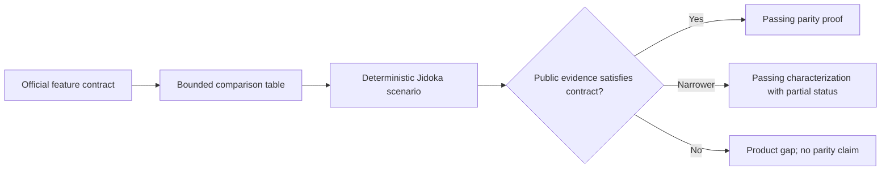
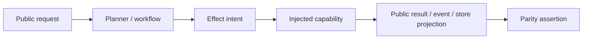

# feat: Add the next five agent-framework parity proofs

## Summary

Add five source-backed comparison documents and five opt-in parity tests for
deterministic workflows, delegation versus handoff, MCP client tools,
conversation history versus scoped memory, and bounded structured-result
repair. Each test will exercise current public Jidoka APIs with deterministic
injected capabilities and will prove behavior through public runtime evidence.

This is a proof slice of the broader agent-framework showcase plan. It does not
add missing runtime features merely to make the matrix look complete.

## Requirements

- R1. Give each feature an atomic comparison contract, a dated table covering
  Mastra, LangGraph/LangChain, Pydantic AI, OpenAI Agents SDK, Google ADK,
  LlamaIndex/LlamaAgents, AutoGen, and Jidoka, and links to official sources.
- R2. Add one deterministic `Jidoka.ParityCase` module for each contract, tagged
  with the comparison's feature name and excluded from normal test runs.
- R3. Assert public evidence such as operation results, journals, events,
  ownership state, request records, memory projections, and typed results;
  model-authored prose and private runtime fields are not proof.
- R4. Exercise real Jidoka orchestration paths while injecting model, MCP,
  operation, and storage capabilities so every proof is reproducible without
  credentials or external services.
- R5. State exact nonclaims and classify a Jidoka feature as partial when the
  current runtime contract is materially narrower than competitors' documented
  behavior.
- R6. Make every comparison independently runnable and keep all five runnable
  together through the existing parity-tag convention.
- R7. Preserve the V2 functional-core/effect-shell boundary. Keep any
  parity-discovered lifecycle correction inside the effect adapter and
  application supervision rather than the pure workflow core.

## Scope Boundaries

### In scope

- Five markdown comparison documents numbered 02 through 06.
- Five matching parity test modules under `test/parity/`.
- Official-doc refresh sufficient to support the bounded claims in those five
  tables as of 2026-07-16.
- Deterministic happy-path and contract-critical failure/boundary assertions.

### Deferred

- Persisted or scheduled workflow execution, dynamic workflow graph mutation,
  and unbounded workflow loops.
- MCP server hosting, real transport interoperability, authentication, and live
  external MCP servers, plus runtime enforcement of discovered MCP argument
  schemas.
- Production session or memory stores, semantic/vector retrieval, and a core
  fix for automatic transcript continuation.
- Provider-native constrained decoding, durable handoff ownership, and
  resumable nested subagents.
- Phoenix routes, Livebooks, trace/replay/eval proofs, architecture-table
  publication, and changes to the broad research matrix.

## Context & Research

- `docs/comparisons/01-resumable-tool-approval.md` establishes the document
  shape: contract, dated framework table, executable proof, passing-proves
  claims, nonclaims, and official sources.
- `test/parity/resumable_tool_approval_test.exs` and
  `test/support/parity_case.ex` establish the opt-in ExUnit convention and the
  preference for real public facades with deterministic injected capabilities.
- Workflow behavior is already covered piecemeal in
  `test/jidoka/workflow_dsl_test.exs` and
  `test/integration/workflow_dsl_integration_test.exs`; the parity proof will
  consolidate the bounded composition contract and workflow-as-tool evidence.
- Delegation and handoff are separate contracts in
  `test/jidoka/subagent_test.exs`, `test/jidoka/handoff_test.exs`,
  `guides/skill-workflow-subagent-tools.md`, and `guides/handoffs.md`.
- MCP discovery, compilation, execution, and failure events are grounded in
  `test/jidoka/mcp_test.exs` and
  `test/integration/operation_source_integration_test.exs`.
- Session records and memory scopes are covered by
  `test/jidoka/session_test.exs` and
  `test/integration/memory_integration_test.exs`; explicit transcript carry is
  demonstrated by `test/integration/multi_turn_integration_test.exs`.
- Structured-result validation and repair are grounded in
  `test/integration/structured_result_integration_test.exs`.
- Official competitor documentation is the authority for competitor
  mechanisms. Framework terms are normalized to each atomic contract rather
  than copied as broad feature labels.

## Key Technical Decisions

- KTD1. **Use one comparison and one parity module per feature.** This keeps
  failures attributable and preserves a simple filterable suite as the catalog
  grows. Shared mechanics remain in `Jidoka.ParityCase` or existing test
  support only when at least two comparisons genuinely reuse them. A passing
  parity-tagged test validates the status declared by its comparison; it does
  not upgrade a partial characterization into a full parity claim.
- KTD2. **Prove current public behavior without implementing feature gaps.** A
  parity test is an executable evidence artifact, not a compatibility shim.
  Missing behavior is documented as partial or not established and becomes
  separately scoped product work. A correctness defect that invalidates an
  already-claimed public contract may be fixed narrowly at its existing runtime
  boundary; the supervised handoff-store lifecycle correction is that case.
- KTD3. **Separate delegation from handoff inside one contract.** Delegation is
  a bounded child execution whose result returns to the parent. Handoff records
  future-turn ownership, which an application dispatcher must consult. Treating
  both as generic multi-agent routing would hide the most important semantic
  distinction.
- KTD4. **Classify session/history parity as partial.** Jidoka can persist
  request records, recall scoped memory, and carry prior assistant/tool
  observation state when the caller supplies the prior `agent_state`. Prior
  user requests are not retained in that state, and `Jidoka.Session.run/3` does
  not currently inject the latest result's state into the next request, so the
  comparison and test must expose both boundaries rather than simulate them.
- KTD5. **Use a public MCP source with a fake client.** Discovery and runtime
  calls will cross the same compiler, capability, effect, journal, and prompt
  boundaries as a live MCP tool while staying deterministic. The local name,
  remote name, exposed schema, exact forwarded arguments, normalized result,
  and failure events are all part of the proof. Schema exposure is not runtime
  argument enforcement.
- KTD6. **Treat structured repair as a bounded provider-neutral result phase.**
  The proof will count attempts, inspect repair/validation events and public
  repair messages, and verify typed exhaustion. It will not imply provider-
  native constrained decoding or repair of arbitrary tool outputs.

## High-Level Technical Design

The five comparisons use the same evidence pipeline while retaining
feature-specific public proof surfaces.

At runtime, every positive proof follows the ordinary effect-shell path:

## Implementation Units

### U1. Lock the parity contracts and suite conventions

- **Dependencies:** None.
- **Goal:** Make the five feature definitions, evidence rules, and test naming
  stable before parallel implementation.
- **Files:**
  - `docs/plans/2026-07-16-002-feat-next-five-parity-proofs-plan.md`
  - `test/support/parity_case.ex` (modify only if proven shared behavior is
    missing)
- **Approach:** Reuse the existing tag convention unchanged. Give each test one
  feature atom and assert stable public projections. Prefer scenario-local fake
  capabilities; promote helpers only after repeated use is visible. Comparison
  status remains authoritative, so aggregate pass counts cannot erase a
  documented partial classification.
- **Test expectation:** None — this unit locks plan-level contracts and
  conventions; exact feature and aggregate selection are verified in U7.
- **Verification:** The suite topology requires no per-feature runner script or
  parity ID registry and introduces no unrelated support abstraction.
- **Requirements:** R2, R3, R4, R6, R7.

### U2. Prove deterministic workflow composition

- **Dependencies:** U1.
- **Goal:** Demonstrate conditional branching, input-ordered concurrent
  fanout/reduction, empty reduction, bounded retry, and the same workflow as one
  agent operation.
- **Files:**
  - `docs/comparisons/02-deterministic-workflow-composition.md`
  - `test/parity/deterministic_workflow_composition_test.exs`
- **Approach:** Build a small workflow from the public DSL. Use process
  synchronization rather than sleep timing to force out-of-order completion,
  and compare direct workflow output with the nested output of the workflow
  operation result.
- **Test scenarios:** Eligible/ineligible gate branches; deliberately reversed
  map completion with input-ordered reduction; empty fanout; transient success
  on the configured attempt; permanent failure with the exact retry bound; one
  workflow intent/result on the agent path.
- **Verification:** The direct and agent-mediated outputs agree, skipped work is
  absent, retry counts are exact, and the journal exposes one workflow operation
  boundary.
- **Requirements:** R1-R7.

### U3. Prove bounded delegation versus ownership handoff

- **Dependencies:** U1.
- **Goal:** Show that subagents return bounded evidence to the parent while
  handoffs record a future-turn owner for application-managed dispatch.
- **Files:**
  - `lib/jidoka/application.ex`
  - `lib/jidoka/handoff/owner_store/in_memory.ex`
  - `docs/comparisons/03-bounded-delegation-vs-ownership-handoff.md`
  - `test/jidoka/handoff_test.exs`
  - `test/parity/bounded_delegation_vs_ownership_handoff_test.exs`
- **Approach:** Use one router with a child tool and a handoff target. Whitelist
  forwarded context, use a unique conversation ID, allow the `:unsafe_once`
  handoff explicitly, and reset the supervised node-local owner record on exit.
  The default in-memory adapter is owned by a supervised process so request
  process termination does not erase all routing records.
- **Test scenarios:** Child result returns to parent with no owner change;
  secrets are not forwarded; handoff stores target ownership and public context;
  the handoff-producing process exits before the owner lookup; direct router
  invocation remains a router invocation; explicit dispatch of fresh input
  through `owner.agent` reaches the target; reset removes ownership.
- **Verification:** Operation results and ownership projections distinguish the
  two paths, ownership survives the request process, and no assertion relies on
  timestamps or private state.
- **Requirements:** R1-R7.

### U4. Prove MCP client tool consumption

- **Dependencies:** U1.
- **Goal:** Demonstrate deterministic MCP discovery and execution as an
  ordinary Jidoka operation, including a remote failure that cannot become a
  false tool observation.
- **Files:**
  - `docs/comparisons/04-mcp-client-tool-consumption.md`
  - `test/parity/mcp_client_tool_consumption_test.exs`
- **Approach:** Compile a public MCP operation source backed by a fake client,
  inject the compiled operation/capability into a turn, and inspect operation
  and prompt metadata, exact forwarded arguments, normalized output, journal,
  prompt observation, and streamed failure events.
- **Test scenarios:** One prefixed discovered tool with the remote schema; local
  call mapped to the remote tool with the exact model-proposed arguments; one
  successful MCP result observed by the model; remote error yields typed
  failure events, no successful observation, and no second model call.
- **Verification:** Success and failure traverse public capability/effect
  surfaces, and the document claims client consumption only.
- **Requirements:** R1-R7.

### U5. Characterize session history versus scoped memory continuity

- **Dependencies:** U1.
- **Goal:** Prove working session records, exact scoped memory recall, explicit
  assistant/tool-state carry, and the current absence of automatic session
  transcript threading or full transcript reconstruction.
- **Files:**
  - `docs/comparisons/05-session-history-vs-scoped-memory-continuity.md`
  - `test/parity/session_history_vs_scoped_memory_continuity_test.exs`
- **Approach:** Use isolated in-memory session and memory stores for two
  sessions. Run ordinary session calls, then run a session request that
  explicitly carries a prior public `agent_state`. Inspect the actual model
  prompt, returned state, records, events, and store projections.
- **Test scenarios:** Session A retains request records and recalls only A's
  memory; ordinary A2 omits A1's assistant transcript; explicit state carry
  includes A1's assistant/tool observations plus current scoped memory in an
  executed turn, preserves prior and current assistant/tool messages in the
  returned state, and does not reconstruct A1's user request; session B sees
  neither A's state nor memory. The test name and executable-proof section
  identify this as a `partial characterization`.
- **Verification:** The test passes as a characterization and the comparison
  labels Jidoka partial; it does not emulate automatic continuity.
- **Requirements:** R1-R7.

### U6. Prove bounded structured-result repair

- **Dependencies:** U1.
- **Goal:** Demonstrate valid-first-pass, repair-to-valid, and bounded
  exhaustion behavior for a declared result schema.
- **Files:**
  - `docs/comparisons/06-bounded-structured-result-repair.md`
  - `test/parity/bounded_structured_result_repair_test.exs`
- **Approach:** Drive a result-schema agent with deterministic response
  sequences. Count model attempts, inspect public result-phase events and repair
  messages, assert typed values, and capture streamed failure evidence when no
  `Turn.Result` is returned.
- **Test scenarios:** Valid on attempt one with no repair; invalid then valid
  with one `:result_repair_requested` event followed by one
  `:result_validated` event; always invalid with exactly one plus the configured
  maximum attempts, typed result-phase exhaustion, and no invalid success
  value.
- **Verification:** Attempt bounds and event order are exact.
- **Requirements:** R1-R7.

### U7. Verify and reconcile the parity wave

- **Dependencies:** U2, U3, U4, U5, U6.
- **Goal:** Ensure the five proofs work independently, together, and alongside
  the normal suite without overstating any comparison.
- **Files:**
  - All files from U2-U6
  - `docs/comparisons/01-resumable-tool-approval.md` (consistency review only)
- **Approach:** Format all edited Elixir files, run each feature filter, run the
  aggregate parity set, then run the normal suite. Reconcile every passing-
  proves bullet with a concrete assertion and every table boundary with its
  test or nonclaim.
- **Test scenarios:** Each exact feature filter selects one module; aggregate
  parity selects all six comparisons; normal tests remain green with parity
  excluded; no comparison depends on credentials, network, time races, or
  mutable cross-test state.
- **Verification:** All commands pass, working tree changes are limited to the
  plan/comparison/parity surface, and the partial session claim remains explicit.
- **Requirements:** R1-R7.

## System-Wide Impact

- **Public API:** No production API or callback changes are planned. Tests use
  the existing Agent, Workflow, Session, MCP source, Memory, Review, Stream, and
  result/event surfaces.
- **Runtime/effects:** Each proof crosses the ordinary operation intent and
  effect interpreter where applicable. The default handoff owner adapter uses a
  supervised ETS owner; no test-only execution branch enters `lib/`.
- **State lifecycle:** Handoff ownership is node-local, survives request-process
  exit, and is reset per test. In-memory session and memory stores are isolated
  per scenario. Workflow retry counters and fake MCP/model state are
  process-scoped and deterministic.
- **Failure propagation:** Workflow retry exhaustion, MCP capability failure,
  and structured-result exhaustion must remain typed failures. A failed effect
  must not be represented as a successful operation observation.
- **Security/trust:** Forwarded agent context is allowlisted and secret absence
  is asserted. MCP metadata and results are treated as untrusted remote input.
  The proof does not add authorization or credential handling.
- **Documentation:** Comparison 01 remains the style baseline. The broad plan,
  architecture overview, README, and marketing surfaces are not updated until
  the larger evidence map is ready.

## Risks & Dependencies

- **Competitor semantics drift:** Official docs can change. Mitigation: date the
  review, link canonical publisher pages, qualify hosted/app-managed behavior,
  and use “not established in this bounded review” instead of absence claims.
- **False parity from prose:** A scripted model could simply state success.
  Mitigation: assert journals, operation results, events, store projections,
  ownership records, and attempt counts independently of final text.
- **Timing-sensitive workflow proof:** Concurrent fanout can become flaky.
  Mitigation: coordinate completions with process messages/barriers and assert
  stable result order, never elapsed time.
- **Global handoff leakage:** The default owner store is supervised node-local
  ETS with global visibility inside the node. Mitigation: unique conversation
  IDs, a cross-process lifetime assertion, and on-exit reset; never assert
  unstable timestamps.
- **Session documentation mismatch:** Existing guides imply automatic history
  continuation. Mitigation: label the comparison partial, assert current
  behavior, and leave guide/runtime reconciliation for separately authorized
  work.
- **Fake MCP overreach:** A fake does not prove network interoperability.
  Mitigation: claim only compiler-to-capability client consumption and list live
  transport/authentication/server hosting as nonclaims.

## Resolved During Planning

- The next wave is exactly the five confirmed features; trace/replay/eval stays
  deferred.
- One comparison/test pair is the scaling unit; no per-test scripts or parity ID
  registry will be added.
- The session/history proof is intentionally partial and will not patch or
  emulate the missing automatic state carry.
- Missing runtime features remain outside this proof slice. The review-discovered
  handoff owner-lifetime defect was corrected narrowly in the existing storage
  adapter and application supervision because it invalidated the claimed
  future-turn contract.

## Open Questions

- None block this plan. A newly discovered feature gap must narrow the affected
  comparison; a correctness defect in an already-claimed contract must be
  corrected narrowly at the existing boundary or explicitly downgrade the
  comparison.

## Sources & References

- `docs/plans/2026-07-16-001-feat-agent-framework-showcase-plan.md`
- `docs/comparisons/01-resumable-tool-approval.md`
- `JIDOKA_V2.md`
- `test/support/parity_case.ex`
- `test/support/test_support.ex`
- `test/jidoka/workflow_dsl_test.exs`
- `test/integration/workflow_dsl_integration_test.exs`
- `test/jidoka/subagent_test.exs`
- `test/jidoka/handoff_test.exs`
- `test/jidoka/mcp_test.exs`
- `test/integration/operation_source_integration_test.exs`
- `test/jidoka/session_test.exs`
- `test/integration/memory_integration_test.exs`
- `test/integration/multi_turn_integration_test.exs`
- `test/integration/structured_result_integration_test.exs`
